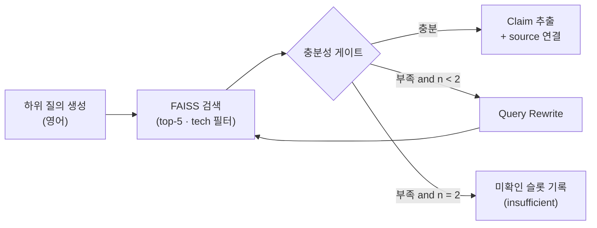
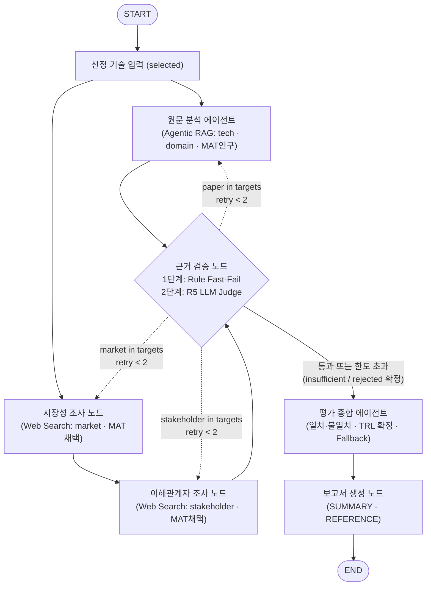

# KV cache 최적화 기술 평가 설계서 최종

**SKALA 4기 · 판교 9반 · RAG Design**
SKALA 4기 · 판교 9반 팀 프로젝트

---

## 설계 요약

| 항목 | 결정 |
| --- | --- |
| 대상 기술 | SW KIVI (2bit 비대칭 KV 양자화) / HW CXL-PNM (CXL 메모리 내 근접 연산 KV 관리) |
| 도메인 | 클라우드 LLM 서빙 |
| 평가 관점 | 기술 성숙도(TRL) · 시장성 · 이해관계자 · 도메인 적합성 |
| 노드/에이전트 | 원문 분석(Agentic RAG) · 시장성 조사(Web) · 이해관계자 조사(Web 체이닝) · 근거 검증(2단계 Fast-Fail) · 평가 종합 · 보고서 생성 |
| 흐름/동시성 | 병렬 실행(원문 ∥ 시장성→이해관계자) + Custom Upsert Reducer 기반 충돌 방지 + Conditional Edge 표적 피드백 |
| Embedding | 오픈소스 3종을 코퍼스 기반 Hit@5·MRR로 실측 비교 후 확정 |
| 원칙 | 우열 판정 없음. 관점 간 일치와 불일치를 근거와 함께 기록 |

---

## 1. 문제 정의

### 1.1 배경

KV cache는 LLM이 토큰을 하나씩 생성할 때마다 이전에 계산한 Key와 Value를 메모리에 저장해두고 재사용하는 메커니즘이다. 매 생성 단계마다 어텐션을 처음부터 다시 계산하는 연산 낭비를 막아주지만, 입력 문맥이 길어질수록 저장해야 할 데이터가 선형으로 증가하여 GPU의 고대역폭 메모리(HBM) 용량을 빠르게 채운다. 클라우드 서빙 환경에서 메모리 고갈은 동시 처리 가능한 배치 크기를 제한하고, 이는 시스템 전체의 처리량 저하와 토큰당 서빙 단가 상승으로 이어진다.

이 병목을 해결하는 접근 방식은 크게 두 흐름으로 나뉜다. 소프트웨어 진영은 양자화나 프루닝을 통해 데이터 자체의 크기를 줄여 기존 GPU 환경에서 즉시 적용 가능한 해법을 추구하지만, 압축률을 높일수록 모델 정확도가 떨어질 위험을 안고 있다. 반면 하드웨어 진영은 데이터 정밀도를 유지한 채 CXL이나 시스템 메모리 같은 외부 저장소로 공간을 확장하여 정확도 손실을 원천 차단하지만, 새로운 하드웨어 도입 비용과 메모리 간 데이터 전송 지연이라는 과제가 남는다.

| 진영 | 접근 방식 | 장점 | 단점 |
| --- | --- | --- | --- |
| **SW** | KV cache 자체의 크기를 줄인다 | 기존 GPU·HBM 위에서 소프트웨어만으로 즉시 적용 가능 | 압축률을 높일수록 정확도가 떨어질 위험 |
| **HW** | 원본은 그대로 두고 저장 공간을 넓힌다 | HBM 밖의 더 넓고 값싼 메모리·스토리지로 확장해 정확도 손실 없음 | 새로운 인프라 필요, 전송 지연 잔존 |

### 1.2 문제 정의

본 프로젝트는 클라우드 LLM 서빙 도메인을 기준으로 KV cache 병목을 해결하는 SW와 HW 진영의 상반된 접근 방식을 비교한다. 특히 두 기술이 기술 성숙도, 시장성, 이해관계자, 도메인 적합성이라는 네 가지 관점에서 각각 어떻게 평가되는지 객관적 근거를 기반으로 분석하고 그 차이를 도출한다.

### 1.3 제약 조건

프로젝트는 1.5일의 제한된 일정 안에서 수행되며, RAG 분석용 코퍼스는 핵심 논문 원문 위주로 200페이지 이내로 통제한다. 임베딩 파이프라인에는 오픈소스 모델만 투입하여 재현성을 확보한다. 또한 모든 평가 근거는 공개된 논문과 공인 웹 자료에 한정되므로, 기술 성숙도(TRL)를 비롯한 정량적 수치는 확정적 평가가 아닌 근거에 기반한 추정 범위로 제시한다.

### 1.4 범위

평가의 핵심은 SW와 HW 대표 기술의 관점별 근거를 수집, 검증, 대조하는 데 있다. 두 기술 간의 우열 판정이나 특정 상용 제품으로의 일방적 도입 추천은 본 평가의 명세상 엄격히 금지된다. 본 평가는 어느 한 기술의 우위를 가리는 것이 아니라, 데이터 압축(SW)과 메모리 확장(HW)이라는 상반된 두 접근법이 지닌 고유한 메커니즘, 장단점, 그리고 클라우드 서빙 워크로드 특성별 트레이드오프를 실증 근거를 바탕으로 객관적으로 대조하는 데 집중한다. 기술 성숙도 또한 공개 자료의 사실 관계를 바탕으로 추정 구간을 명시하는 수준에 집중하며, 자체적인 알고리즘 구현이나 논문 벤치마크 재현 실험은 범위에 포함하지 않는다. 평가 대상 도메인은 대규모 동시 추론이 발생하는 클라우드 서빙 환경에 집중하고, 온디바이스 등 다른 운영 환경은 평가의 한계점에서만 간략히 다룬다.

---

## 2. 대상 기술

### 2.1 후보 검토

초기 검토 대상이었던 6개 기술 후보에 대해 SW와 HW의 진영 분류 적합성, RAG 문서 풀의 완결성, 논문 원문 내용의 정합성을 교차 검증했다.

| 후보 | 진영 | 원문 확인 결과 | 판단 |
| --- | --- | --- | --- |
| KIVI | SW | KV cache 전용 양자화 논문. 재학습 없이 기존 모델에 적용 가능 | 선정 |
| TurboQuant | SW | 범용 벡터 양자화 이론 논문. 요약에 제시된 속도 향상 수치가 원문에서 확인되지 않음 | 제외 |
| DeepSeek-V2 (MLA) | SW | 52p 중 MLA 관련 약 8p. 사전학습 단계 구조 변경이라 사후 적용 기술과 층위가 다름 | 제외 |
| InfiniGen | HW | 기존 CPU 메모리 오프로딩 + 선택적 프리패치. 새 하드웨어가 필요 없는 SW 기법 | 제외 |
| ITME | HW | CXL-Hybrid 메모리 계층 확장. 피어리뷰 전 preprint | 제외 |
| CXL-PNM | HW | CXL 메모리 내 PNM 가속기가 KV 선택·어텐션 수행. 정식 학회 게재 | 선정 |

### 2.2 선정 기준

선정 기준은 동일한 도메인 조건에서 다관점 평가가 명확히 갈릴 수 있는 비교 구도를 갖추었는가에 두었다. 어느 한 기술의 우수성을 입증하는 것이 목적이 아니므로, 평가 관점에 따라 서로 다른 장단점과 해석이 나타날 수 있는 조건을 우선적으로 검토했다.

| 기준 | KIVI | CXL-PNM |
| --- | --- | --- |
| 동일 병목 | KV cache 메모리 용량 | KV cache 메모리 용량·전송 |
| 상반된 접근 | 데이터를 줄임 (2bit) | 담는 공간과 연산 위치를 바꿈 |
| 진영 정합성 | 순수 SW, 기존 GPU 그대로 | CXL·PNM 하드웨어가 개입 |
| 원문 적합성 | KV 전용 논문, 약 15p | KV 전용 논문, 약 25p |
| 출처 | ICML 2024 | PACT 2025 (IEEE) |

두 기술은 동일하게 KV cache 메모리 용량이라는 병목을 해결 대상으로 삼지만, 한쪽은 데이터를 2비트로 줄이고 다른 한쪽은 저장 공간과 연산 위치 자체를 옮기는 정반대의 해법을 채택했다. 후보 중 InfiniGen은 CPU 오프로딩 기법으로 하드웨어 추가 없이 구동되어 비교 구도가 소프트웨어 알고리즘 대 시스템 소프트웨어로 좁아질 우려가 있어 제외했다. 

CXL-PNM의 경우 7nm 공정 설계 기반의 시뮬레이션 연구로, 이미 오픈소스 구현체가 존재하는 KIVI에 비해 기술 성숙도 격차가 발생한다. 하지만 이러한 성숙도 차이는 비교 대상에서 배제할 이유가 아니라 오히려 기술 성숙도 관점에서 실증해야 할 분석 대상에 해당한다. 다만 시뮬레이션 연구라는 특성이 시장성과 이해관계자 평가를 과도하게 왜곡하지 않도록, 이 두 관점은 개별 기술을 넘어 기술 계열 단위(KV 양자화 계열 vs CXL 메모리 확장 계열)로 평가 단위를 확장하여 분석을 수행한다.

### 2.3 최종 선정 결과

| 진영 | 기술 | 핵심 메커니즘 | 원문 |
| --- | --- | --- | --- |
| SW | KIVI | Key는 채널 단위, Value는 토큰 단위로 비대칭 2bit 양자화. 최근 토큰은 원 정밀도 유지 | Liu, Z. et al.(2024). ICML 2024. arXiv:2402.02750 |
| HW | CXL-PNM | 전체 KV를 CXL 메모리에 보관하고, 모듈 내 PNM 가속기가 중요 토큰 페이지 선택·어텐션을 수행해 GPU recall 제거 | Kim, D. et al.(2025). PACT 2025. arXiv:2511.00321 |

### 2.4 평가 전제

기술 평가에 앞서 실험 환경과 수치 해석에 관한 세 가지 기본 전제를 수립한다.

첫째, 두 기술 모두 정확도와 효율성 사이에 트레이드오프를 갖는다. KIVI는 표현 비트 수를 낮추어 용량을 줄이고, CXL-PNM은 어텐션 계산에 참여하는 토큰 수를 선별적으로 줄이는 방식을 취한다. 둘째, CXL-PNM 논문의 성능 수치는 7nm 설계를 바탕으로 한 사이클 단위 시뮬레이션 결과이므로, 실측치와 명확히 구분하여 `simulation` 유형으로 분류한다. 셋째, 두 논문에서 사용한 모델 크기, 문맥 길이, 하드웨어 스펙 등 실험 조건이 일치하지 않으므로 통제되지 않은 직접적인 수치 대조는 배제하고 각 수치에 실험 배경을 반드시 함께 명시한다.

---

## 3. 평가 관점 및 기준

### 3.1 도메인: 클라우드 LLM 서빙

본 프로젝트의 평가 도메인은 `클라우드 LLM 서빙`으로 선정하였다. 클라우드 LLM 서빙은 데이터센터 GPU 클러스터에서 다수 사용자의 요청을 동시에 처리하는 추론 환경으로, 장문맥 요청도 포함하며 KV cache 병목이 가장 직접적으로 드러나는 환경이다. 또한 KIVI와 CXL-PNM 두 원문 모두 이 환경을 평가 대상으로 삼고 있어 같은 조건에서 비교가 가능하다. 반면 온디바이스는 CXL 인프라 전제 자체가 성립하지 않아 평가 도메인에서 제외하였다.

### 3.2 평가 단위

계열 근거를 개별 기술 평가로 옮겨 쓰지 않으며, 보고서에 계열 근거임을 표기하도록 한다.

| 관점 | 평가 단위 | 이유 |
| --- | --- | --- |
| 기술 성숙도, 도메인 적합성 | 개별 기술 | 메커니즘과 실험 조건이 원문에 있음 |
| 시장성, 이해관계자 | 기술 계열 (KV 양자화 / CXL 메모리 확장·근접 연산) | 단일 논문에 대한 시장·업계 반응은 거의 없음. 두 기술은 각 계열의 대표로 둠 |

### 3.3 기술 성숙도 (TRL)

기술 성숙도는 평가자의 주관적 판단을 배제하기 위해 수집된 근거 유형에 따라 객관적인 추정 구간을 사전에 정의한다.

| 근거 유형 | 추정 구간 | 수집 주체 |
| --- | --- | --- |
| 논문·알고리즘 실험, 시뮬레이션 | TRL 3-4 | 원문 분석 |
| 오픈소스 구현, 프레임워크 통합 | TRL 5-6 | 외부 조사 |
| 벤더 시제품·제품 발표 | TRL 6-7 | 외부 조사 |
| 상용 서비스 배포 공개 | TRL 8-9 | 외부 조사 |

성숙도 평가는 개별 기술 수준과 기술 계열 수준을 엄격히 분리하여 이원화된 TRL 지표로 도출한다. 예를 들어 CXL-PNM의 경우 개별 기술은 7nm 시뮬레이션 연구 수준(TRL 3-4)에 머물지만, 이를 뒷받침하는 CXL 메모리 확장 계열은 주요 반도체 벤더의 실물 시제품 출시 및 표준화(TRL 7-8)에 도달해 있다. 이를 단일 숫자로 혼합하면 연구 논문과 양산 하드웨어 간의 성숙도가 왜곡되므로, `tech_trl`(개별 기술 성숙도)과 `family_trl`(계열 생태계 성숙도)을 별도 산출하고 각각의 근거와 판단 신뢰도(Confidence)를 한 묶음으로 제시한다. 특히 TRL 4에서 6에 이르는 구간은 기업 내부의 비공개 구현 정보가 많아 외부 공개 자료만으로는 검증에 한계가 있으므로 신뢰도를 보수적으로 낮게 부여한다. 또한 논문의 발표 연도나 공개 시점 자체를 기술의 성숙도와 동일시하여 해석하지 않는다.

### 3.4 시장성

KV cache 최적화 기술만을 독립적으로 분리한 시장 규모를 산출하는 것은 통계적으로 모호하므로, 본 평가에서는 추상적인 시장 규모 대신 상용 프레임워크 채택 현황, 배포 사례, 생태계 형성 수준, 그리고 기존 인프라 대비 도입 장벽을 핵심 지표로 평가한다. 공개된 사실 관계에 기반한 현황 파악에 집중하며, 임의의 미래 시장 전망이나 예측치는 배제한다. HBM이나 CXL 등 인접 시장의 수치를 인용할 때는 해당 데이터가 인접 하드웨어 시장에 관한 것임을 명확히 구분하여 기술한다.

| 항목 | 판단 근거 |
| --- | --- |
| 채택 현황 (adoption) | 서빙 프레임워크 지원, 벤더 채택 발표 |
| 배포 현황 (deployment) | 제품·시제품 출시, 공개된 실제 적용 사례 |
| 생태계 (ecosystem) | 표준화 동향, 지원 벤더 범위 |
| 도입 장벽 (barriers) | 신규 하드웨어 필요 여부, 기존 인프라 변경 범위 |

### 3.5 이해관계자

이해관계자 분석은 클라우드 서빙 운영사, 프레임워크 및 모델 개발자, 서비스 최종 사용자, 그리고 하드웨어 벤더라는 4대 주체를 대상으로 진행한다. 각 주체별로 얻을 수 있는 실익(Benefit), 우려 사항(Concern), 도입 장벽(Adoption Barrier), 그리고 이를 뒷받침하는 구체적인 실증 근거를 수집한다. 만약 신뢰할 수 있는 외부 출처를 확보하지 못한 항목은 추측으로 메우지 않고 결측(`insufficient`) 상태로 처리하여 분석의 왜곡을 방지한다.

| Actor | 조사 항목 |
| --- | --- |
| 서빙 운영자 (클라우드·추론 서비스 운영사) | Benefit / Concern / Adoption Barrier / Evidence |
| 개발자 (서빙 프레임워크·모델 개발자) | 〃 |
| End User (서비스 이용자) | 〃 (응답 지연·품질 관련 간접 근거) |
| 공급자 (HW·메모리 벤더) | 〃 |

### 3.6 도메인 적합성

클라우드 서빙 환경에서의 실효성을 검증하기 위해 메모리 점유량, 데이터 전송 대역폭, 처리량 및 응답 지연, 연산 정확도, 인프라 변경 요구, 운영 복잡도라는 6대 축을 기준으로 적합성을 평가한다. 보고서에 인용하는 모든 성능 수치는 모델 크기, 입력 문맥 길이, 테스트 하드웨어, 그리고 실측치인지 시뮬레이션인지 여부를 함께 병기하여 맥락을 온전히 보존한다. RAG 검색을 통해서도 원문 내 관련 근거를 확인하지 못한 항목은 `corpus 내 근거 미확인`으로 기록하고 자의적인 수치 추정을 금지한다.

| 공통 축 | 확인 내용 |
| --- | --- |
| Memory footprint | GPU 메모리 사용량 변화 |
| 대역폭·전송 | 데이터 이동량, 전송 병목 |
| Throughput / Latency | 처리량, 토큰당 지연 |
| Accuracy | 정확도 영향과 측정 여부 |
| 인프라 변경 | 필요한 HW·SW 변경 |
| 운영 복잡도 | 배포·운영 시 추가 부담 |

### 3.7 근거 판정 규칙

모든 에이전트와 검증 노드가 일관된 기준으로 정보를 다룰 수 있도록 주장 유형과 상태 값을 체계화하여 운용한다. 검증을 거친 후에도 근거가 불충분하거나(`insufficient`) 주장과 근거가 일치하지 않는(`rejected`) Claim은 요약문이나 시사점 같은 최종 핵심 결론에서 원천 배제하고, 보고서의 한계점(Evidence Gap) 섹션에만 결측 사유와 함께 기록한다.

| 구분 | 값 | 의미 |
| --- | --- | --- |
| 주장 유형 | `fact` | 출처로 직접 확인된 사실 |
|  | `vendor_claim` | 벤더·저자 자체 주장 |
|  | `simulation` | 시뮬레이션 기반 수치 |
|  | `estimate` | 확인된 근거에 기반한 추론 (예: TRL 범위). 근거 없는 추측은 해당하지 않음 |
| Claim 상태 | `ok` | 검증 통과 |
|  | `flagged` | 검증 위반, 재조사 대기 |
|  | `insufficient` | 재조사 한도 후에도 근거 부족 |
|  | `rejected` | 재조사 한도 후에도 주장과 근거 불일치 |
| 기록값 | `corpus 내 근거 미확인` | RAG 검색으로 원문 근거를 찾지 못함. 원문에 없다고 단정하지 않음 |
|  | `counter-evidence not found` | 반대 쿼리를 수행했으나 반대 근거가 없음. Claim 상태에 영향 없음 |

### 3.8 종합 규칙과 편향 방지

평가 종합 단계에서는 관점 간 일치하는 결과와 상충하는 결과를 있는 그대로 정리하며, 결론이 한쪽으로 수렴할 때 인위적으로 상충 지점을 꾸며내지 않는다. 특히 본 평가의 절대적 명세에 따라 두 기술 간의 우열 판정은 일절 수행하지 않으며, 특정 기술을 승자로 지정하지 않는다. 대신 클라우드 서빙의 다양한 워크로드 특성(배치 크기, 문맥 길이, 응답 지연 요구 등)에 따라 각 기술이 나타내는 고유한 성능 특성과 운영상의 제약사항을 실증 근거 기반의 대조 분석으로 제시한다. 모든 기술적 분석에는 근거 Claim ID와 출처 신뢰 등급을 병기하고, 논문 원문의 주장과 외부 시장의 실질적 반응 사이에 존재하는 간극을 독립된 비교 축으로 정리한다.

외부 조사 시 지지 근거뿐 아니라 반대 쿼리를 반드시 1회 이상 병행하여 확증 편향을 차단한다. 만약 반대 근거가 실제로 존재하지 않는다면 무리하게 거짓 균형을 만들지 않고 `counter-evidence not found` 상태를 그대로 유지하여 객관성을 담보한다. 또한 공신력이 낮은 커뮤니티나 개인 블로그(Tier 4) 출처는 단독 근거로 채택할 수 없도록 강제한다.

| 편향 방지 장치 | 적용 위치 |
| --- | --- |
| 지지 쿼리와 반대 쿼리를 모두 실행 | 외부 조사 |
| 반대 쿼리 미수행 시 1회 수행 강제 | 근거 검증 (R3) |
| Claim 단위 근거 연결 | 전 에이전트 |
| 출처 등급 부여, T4 단독 근거 금지 | 외부 조사, 근거 검증 (R2) |
| 설계 단계에서 예상 결론 미기재 | 설계서, 보고서 목차 |

---

## 4. 에이전트 및 RAG 설계

### 4.1 에이전트 및 노드 구성

관점마다 에이전트를 독립시키면 동일한 논문과 웹 자료를 중복 검색하여 불필요한 토큰 비용이 발생하며, 반대로 여러 조사 작업을 단일 노드 내부의 절차형 코드로 묶으면 LangGraph의 핵심 이점인 체크포인팅, 단계별 트레이싱, 조건부 재실행(Conditional Edge)이 불가능해진다. 따라서 원문 분석은 RAG 기반의 병렬 노드로 독립시키고, 외부 조사는 그래프 레벨에서 `시장성 조사`와 `이해관계자 조사`라는 개별 노드로 분리하되 선형 체이닝(Chaining)하는 구조를 취한다. 이를 통해 상태 격리와 검색 맥락 공유를 동시에 달성한다. 판단이 필요 없는 규칙 검사와 최종 문서 조립은 전용 노드로 분리한다.

| 구분 | 이름 | 책임 | 도구 | 출력 State |
| --- | --- | --- | --- | --- |
| 에이전트 | 원문 분석 (`paper_analysis`) | 메커니즘·수치·한계·실험 조건 추출, 도메인 평가, TRL 연구 근거 MAT Claim 기록 | RAG (FAISS) | `tech_sw`, `tech_hw`, `domain`, `MAT Claim(연구)` |
| 노드 | 시장성 조사 (`market_research`) | 기술 계열별 채택·배포·생태계·도입 장벽 조사, TRL 채택 근거 MAT Claim 기록 | Web Search | `market`, `MAT Claim(채택)` |
| 노드 | 이해관계자 조사 (`stakeholder_research`) | 시장성 컨텍스트(벤더·동향)를 이어받아 4대 주체별 반응 조사, 추가 MAT Claim 기록 | Web Search | `stakeholder`, `MAT Claim(채택)` |
| 노드 | 근거 검증 (`evidence_audit`) | 2단계 Fast-Fail (1단계: 규칙 검사 ➔ 2단계: R5 LLM Judge), 표적 피드백 생성 | 규칙(Regex) + R5 Judge | `audit`, `retry_count` |
| 에이전트 | 평가 종합 (`evaluation_synthesis`) | 관점 간 일치·불일치 정리, 개별 기술(`tech_trl`) 및 계열 생태계(`family_trl`) 이원화 확정 (0건 Fallback 처리) | 없음 (LLM 추론) | `trl`, `synthesis` |
| 노드 | 보고서 생성 (`report_generation`) | 2단계 생성 (1단계: Jinja2 골격 조립 ➔ 2단계: Strict Grounding 기반 Polishing LLM) | 템플릿 + LLM | `report` |

시장성 조사와 이해관계자 조사를 노드 단위로 분리함으로써 LangSmith 트레이싱 및 상태 체크포인트의 최소 단위가 명확해지며, 근거 검증에서 특정 관점의 Claim만 위반된 경우 해당 노드만 선별적으로 재실행하여 불필요한 재작업을 막을 수 있다. 이때 발생할 수 있는 검색 맥락의 단절은 시장성 조사 노드가 먼저 추출한 핵심 벤더와 프레임워크 키워드를 State를 통해 이해관계자 노드의 쿼리 생성 인풋으로 주입하여 방지한다. 나아가 시장성 조사(`market`)에 대한 위반이 발생하여 재실행될 경우, 시장성 컨텍스트의 변경이 이해관계자 분석에 누락되는 종속성 결함(Stale Dependency)을 원천 차단하기 위해 라우터는 `market_research` 실행 완료 후 종속 노드인 `stakeholder_research` 노드를 연속적으로 재실행(Cascade Chaining)하도록 강제한다.

모든 조사 노드는 명세에 따라 기술 간의 우열을 판정하거나 미래 전망에 대한 자의적 예측을 서술하지 않으며, 클라우드 서빙의 다양한 워크로드 시나리오(초장문맥 추론, 대규모 고배치 서빙 등)에 따른 각 기술의 객관적 특성과 트레이드오프를 근거 기반으로 기술하는 데 집중한다. 또한 주장 유형과 검증 상태는 3.7절의 기준에 따라 엄격히 통제한다. 기술 성숙도(TRL) 관련 근거 수집 역시 역할을 분담하여 원문 분석은 연구 및 실험 단계(TRL 3-4) 근거를 수집하고, 시장성과 이해관계자 조사는 실제 산업 채택과 배포(TRL 5-9) 근거를 수집한다. 평가 종합 에이전트는 이렇게 수집된 근거 ID만을 취합하여 개별 기술과 계열 단위의 TRL 범위와 신뢰도를 이원화하여 확정하며, 자체적인 추가 검색은 수행하지 않는다.

### 4.2 RAG 설계

RAG 파이프라인은 논문 원문 분석 에이전트에만 한정하여 적용한다. 코퍼스로 사용하는 논문 2편에는 시장 동향이나 업계 반응이 수록되어 있지 않으므로 시장성 및 이해관계자 조사에는 웹 검색을 활용한다.

| 항목 | 내용 |
| --- | --- |
| 코퍼스 | KIVI + CXL-PNM 원문 전체, 약 40p (한도 200p) |
| 선정 원칙 | KV cache 전용 논문만 사용해 무관 섹션의 검색 노이즈 차단 |
| 청킹 | 섹션 헤더 기준 분할 후 400-500토큰, overlap 약 15%. 표·그림 캡션 보존 |
| 메타데이터 | `tech`, `section`, `page` |
| 검색 | top-k 5, `tech` 필터로 두 기술 간 혼입 방지 |
| 질의 언어 | 영어 (원문 언어와 일치, 에이전트가 생성) |
| Vector DB | FAISS, 로컬 인덱스 + 빌드 스크립트 |

약 40페이지 분량의 코퍼스는 최신 거대 언어 모델의 단일 컨텍스트 윈도우에 충분히 들어가는 크기임에도 불구하고 RAG 파이프라인을 필수적으로 구축하는 이유는, 본 시스템의 본질이 단순 요약이 아니라 문장 단위 사실 검증과 증빙 감사(Evidence Audit)에 있기 때문이다. 전체 문서를 프롬프트에 직접 주입할 경우 모델이 문맥을 임의로 재해석하거나 환각을 일으켰을 때 어느 페이지의 어떤 문장에 기인한 것인지 역추적하기 어렵다. 따라서 섹션 및 페이지 번호 메타데이터가 보존된 청크 단위 색인을 통해 각 Claim 객체에 원문의 정확한 근거 스니펫(`Evidence.snippet`)과 출처(`Source.page`)를 1:1로 엄밀하게 결합(Claim-Evidence Grounding)함으로써, 사후 2단계 R5 LLM Judge가 기계적으로 진위를 감사할 수 있는 결정론적 추적성을 확보한다.

청크 크기는 후보 임베딩 모델의 입력 한도인 512토큰에 맞추어 400-500토큰으로 설정하고, 약 15%의 중첩 구간을 두어 문맥 연속성을 확보한다.

### 4.3 Agentic RAG Loop



원문 분석의 검색 루프는 단순 유사도 순위 추출에 머물지 않고 문장 단위의 적합성을 검증하는 '충분성 게이트'를 거친다. 검색된 청크가 질의에 명확히 답할 수 있는 경우에만 Claim을 추출하여 근거 스니펫 및 출처와 연결하며, 내용이 미흡하면 부족 사유를 분석하고 도메인 온톨로지 기반 동의어 확장을 적용하여 질의를 재작성(Query Rewrite)한 뒤 재검색을 진행한다. 이를 통해 논문 고유의 전문 어휘(예: non-uniform quantization, near-memory processing, recall overhead)와 평가 질문 간의 어휘 불일치(Vocabulary Mismatch)를 효과적으로 해소한다.

재검색은 최대 2회(초기 검색 포함 총 3회)까지 허용한다. 3회의 시도 후에도 적합한 근거를 찾지 못한 항목은 억지로 추정 문장을 생성하지 않고 미확인 슬롯으로 분류하여 statement를 공란으로 두고 상태를 `insufficient`(기록값 `corpus 내 근거 미확인`)로 처리한다. 검색 실패가 곧 원문 내 정보 부재를 증명하는 것은 아니므로 원문에 없다고 단정하지 않으며, 이러한 공란 Claim은 보고서의 핵심 결론에서 제외하고 한계점(Evidence Gap) 목록에만 기재하여 분석의 신뢰성을 지킨다. 한 하위 질의의 루프가 한도에 도달하더라도 원문 분석 노드는 중단되지 않고 나머지 축의 질의를 계속 처리한 뒤 검증 단계로 넘어간다.

### 4.4 Embedding 모델

| 후보 | 규모 | 입력 한도 | 후보 포함 이유 |
| --- | --- | --- | --- |
| BAAI/bge-small-en-v1.5 | 33M | 512 | 영어 전용 최경량. 원문·질의 모두 영어 |
| intfloat/e5-small-v2 | 33M | 512 | 동급 규모의 다른 학습 방식 비교군 |
| BAAI/bge-m3 | 568M | 8,192 | 긴 청크 대안, 품질 상한 확인용 |

범용 벤치마크 점수가 본 연구 코퍼스의 전문 하드웨어 및 양자화 용어(quantization, CXL, PNM, recall 등)에 대한 검색 성능을 담보하지 않으므로, 코퍼스 기반의 실측 평가를 통해 최종 모델을 결정한다. 원문에서 추출한 20개 테스트 질의를 바탕으로 Hit@5와 MRR을 측정하며, Hit@5 0.8 이상을 달성한 모델 중 가장 가벼운 모델을 선정한다. 모든 소형 모델이 기준에 미달할 경우에 한해 BGE-M3로 전환하고 청크 크기를 재조정한다.

### 4.5 외부 조사 설계 (시장성 및 이해관계자 노드)

이해관계자의 반응과 업계 평가는 가상의 페르소나를 모델 내부에서 생성하지 않고, 실제 공개된 언론 보도, 기업 공식 블로그, 제품 발표 자료를 직접 수집한다. 페르소나 생성 방식은 모델의 추측이 실제 근거인 것처럼 보여 출처 추적성을 훼손하기 때문이다.

실행 흐름은 그래프 레벨에서 `시장성 조사`를 거친 후 `이해관계자 조사`로 이어지는 선형 체이닝을 따른다. 시장성 조사 노드가 도출한 핵심 벤더사와 상용화 동향 키워드를 이해관계자 노드의 입력 컨텍스트로 전달하여 질의의 구체성을 높인다. 각 조사 항목마다 기술의 장점과 한계를 균형 있게 확인하기 위해 지지 쿼리와 반대 쿼리를 반드시 병행하며, 반대 근거가 나타나지 않을 때에는 억지로 대립각을 만들지 않고 `counter-evidence not found`로 기록한다.

만약 외부 조사나 원문 분석에서 기술 성숙도(TRL) 관련 Claim이 전혀 수집되지 않는 예외 상황이 발생하면, 평가 종합 단계에서 무리한 추정을 막기 위해 `estimate_or_range: "Unknown"`, `confidence: "None"`, `fallback_reason: "Insufficient Evidence"`를 기본값으로 할당한다.

| 항목 | 내용 |
| --- | --- |
| 검색 도구 | Tavily (URL·날짜 저장) |
| 질의 방식 | 항목마다 지지 쿼리와 반대 쿼리 실행 (예: adoption / limitation). 반대 근거가 없으면 `counter-evidence not found` 기록 |
| 출처 등급 | 아래 Tier 부여, T4 단독 근거 불가 |

| Tier | 유형 |
| --- | --- |
| T1 | 학회·저널 논문, 표준 문서, 공식 제품 문서 |
| T2 | 기업 연구 블로그, 기술 백서, 공식 발표 자료 |
| T3 | 전문 매체 기사, 애널리스트 리포트 |
| T4 | 커뮤니티·개인 블로그 (보조 근거만) |

---

## 5. 그래프 설계


### 5.1 Graph 흐름



그래프 실행은 입력 노드에서 선정한 기술 정보를 바탕으로 원문 분석과 시장성 조사가 병렬(Fan-out)로 착수된다. 시장성 조사가 완료되면 그 결과를 이어받아 이해관계자 조사가 순차 진행되며, 두 갈래의 조사가 모두 완료되면 근거 검증 노드로 데이터가 모인다(Fan-in). 점선으로 표시된 조건부 재실행(Conditional Edge)은 검증 위반이 발생한 관점(`paper`, `market`, `stakeholder`)을 표적 호출한다. 이때 시장성 조사(`market`)가 재실행 대상으로 지정된 경우, 그래프는 시장성 조사 완료 후 종속된 이해관계자 노드로 흐름을 이어가(Cascade Chaining) 갱신된 시장성 컨텍스트가 이해관계자 데이터에 즉시 동기화되도록 보장한다.

### 5.2 흐름 구조

| 구조 | 위치 | 동작 |
| --- | --- | --- |
| Workflow | 입력 → 조사 → 검증 → 종합 → 보고서 | 정보 수집 → 정합성 검증 → 다관점 종합 → 보고서 문서화 |
| Parallel (Fan-out) | 원문 분석 ∥ (시장성 조사 → 이해관계자 조사) | 독립된 검색 도구와 코퍼스를 병렬로 실행하여 대기 시간 단축 |
| Chaining | 시장성 조사 → 이해관계자 조사 | 시장성 노드가 추출한 주요 벤더/프레임워크 키워드를 State로 전달받아 이해관계자 쿼리 생성 |
| Branch (Conditional) | 근거 검증 | 위반 Claim의 `target_agent`(`paper`/`market`/`stakeholder`) 및 재시도 횟수에 따라 조건부 라우팅 |
| Loop 1 | 원문 분석 내부 | 내부 RAG: 충분성 게이트 → Query Rewrite → 재검색 (최대 2회). 한도 초과 시 공란 슬롯 기록 |
| Loop 2 | 근거 검증 ↔ 조사 노드들 | 2단계 Fast-Fail 기반 표적 피드백: 위반 관점 노드 선별 재실행 및 market 재실행 시 stakeholder 연쇄 동기화 |

초기 실행에서 근거 검증 노드는 원문 분석과 시장성 후속인 이해관계자 조사가 모두 완료된 후에 실행된다. 검증 결과 위반이 발견되면 계산된 `targets`에 포함된 노드를 재실행한다. 만약 시장성 조사(`market`)에 위반이 발생한 경우에는 시장성 노드가 재실행된 후 종속 관계에 있는 이해관계자 조사(`stakeholder_research`) 노드가 연쇄적으로 재실행(Cascade Chaining)되어 최신 시장 컨텍스트를 즉시 동기화한다. 반면 이해관계자 조사나 원문 분석만 단독으로 위반된 경우에는 상위 의존성이 없으므로 해당 노드만 선별적으로 재실행하여 불필요한 연쇄 비용을 차단한다.

정해진 재시도 한도(관점별 2회)를 소진한 Claim은 미해결 상태인 `insufficient` 또는 `rejected`로 최종 확정하고 평가 종합 단계로 전달한다. 평가 종합 노드는 이들 미해결 Claim을 핵심 결론 도출에서 배제하고, 보고서 말미의 한계점(Evidence Gap) 목록으로 안전하게 격리한다.

### 5.3 멀티에이전트 협업 및 2단계 Fast-Fail 검증

에이전트와 노드 간의 협업은 비정형 자연어 피드백 대신 구조화된 데이터 객체(`AuditIssue`)를 통해 이루어진다. 이를 통해 수정이 필요한 Claim ID와 구체적인 조치 사항(`action`)만을 명확히 전달하여 재작업 범위를 최소화한다.

검증 파이프라인은 비용과 레이턴시를 최적화하기 위해 2단계 Fast-Fail 구조로 운영한다. 1단계에서는 정규식과 Pydantic 스키마 검사를 활용하여 R1부터 R4까지의 규칙(출처 유무, T4 단독 출처 여부, 반대 쿼리 수행 여부, 주장 유형 왜곡)을 0ms, 무비용으로 스캔한다. 형식적 규칙 위반이 감지되면 LLM을 호출하지 않고 즉시 해당 노드로 루프백하여 불필요한 토큰 낭비를 막는다. 2단계는 1단계 규칙을 통과한 Claim에 한해서만 R5 LLM-as-a-Judge를 가동하여, 추출된 Claim 문장과 근거 스니펫 간의 사실 정합성을 정밀 검증한다.

| 규칙 | 검사 단계 | 검사 내용 | 조치 (한도 후 상태) |
| --- | --- | --- | --- |
| R1 | 1단계 (Rule) | `fact`인데 근거 출처 없음 | 외부만 재검색 (`insufficient`). paper는 재검색하지 않음 |
| R2 | 1단계 (Rule) | T4 출처 단독 근거 | T1-T3 보강 검색 (`insufficient`) |
| R3 | 1단계 (Rule) | 반대 쿼리 미수행 (외부 조사 대상) | 반대 쿼리 1회 수행. 미발견 시 `counter-evidence not found` 기록 |
| R4 | 1단계 (Rule) | 벤더·시뮬레이션 수치를 `fact`로 표기 | 주장 유형 수정 (`relabel`) |
| R5 | 2단계 (Judge) | Claim 문장과 근거 스니펫 불일치 (LLM 검증) | 재추출 (`rejected`) |

초기 설계안에 포함되었던 '~~R5: 필수 항목 공백 검사~~'는, 원문 RAG 분석에서 정보를 확인하지 못한 항목을 형식적 검증 위반으로 처리하지 않고 문맥상 미확인 슬롯(공란 Claim, `insufficient`)으로 수용하여 한계점(Evidence Gap) 목록으로 격리하는 아키텍처로 개선됨에 따라 독립된 검증 규칙에서 제외되었다. 이에 따라 규칙 번호의 결번으로 인한 구현 혼선을 방지하기 위해 종전의 R6(LLM Judge 의미 일치성 검증)을 R5로 통합 승격하여, 1단계 4대 정적 규칙(R1~R4)과 2단계 심층 검증(R5)으로 이어지는 완결된 5대 검증 체계를 확립했다.

검증 노드가 생성하는 피드백 데이터는 다음과 같이 이슈별 타깃과 조치 명령을 포함한다.

```json
{
  "issues": [
    {
      "claim_id": "MKT-03",
      "rule": "R1",
      "issue": "근거 출처 없음",
      "target_agent": "market",
      "action": "search_evidence"
    },
    {
      "claim_id": "STK-02",
      "rule": "R2",
      "issue": "T4 블로그 단독 인용",
      "target_agent": "stakeholder",
      "action": "search_evidence"
    },
    {
      "claim_id": "DOM-02",
      "rule": "R5",
      "issue": "Claim과 스니펫 불일치",
      "target_agent": "paper",
      "action": "re_extract"
    }
  ]
}
```

### 5.4 State 설계 및 멱등성 (Idempotency) 보장

LangGraph의 병렬 실행(Fan-out)과 재시도 루프에서 기본 `operator.add` 리듀서를 사용할 경우, 이전 턴에서 검증에 실패한 Claim과 새로 수집된 Claim이 리스트에 중복 누적되어 상태 오염(Stale Data)이 발생한다. 이를 방지하기 위해 공유 컬렉션 키에는 고유 ID 기반의 Custom Upsert Reducer를 적용하여 멱등성을 보장한다. 동일한 Claim ID가 다시 유입되면 기존 데이터를 덮어쓰고, 신규 ID만 리스트에 추가함으로써 재시도 횟수가 늘어나도 데이터 정합성을 유지한다.

| 키 | 타입 및 리듀서 | Writer | Reader | 설명 |
| --- | --- | --- | --- | --- |
| `selected` | `dict` (Last-write) | 선정 입력 | 전체 | {sw, hw, families, rationale}. 불변 |
| `tech_sw` / `tech_hw` | `dict` (Patch/Overwrite) | 원문 분석 | 종합, 보고서 | 원문 추출 메커니즘, 실험 수치, 한계점 |
| `domain` | `dict` (Patch/Overwrite) | 원문 분석 | 종합, 보고서 | 기술별 도메인 6대 축 적합성 수치 |
| `market` | `dict` (Patch/Overwrite) | 시장성 조사 | 이해관계자, 종합, 보고서 | 계열별 채택·배포·생태계·도입 장벽 (이해관계자 노드로 전달) |
| `stakeholder` | `dict` (Patch/Overwrite) | 이해관계자 조사 | 종합, 보고서 | 4대 Actor별 Benefit, Concern, Barrier |
| `claims` | `Annotated[list[Claim], upsert_claims]` | 원문, 시장성, 이해관계자, 검증 | 검증, 종합, 보고서 | ID 기준 덮어쓰기 리듀서 (재실행 시 오염 차단) |
| `evidence` | `Annotated[list[Evidence], upsert_evidence]` | 원문, 시장성, 이해관계자 | 검증, 보고서 | 근거 문장 스니펫 (ID 기준 덮어쓰기) |
| `sources` | `Annotated[list[Source], union_sources]` | 원문, 시장성, 이해관계자 | 검증, 보고서 | 출처 메타데이터 (URL/source_id 기준 중복 제거) |
| `audit` | `dict` (Overwrite) | 근거 검증 | 라우터, 각 조사 노드 | 위반 이슈 목록 {issues[{claim_id, rule, target_agent, action}]} |
| `retry_count` | `dict[str, int]` (Overwrite) | 근거 검증 | 근거 검증, 라우터 | 노드별 재시도 횟수 {"paper": n, "market": n, "stakeholder": n} |
| `trl` | `dict[str, TRL]` (Overwrite) | 평가 종합 | 보고서 | 개별 기술(`tech_trl`) 및 계열(`family_trl`) 성숙도 이원화 객체, 신뢰도, 근거 ID (0건 Fallback) |
| `synthesis` | `dict` (Overwrite) | 평가 종합 | 보고서 | 관점 간 일치/불일치, 한계점 ID(unknowns), 워크로드별 조건부 적합성 시사점 |
| `report` | `str` (Overwrite) | 보고서 생성 | 출력 | 2단계 파이프라인(Jinja2 골격 + Strict Grounding Polishing LLM)으로 완성된 보고서 전문 |

재실행 시 각 관점 노드는 State의 딕셔너리 전체를 초기화하지 않고 문제가 된 Claim이 가리키는 슬롯만 선별적으로 패치(Patch) 갱신한다. 또한 평가 종합 노드는 수집된 MAT Claim이 0건인 예외적인 상황에서도 Fallback 기본값을 채워 넣어 런타임 오류 없이 후속 보고서 생성이 진행되도록 보장한다.

---

## 6. 평가 보고서 목차

| 장 | 내용 |
| --- | --- |
| SUMMARY | 관점별 핵심 결과와 관점 간 일치·불일치 요약 (0.5p 이내) |
| 1. 분석 배경 | KV cache가 메모리 병목이 된 구조, 클라우드 서빙을 도메인으로 둔 이유 |
| 2. 기술 선정 | 후보 검토, 선정 기준, KIVI·CXL-PNM 선정 사유 |
| 3. 기술 개요 | 메커니즘, 주장 수치(실측/시뮬레이션 구분), 한계, 실험 조건 |
| 4. 관점별 평가 | 기술 성숙도 · 시장성 · 이해관계자 · 도메인 적합성 |
| 5. 시사점 | 관점 간 일치·불일치, 원문 주장 vs 외부 평가, 두 접근의 결합 가능성 |
| 6. 한계점 | 공개 정보 기반 추정, 논문‒채택 시차, 시뮬레이션 수치, Evidence Gap (`insufficient` · `rejected` Claim), 확증편향 방지 조치 |
| REFERENCE | 보고서에 실제 인용한 자료 목록 |

보고서 생성은 구조적 일관성과 유려한 전달력을 동시에 확보하기 위해 2단계 파이프라인으로 수행된다. 1단계에서는 Jinja2 템플릿 엔진을 통해 검증을 통과한 State의 Claim, Evidence, 출처 메타데이터, 도메인 수치를 규격화된 마크다운 골격(Skeleton)에 오차 없이 1:1로 매핑한다. 2단계에서는 조립된 골격 내의 문장을 사실 왜곡 없이 자연스러운 서술형 줄글 문단으로 다듬는 Polishing LLM을 가동한다. 이때 모델은 1단계에서 주입된 Claim 문장과 정량 수치를 절대 임의로 변경하거나 새로운 가설을 추가하지 않는 엄격한 근거 바인딩(Strict Grounding) 제약을 따르며, SUMMARY와 시사점 섹션에서 문맥의 유기적 흐름을 완성한다.

각 장의 서술은 명세에 따라 기술 간 우열 판정을 일절 배제하며, 두 기술의 관점별 평가 결과를 객관적 사실과 근거 중심으로 충실하게 전달한다. 4장과 5장에서는 특정 기술의 우위를 판정하지 않고, 초장문맥 단일 요청 추론 워크로드와 대규모 동시 서빙 배치 워크로드 등 서로 다른 운영 조건에서 각 기술이 갖는 장점과 제약, 그리고 상호 보완 가능성을 균형 있게 대조하여 정리한다. 또한 6장 한계점에서는 검증 한도를 소진하여 `insufficient` 또는 `rejected`로 확정된 Evidence Gap 목록과 결측 사유를 투명하게 공개하여 분석의 객관성과 신뢰성을 최종적으로 완결한다.

---

## 부록

### A. Mermaid 원본

**Graph 흐름**


**Agentic RAG Loop**


### B. State 스키마

```python
from typing import Annotated, TypedDict

def upsert_claims(existing: list["Claim"], updates: list["Claim"]) -> list["Claim"]:
    """동일 Claim ID 덮어쓰기 (재실행 루프 시 Stale Data 누적 방지)"""
    claim_map = {c["id"]: c for c in existing}
    for new_c in updates:
        claim_map[new_c["id"]] = new_c
    return list(claim_map.values())

def upsert_evidence(existing: list["Evidence"], updates: list["Evidence"]) -> list["Evidence"]:
    """동일 Evidence ID 덮어쓰기"""
    ev_map = {e["evidence_id"]: e for e in existing}
    for new_e in updates:
        ev_map[new_e["evidence_id"]] = new_e
    return list(ev_map.values())

def union_sources(existing: list["Source"], updates: list["Source"]) -> list["Source"]:
    """Source ID 및 URL 기준 중복 제거 병합"""
    src_map = {s["source_id"]: s for s in existing}
    for new_s in updates:
        src_map[new_s["source_id"]] = new_s
    return list(src_map.values())

class Claim(TypedDict):
    id: str  # "TEC-03", "MKT-05", "STK-07", "DOM-02", "MAT-01"
    perspective: str  # maturity | market | stakeholder | domain
    tech: str  # KIVI | CXL-PNM | 계열명
    statement: str  # 한 문장 주장. 미확인 슬롯은 ""
    kind: str  # fact | vendor_claim | simulation | estimate. 미확인 슬롯은 비움
    evidence_ids: list[str]
    counter_evidence_ids: list[str]
    counter_searched: bool  # 반대 쿼리 수행 여부 (R3). market/stakeholder/MAT채택만
    status: str  # ok | flagged | insufficient | rejected

class Evidence(TypedDict):
    evidence_id: str
    source_id: str
    snippet: str  # 근거 문장 (R5 LLM Judge 검사 대상)

class Source(TypedDict):
    source_id: str
    title: str
    publisher: str  # 저자 또는 기관
    date: str  # YYYY 또는 YYYY-MM-DD
    url: str
    source_type: str  # paper | patent | web
    source_tier: str  # T1-T4 (R2 검사 대상)

class AuditIssue(TypedDict):
    claim_id: str
    rule: str  # R1, R2, R3, R4, R5
    issue: str
    target_agent: str  # paper | market | stakeholder
    action: str  # search_evidence | search_counter_evidence | re_extract | relabel

class Audit(TypedDict):
    issues: list[AuditIssue]
    # targets는 State에 저장하지 않음. 라우터 로컬: unique(issues[].target_agent)

class TRL(TypedDict):
    tech_trl: str  # 개별 기술 성숙도 (예: "3-4", 7nm 시뮬레이션/알고리즘 연구 수준)
    family_trl: str  # 기술 계열 생태계 성숙도 (예: "7-8", CXL 메모리 실물 시제품/상용화)
    confidence: str  # high | medium | low | none
    fallback_reason: str | None  # "Insufficient Evidence" 등
    research_evidence: list[str]  # MAT Claim IDs from 원문 분석
    adoption_evidence: list[str]  # MAT Claim IDs from 외부 조사 (시장성/이해관계자)

class OverallState(TypedDict):
    selected: dict
    tech_sw: dict
    tech_hw: dict
    domain: dict
    market: dict
    stakeholder: dict
    claims: Annotated[list[Claim], upsert_claims]
    evidence: Annotated[list[Evidence], upsert_evidence]
    sources: Annotated[list[Source], union_sources]
    audit: Audit
    retry_count: dict[str, int]  # {"paper": 0, "market": 0, "stakeholder": 0}
    trl: dict[str, TRL]  # 기술별 TRL 객체
    synthesis: dict
    report: str
```

### C. Embedding 테스트 절차

임베딩 모델 선정은 다음의 단계별 실측 절차를 거쳐 진행한다. 먼저 두 논문 원문에서 핵심 메커니즘, 실험 수치, 기술적 한계, 평가 환경을 고르게 아우르는 20개의 대표 질의와 이에 대응하는 정답 청크를 기술별로 10개씩 구축한다. 구축된 평가 셋을 바탕으로 후보 모델별 Hit@5, MRR, 그리고 CPU 환경에서의 인덱싱 및 쿼리 응답 시간을 측정한다.

측정 결과 Hit@5 0.8 이상의 검색 정확도를 달성한 모델 가운데 가장 파라미터가 작고 가벼운 모델을 최종 채택한다. 만약 소형 모델 후보군이 모두 기준치에 미달할 경우에 한해 8,192토큰을 지원하는 BGE-M3 모델로 전환하고 이에 맞추어 청크 분할 단위를 재조정한다. 최종 도출된 실측 벤치마크 결과와 확정된 임베딩 모델 정보는 프로젝트 README 문서의 Retrieval 항목에 정리하여 공개한다.

