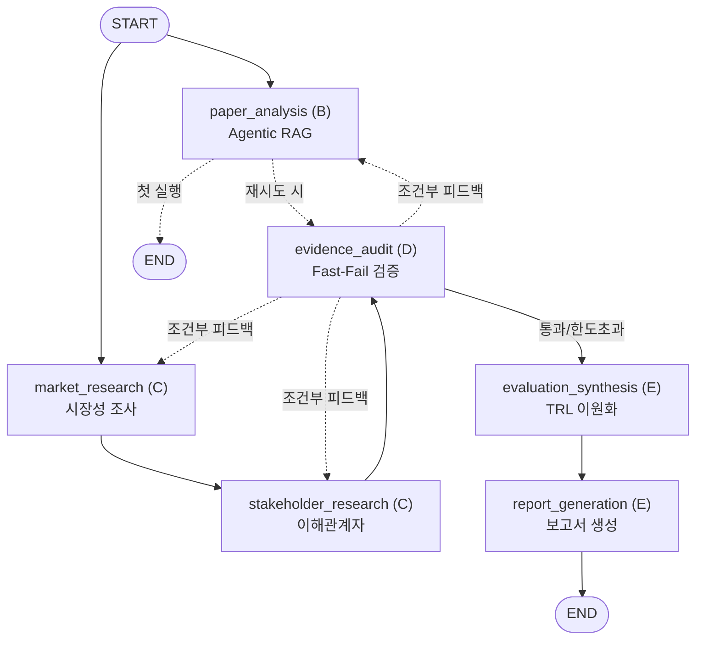

# KV Cache 최적화 기술 평가 LangGraph 멀티 에이전트 시스템 (팀 3)

> SKALA 4기 멀티 에이전트 프로젝트 (10:00 ~ 14:00)  
> 기술 비교: **KIVI** (SW 2-bit 양자화) vs **CXL-PNM** (HW CXL 근접 처리 가속)  
> 프레임워크: **Python 3.10+ / uv / LangGraph 1.2.12**

---

## 1. 프로젝트 아키텍처



## 2. 빠른 실행 방법

### 환경 준비
```bash
cp .env.example .env
# OPENAI_API_KEY 및 TAVILY_API_KEY 입력 (키 없이도 Fallback 동작 가능)

# uv 가상환경 설정 및 의존성 설치
uv venv
source .venv/bin/activate
uv pip install -r requirements.txt
```

### 전체 테스트 실행 (TDD 검증)
```bash
pytest tests/ -v
```

### 파이프라인 실행 및 보고서 생성
```bash
python main.py
test -s final_evaluation_report.md
```

## 3. 역할 분담
- **담당 A**: 아키텍처, State 계약, LangGraph 오케스트레이션 (`src/state.py`, `src/graph.py`, `main.py`)
- **담당 B**: Agentic RAG 및 임베딩 벤치마크 (`src/rag/**`)
- **담당 C**: 외부 웹 조사 엔진 (`src/research/**`)
- **담당 D**: 2단계 Fast-Fail 검증 엔진 (`src/audit/**`)
- **담당 E**: 다관점 종합 및 보고서 생성 (`src/synthesis/**`)
