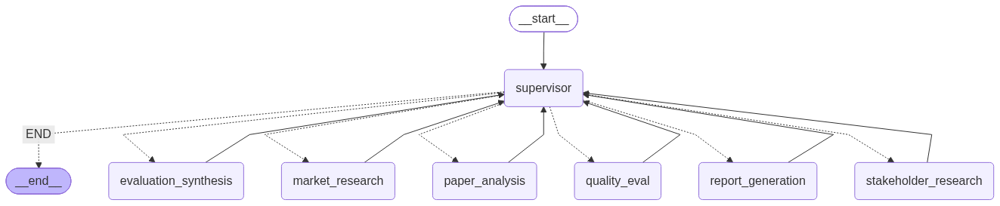

# Subject
본 프로젝트는 KV cache 최적화 기술을 소프트웨어(SW)와 하드웨어(HW) 두 진영에서 하나씩 선정하여, 기술 성숙도(TRL)·시장성·이해관계자·도메인 적합성 관점에서 평가하는 **Supervisor 패턴** 기반 멀티 에이전트 시스템을 LangGraph로 설계·개발하는 프로젝트이다.

> SKALA 4기 판교 9반 · 팀 3 · 평가 도메인: **클라우드 LLM 서빙**  
> 기술 비교: **KIVI** (SW, 2-bit KV 양자화) vs **CXL-PNM** (HW, CXL 메모리 내 근접 연산)  
> 원칙: 두 기술의 우열을 판정하지 않고, 관점 간 일치·불일치와 워크로드별 트레이드오프를 근거와 함께 기록한다.


## Overview
- **Objective** : KV cache 병목을 다루는 SW·HW 대표 기술을 4개 관점(TRL · 시장성 · 이해관계자 · 도메인 적합성)에서 근거 기반으로 비교 평가
- **Pattern** : Supervisor — Worker 수 확장보다 수집 근거의 충분성을 판단하고 부족한 관점만 재조사하는 품질 제어가 핵심이다. 기존 evidence audit/retry를 Supervisor의 중앙 제어로 확장해 specialized research role을 유지한 채 State 기반 targeted rework를 수행한다.
- **동적 처리** : Supervisor가 매 step의 current State를 확인하여 audit issue, quality rework target, `node_status`, `retry_count`, dependency에 따라 다음 Agent를 runtime에 결정한다. 수집이 끝난 뒤에도 평가 종합·보고서 생성·품질 평가·종료를 Supervisor가 `node_status`와 품질 결과로 고른다. `paper → market → stakeholder` 고정 순서를 사용하지 않으므로 실행마다 방문 Agent·순서·retry 횟수가 달라질 수 있다.
- **Tools** : LangGraph, FAISS, Tavily Search, Jinja2, Streamlit, xhtml2pdf


## Selected Technologies
- **SW : KIVI** (Liu et al., ICML 2024, arXiv:2402.02750) — Key는 채널 단위, Value는 토큰 단위로 비대칭 2-bit 양자화한다. 재학습 없이 기존 GPU·HBM 위에서 소프트웨어만으로 적용할 수 있는 KV cache 전용 기법이다.
- **HW : CXL-PNM** (Kim et al., PACT 2025, arXiv:2511.00321) — 전체 KV를 CXL 메모리에 보관하고, 모듈 내 PNM 가속기가 중요 토큰 선택과 어텐션을 수행해 GPU recall을 제거한다. 성능 수치는 7nm 설계 기반 사이클 단위 **시뮬레이션** 결과다.
- **선정 이유** : 같은 병목(KV cache 메모리 용량)을 "데이터를 줄이는 방식(SW)"과 "저장 공간·연산 위치를 옮기는 방식(HW)"이라는 상반된 방법으로 해결해, 관점별로 장단점이 뚜렷하게 갈린다. 두 기술 모두 KV cache를 직접 다루는 정식 학회 논문이라 원문 분석이 가능하다. 후보 6개(TurboQuant, DeepSeek-V2 MLA, InfiniGen, ITME 제외)의 검토 과정은 설계서 2장에 있다.


## Features
- **PDF 원문 기반 정보 추출** : KIVI·CXL-PNM 논문 PDF를 청킹·임베딩해 FAISS로 검색하고, 검색된 원문 청크를 Evidence snippet으로 Claim에 연결
- **Agentic RAG Loop** : `tech` 필터 top-5 검색 → 충분성 게이트 → Query Rewrite(최대 2회, 평가 축이 바뀐 Rewrite는 거부) → 실패 시 `insufficient`(corpus 내 근거 미확인)
- **외부 웹 조사** : Tavily로 시장성(채택·배포·생태계·도입 장벽)과 이해관계자(4대 Actor × 기술 계열)를 조사한다. 시장성 결과는 State에 저장되며 Supervisor가 dependency를 확인한 뒤 이해관계자를 선택한다.
- **Supervisor 기반 근거 검증** : Supervisor가 R1~R5 감사 결과, 재시도 상태, 시장→이해관계자 의존성을 보고 다음 Research Agent를 동적으로 선택(관점별 최대 2회, 전체 최대 10 step). R5 판정은 같은 Claim·근거 입력이면 캐시를 재사용한다
- **TRL 이원화** : 개별 기술 성숙도(`tech_trl`)와 기술 계열 생태계 성숙도(`family_trl`)를 분리 산출
- **보고서 자동 생성** : 검증된 Claim으로 보고서 view를 만들고 Jinja2 템플릿으로 결정적으로 렌더링한다. LLM(`gpt-4o`)은 근거 문장 필드만 한국어로 번역하고, 인용 번호·Claim ID·수치 표기는 템플릿이 결정한다. 배포 장벽(반대 근거)에도 출처 번호를 붙이고, 6장 Evidence Gap에는 미확인 사유를 공개한다 → `final_evaluation_report.md` / `.pdf`, Streamlit 대시보드 제공
- **보고서 품질 평가** : `quality_eval`이 **3안 Hybrid**로 판정한다. 1단계 규칙(결정적)이 아래 항목을 검사하고, 통과한 보고서만 2단계 LLM Judge가 본문을 채점해 State에 기록한다. Supervisor가 재수집 또는 종료를 결정한다 (최대 2회 평가).

  | 항목 | 판정 기준 (`src/synthesis/quality.py`) |
  | :--- | :--- |
  | Groundedness | 검증된(`ok`) Claim 전부가 Evidence → Source로 연결되는가 |
  | 중립성 | 보고서에 우열·추천 표현(예: "~를 추천한다", "~가 더 우수하다", "the winner is")이 없는가 |
  | 편향 통제 | 외부 조사(market·stakeholder·MAT-A)에서 같은 관점의 검증 Claim이 2건 이상이면 출처가 2개 이상인가. 반대 쿼리 수행 여부는 Supervisor 근거 검증 R3가 보장하므로 다시 검사하지 않는다 |
  | 관점 커버리지 | 기술별로 성숙도 ≥1, 시장성 ≥1, 도메인 ≥3 검증 Claim, 이해관계자 4대 Actor별 ≥1 검증 Claim. 그 칸의 Claim을 만드는 에이전트(예: MAT-A는 market, MAT-R·DOM은 paper)가 재수집 한도를 다 썼고 6장 Evidence Gap에 공개했으면 통과 |
  | 필수 목차 | `SUMMARY`, `REFERENCE` 포함 |
  | 2단계 LLM Judge (`src/synthesis/quality_judge.py`) | 규칙을 통과한 보고서 본문을 Groundedness·중립성·편향 통제·커버리지·일관성(절 사이 모순) 5개 항목, 1–5점 기준표로 채점 (`gpt-4o`, 4점 이상 통과) |

  - 재수집할 수 있는 대상(재시도 한도가 남은 에이전트)이 있으면 Supervisor가 해당 Agent를 다시 선택하고, 이후 평가 종합 → 보고서 → 품질 평가를 다시 거친다. 재수집 대상이 없는 미달(근거 부족 한도 소진, 서술·형식·Judge 미달)은 종료한다. 보고서 생성이 템플릿 + 필드 번역이라 같은 State로 다시 만들어도 결과가 같기 때문이다(#70). 미달 결과는 `final_quality_result.json`에 남는다.
  - 3안 선정 이유: 1안(규칙만)은 형식만 검사해 보고서 생성 단계의 근거 없는 서술, 정규식 밖 우열 뉘앙스, 절 사이 모순을 놓친다. 2안(Judge만)은 비결정적이고 매번 호출 비용이 든다. 그래서 규칙 미달이면 Judge를 부르지 않는 Fast-Fail로 비용을 줄이고, Judge가 미달로 판정하면 보고서 원문 인용을 요구한다(인용이 없으면 1회 재질의 후 무효). API 키가 없거나 호출이 실패하면 규칙 판정만 쓴다.
  - `main.py`는 최종 품질 평가 결과(통과 여부·미달 항목·미충족 칸·6장 공개 칸)를 출력하고 `final_quality_result.json`으로 저장한다.
- **확증 편향 방지 전략** :
  - 모든 외부 조사 항목에 지지 쿼리와 반대 쿼리를 병행(R3). 반대 근거가 없으면 `counter-evidence not found`로 기록하고 상충을 만들지 않음
  - 출처 Tier(T1~T4) 부여, T4(커뮤니티·개인 블로그) 단독 근거 금지(R2)
  - 벤더 발표는 `vendor_claim`, 논문 시뮬레이션 수치는 `simulation`으로 구분(R4)
  - 우열·승자·추천 문장 금지, 근거가 부족한 Claim은 결론에서 제외하고 한계점(Evidence Gap)에만 기록
  - verified market/stakeholder/MAT-A Claim이 관점별 2건 이상이면 하나의 `source_id`에만 의존하지 않는지 최소 diversity 검사


## Tech Stack
| 구분 | 사용 기술 |
| :--- | :--- |
| Framework | LangGraph 1.2.12 (Python 3.11, uv) |
| LLM / Generator | `gpt-4o-mini` (질의 생성·Query Rewrite·웹 근거 요약·Claim 추출), `gpt-4o` (보고서 근거 문장 번역) |
| LLM / Judge | `gpt-4o` (근거 검증 R5: Claim–Evidence 일치 판정, Pydantic Structured Output). 보고서 품질 평가 2단계 Judge: 규칙 통과 보고서 본문 5개 항목 채점 |
| Retrieval | FAISS (로컬 인덱스, top-k 5, `tech` 메타데이터 필터) — **Hit@5 0.80, MRR 0.596** (코퍼스 기반 20개 질의) |
| Embedding | `intfloat/e5-small-v2` (비교: `BAAI/bge-small-en-v1.5` Hit@5 0.75, MRR 0.548 → Hit@5 ≥ 0.8 기준으로 채택) |
| Web Search | Tavily Search |
| Report | Jinja2, xhtml2pdf (한글 폰트 `NanumGothic`) |

### Embedding 모델 선정
논문 원문에서 만든 질의 20개(KIVI·CXL-PNM 각 10개)로 코퍼스 청크 검색 성능을 측정했다. **Hit@5 ≥ 0.8을 만족하는 소형 모델 중 MRR이 가장 높은 모델**을 채택하고, 소형 모델이 모두 미달하면 `BAAI/bge-m3`로 전환한다.

| 모델 | 규모 | Hit@5 | MRR | Hit@5 ≥ 0.8 | 결과 |
| :--- | :---: | :---: | :---: | :---: | :--- |
| `BAAI/bge-small-en-v1.5` | 33M | 0.75 | 0.548 | 미달 | — |
| `intfloat/e5-small-v2` | 33M | **0.80** | **0.596** | 충족 | **채택** |
| `BAAI/bge-m3` | 568M | — | — | — | 소형 모델이 기준을 충족해 미측정 |

> 근거: `src/rag/benchmark.py`, `src/rag/benchmark_results.json` (`python -m src.rag.benchmark`로 재현)


## Agents
| Agent / Node | 담당 | 역할 | 출력 State |
| :--- | :---: | :--- | :--- |
| `paper_analysis` | B | 논문 원문 Agentic RAG로 메커니즘·수치·한계·도메인 6대 축 추출, 연구 단계 TRL 근거(`MAT-R*`) 기록 | `tech_sw`, `tech_hw`, `domain`, `claims(DOM-*, MAT-R*)` |
| `market_research` | C | 기술 계열별 채택·배포·생태계·도입 장벽 조사, 채택 단계 TRL 근거(`MAT-A*`) 기록 | `market`, `claims(MKT-*, MAT-A*)` |
| `stakeholder_research` | C | 시장성 컨텍스트(`key_vendors`)를 이어받아 4대 Actor × 기술 계열의 Benefit·Concern·Barrier·Evidence 조사 | `stakeholder`, `claims(STK-01~08)` |
| `supervisor` | A/D | 조정 계층. 새 수집 결과가 있으면 내부에서 근거 검증(R1~R4 규칙 → R5 Judge)을 실행하고, audit issue·품질 재작업 대상·`node_status`·의존성으로 다음 Research Agent 1개를 선택한다. 수집이 끝나면 평가 종합 → 보고서 생성 → 품질 평가를 차례로 고르고, 품질 결과에 따라 재수집 또는 종료(`END`)를 결정한다. 실제 재작업 dispatch 때만 `retry_count` 증가 | `audit`, `claims[*].status`, `next_agent`, `retry_count`, `step_count`, `last_decision` |
| `evaluation_synthesis` | E | 관점 간 일치·불일치 정리, TRL 이원화 확정(0건 Fallback) | `trl`, `synthesis` |
| `report_generation` | E | 검증된 Claim으로 보고서 view 구성 → 근거 문장 필드 번역 → Jinja2 렌더링 | `report` |
| `quality_eval` | E | 3안 Hybrid 품질 평가 결과와 미달 원인·재작업 후보를 State에 기록하며, 다음 Node는 Supervisor가 결정 | `quality` |


## Architecture


> `build_evaluation_graph().get_graph().draw_mermaid_png()`로 실제 코드에서 생성한 그래프 (`docs/images/architecture.png`). 실선은 고정 엣지, 점선은 조건부 분기다.

| 엣지 | 종류 | 결정 주체 |
| :--- | :--- | :--- |
| `START → supervisor` | 고정 | — |
| `supervisor → 모든 작업 Node / END` | 조건부 (`route_supervisor`) | Supervisor가 현재 State로 `next_agent`를 선택 |
| `paper_analysis / market_research / stakeholder_research → supervisor` | 고정 | Research Agent는 항상 Supervisor로 복귀 |
| `evaluation_synthesis / report_generation / quality_eval → supervisor` | 고정 | 보고서 단계도 작업 후 Supervisor로 복귀 |

### 데이터 흐름 (End-to-End Data Flow)
파이프라인은 24개 State field(Payload 13 + Control 11)를 사용하며, Research Agent 간 직접 통신 없이 Supervisor를 통해서만 제어된다.

| 단계 | 실행 노드 (담당) | 입력 State | 처리 내용 | 출력/누적 State |
| :---: | :--- | :--- | :--- | :--- |
| **Step 1<br/>초기화 & 동적 선택** | `START` → `supervisor` (A/D) | `INITIAL_INPUT_STATE` | • 대상 기술 및 제어 metadata 주입<br/>• audit/coverage/retry/dependency를 읽어 다음 Research Agent를 한 개 선택 | `selected`, `node_status`, `retry_count`, `step_count` |
| **Step 2<br/>논문 RAG 분석** | `paper_analysis` (B) | `selected` | • KIVI/CXL-PNM 원문 PDF 청킹 및 E5 임베딩 벡터 검색<br/>• 정량 실험 수치(실측/시뮬레이션 구분) 및 6대 축 적합성 추출 | `tech_sw`, `tech_hw`, `domain`,<br/>`claims(DOM-*, MAT-R*)`, `evidence`, `sources` |
| **Step 3<br/>시장성 및 이해관계자** | `market_research` 또는<br/>`stakeholder_research` (C) | `selected`<br/>(stakeholder는 `market` State 의존) | • Tavily Web Search 기반 최신 시장 동향 및 배포 장벽 조사<br/>• 4대 Actor(서빙 운영자, 프레임워크 개발자, End User, HW·메모리 공급자) × 기술 계열 2개 관점 영향도 분석<br/>• 시장 결과 저장 뒤 Supervisor가 dependency를 확인하여 이해관계자 작업을 선택 | `market`, `stakeholder`,<br/>`claims(MKT-*, STK-*)`, `evidence`, `sources` |
| **Step 4<br/>Supervisor audit & routing** | `supervisor` (A/D) | `claims`, `evidence`, `sources`, control State | • R1~R5 audit 후 current State에서 한 Agent만 선택<br/>• 실제 retry dispatch만 count하며 market refresh는 stakeholder를 stale 처리 | `audit.issues`, `next_agent`, `retry_count`, `node_status` |
| **Step 5<br/>TRL 이원화 & 종합** | `supervisor → evaluation_synthesis → supervisor` (E/A) | `claims`, `evidence`, `tech_*`, `market`, `stakeholder` | • 개별 기술 TRL(5-6 / Unknown) vs 계열 산업 TRL(7-8) 이원화 평가<br/>• 기술별 트레이드오프 및 상호 보완적 하이브리드 결합 가능성 도출 | `trl`, `synthesis` |
| **Step 6<br/>보고서 생성 & 산출** | `supervisor → report_generation → supervisor` (E/A) | 전체 누적 State | • 검증된 Claim으로 보고서 view 구성, 근거 문장 필드 번역 및 Jinja2 렌더링<br/>• Markdown/PDF 자동 변환 | `report`,<br/>`final_evaluation_report.md`, `final_evaluation_report.pdf` |
| **Step 7<br/>보고서 품질 평가** | `supervisor → quality_eval → supervisor` (E/A) | `report`, `claims`, `evidence`, `sources`, `retry_count` | • 1단계 규칙과 2단계 LLM Judge로 품질 판정<br/>• Supervisor가 재수집 또는 종료를 선택 | `quality` → `final_quality_result.json` |


## State Schema
`src/state.py`의 `OverallState`는 `PayloadState`(13)와 `ControlState`(11)를 결합한 24개 field다.

- **제어 vs 페이로드 분리** : `PayloadState`는 Agent가 만든 작업 결과(`selected`, `tech_sw`, `tech_hw`, `domain`, `market`, `stakeholder`, `claims`, `evidence`, `sources`, `audit`, `trl`, `synthesis`, `report`)이고, `ControlState`는 Supervisor 조정·종료·재개에 필요한 최소 상태(`retry_count`, `next_agent`, `node_status`, `step_count`, `trace_id`, `quality`, `last_audited_step`, `last_decision`, `last_error`, `last_errors`, `node_attempts`)다. 라우팅은 `audit.issues`, `quality.rework_targets`, `node_status`, `retry_count`만 읽는다.
- **관측성 위치** : 결정 로그 본문은 State에 쌓지 않는다. State에는 최신 결정 `last_decision`(`next`, `reason`)만 덮어쓰고, 전체 결정 이력은 LangSmith trace에서 확인한다.
- **지속성 비용** : 대용량 로그·검색 원문을 State에 누적하지 않는다. `claims`/`evidence`/`sources`는 ID·URL 기준 reducer로 최신 구조화 결과만 유지해, 재작업을 반복해도 checkpoint마다 무한히 늘지 않는다.
- **상관** : `make_initial_state()`가 실행마다 UUID `trace_id`를 만들고, `main.py`가 이를 LangGraph `thread_id`로 전달해 State·checkpoint·LangSmith trace를 같은 키로 잇는다.
- **재개/복구** : `node_status`(수집 `paper`·`market`·`stakeholder`와 보고서 단계 `synthesis`·`report`·`quality`, 값은 `pending`/`complete`/`stale`/`failed`), `node_attempts`, `last_error`/`last_errors`, `retry_count`, `step_count`, `last_audited_step`으로 중단·실패·재시도 상태를 판단한다. Worker 첫 실패는 `pending`으로 되돌려 1회 재시도하고, 반복 실패는 `failed`로 둔다. `main.py`는 `InMemorySaver` checkpointer로 실행한다.
- **동시 처리** : Supervisor는 한 번에 Research Agent 하나만 dispatch해 제어 field의 동시 쓰기를 없앴다. 재작업으로 같은 Claim이 다시 들어와도 `upsert_claims`(Claim ID), `upsert_evidence`(Evidence ID), `union_sources`(Source ID·URL 중복 제거) reducer가 덮어써 오염을 막는다. market → stakeholder 의존은 엣지가 아니라 `node_status`로 표현하고, market 재작업 시 stakeholder를 `stale`로 바꿔 다시 수집한다.
- **종료 보장** : 관점별 재작업 `RETRY_LIMIT=2`, Research dispatch `MAX_STEPS=10`, 보고서 품질 평가 `MAX_QUALITY_ATTEMPTS=2`, Worker 실패 1회 재시도로 모든 루프를 제한한다. 마지막 재작업 후에도 검증 이슈가 남은 Claim만 `insufficient`/`rejected`로 확정해 6장 Evidence Gap에 공개한다.

## Evaluation Results
최종 평가 보고서(`final_evaluation_report.pdf`, 2026-10-07 실행 결과) 기준이다. LLM·웹 검색 결과에 따라 실행마다 일부 Claim은 달라질 수 있다.

### TRL 추정 결과 (TRL 이원화)
| 기술 | 개별 기술 성숙도 (`tech_trl`) | 계열 생태계 성숙도 (`family_trl`) | 신뢰도 | 근거 Claim |
| :--- | :---: | :---: | :---: | :--- |
| **KIVI** (SW) | 5-6 | 7-8 | high | 연구: DOM-01, DOM-05, DOM-09, DOM-11, MAT-R01 / 채택: MKT-02 |
| **CXL-PNM** (HW) | 3-4 | 7-8 | high | 연구: DOM-02, DOM-04, DOM-06, DOM-10, DOM-12, MAT-R02 / 채택: MKT-03, MKT-04, MKT-06, MAT-A02 |

> 판정 규칙(`src/synthesis/evaluator.py`): 연구 근거(domain·MAT-R)에 `fact`가 있으면 `tech_trl` 5-6, `simulation`만 있으면 3-4. 채택 근거(market·MAT-A)에 `fact`가 있으면 `family_trl` 7-8, `vendor_claim`만 있으면 6-7.

- 두 기술 모두 계열 생태계(KV 양자화 / CXL 메모리 확장)는 7-8 수준이지만, 개별 기술은 KIVI가 오픈소스 구현 단계(5-6), CXL-PNM이 시뮬레이션 연구 단계(3-4)로 **개별 기술과 계열 사이의 성숙도 간극**이 드러난다.

## Directory Structure
```
├── data/
│   ├── papers/              # 문서 풀: KIVI·CXL-PNM 논문 PDF
│   ├── fonts/               # PDF 보고서용 한글 폰트
│   ├── eval_queries.json    # 임베딩 벤치마크 질의 20개
│   └── faiss_index/         # FAISS 로컬 인덱스 (indexer.py로 생성, git 제외)
├── src/
│   ├── supervisor.py        # [조정 계층] Supervisor: 근거 검증 호출 · State 기반 다음 Agent 선택
│   ├── graph.py             # StateGraph 조립 (Supervisor 허브 · 품질 평가 loop)
│   ├── state.py             # OverallState 24개 field (Payload 13 + Control 11) + Custom Reducer
│   ├── config.py            # 모델명 · 경로 · API 키
│   ├── rag/                 # [B] indexer · benchmark · agentic_rag (paper_analysis)
│   ├── research/            # [C] client · market · stakeholder
│   ├── audit/               # [D] 근거 검증 로직 rules(R1~R4) · judge(R5) · auditor (Supervisor 내부에서 호출)
│   └── synthesis/           # [E] evaluator · report_gen · quality(규칙) · quality_judge(LLM Judge) · pdf_export
│       └── templates/       # 보고서 템플릿 (report.md.j2)
├── tests/                   # 모듈별 단위 테스트 + mock_data.py (외부 API mock)
├── scripts/                 # OpenWiki 리포트 생성 스크립트
├── tasks/                   # 역할별 개발 가이드 · 공통 규칙 · 코드 리뷰 프롬프트
├── docs/                    # 구현 계획 · 명세 · 아키텍처 이미지(images/)
├── KV_cache_최적화_기술_평가_설계서_최종.md   # 설계서
├── main.py                  # 실행 스크립트 (non-interactive)
├── app.py                   # Streamlit 대시보드
├── final_evaluation_report.md / .pdf   # 평가 결과 (실행 시 생성, git 제외)
├── final_quality_result.json           # 최종 품질 평가 결과 (실행 시 생성, git 제외)
└── README.md
```


## Usage
### 1. 환경 변수 설정
`.env.example`을 복사해 `.env`를 만들고 키를 입력한다. API 키가 없어도 Fallback으로 크래시 없이 동작하지만, 실제 검색·RAG 결과를 얻으려면 `OPENAI_API_KEY`와 `TAVILY_API_KEY`가 필요하다.

```bash
cp .env.example .env
```

```dotenv
OPENAI_API_KEY=
LANGCHAIN_API_KEY=
LANGCHAIN_TRACING_V2=true
LANGCHAIN_ENDPOINT=https://api.smith.langchain.com
LANGCHAIN_PROJECT=RAG-PROJECT
HF_TOKEN=
TAVILY_API_KEY=
```

| 환경 변수 | 필수 여부 | 기본/예시 값 | 설명 |
| :--- | :---: | :--- | :--- |
| `OPENAI_API_KEY` | 선택 (권장) | `sk-...` | **OpenAI API Key**: 근거 검증 R5 Judge와 보고서 품질 평가 2단계 Judge(`gpt-4o`), 보고서 근거 문장 번역(`gpt-4o`), 리서치 질의 생성·요약·Claim 추출(`gpt-4o-mini`)에 사용됩니다. (미설정 시 Judge·번역 없이 규칙 기반 Fallback으로 동작) |
| `LANGCHAIN_API_KEY` | 선택 | `lsv2_pt_...` | **LangSmith API Key**: LangGraph 멀티 에이전트 실행 흐름, 노드 간 State 전이 및 LLM 호출 트레이싱 모니터링에 사용됩니다. |
| `LANGCHAIN_TRACING_V2` | 선택 | `true` | **LangSmith V2 트레이싱 활성화**: 실행 로그 및 그래프 트레이스를 LangSmith로 전송할지 여부 (`true` / `false`). |
| `LANGCHAIN_ENDPOINT` | 선택 | `https://api.smith.langchain.com` | **LangSmith 엔드포인트 URL**: 트레이싱 데이터를 수신하는 LangSmith 서버 주소. |
| `LANGCHAIN_PROJECT` | 선택 | `RAG-PROJECT` | **LangSmith 프로젝트명**: LangSmith 대시보드에서 트레이스를 그룹화하여 확인할 프로젝트 이름. |
| `HF_TOKEN` | 선택 | `hf_...` | **Hugging Face Token**: RAG 임베딩 모델(`intfloat/e5-small-v2`) 다운로드 속도 향상 및 Hugging Face API Rate Limit 완화용. |
| `TAVILY_API_KEY` | 선택 (권장) | `tvly-...` | **Tavily Search API Key**: 시장성 조사(`market_research`) 및 이해관계자 리서치(`stakeholder_research`) 노드의 실시간 웹 검색에 사용됩니다. (미설정 시 검색 결과 없이 진행하며, 해당 Claim은 `insufficient`로 처리) |

### LangSmith 제출 캡처

- **Trace A (정상)**: `Supervisor → research agents → Supervisor → synthesis → report → quality pass` 순서, conditional routing·방문 순서·`trace_id`·최종 종료를 캡처한다.
- **Trace B (재작업)**: `Supervisor → targeted research agent → Supervisor → audit issue → targeted rework → Supervisor → synthesis → report → quality` 순서와 retry/rework 또는 quality loop를 캡처한다.
- 캡처 파일명은 순서대로 `tracing-1.png`, `tracing-2.png`, …로 저장한다 (긴 경로는 여러 장으로 나눔).
- 최종 실행 뒤 `final_evaluation_report.pdf`가 **10p 이하**이며 `SUMMARY`, `REFERENCE` 목차를 포함하는지 확인한다.

### 2. 설치 및 테스트
```bash
uv venv && source .venv/bin/activate
uv pip install -r requirements.txt
pytest tests/ -v
```

### 3. 실행
```bash
python main.py                  # 평가 파이프라인 실행 → final_evaluation_report.md / .pdf, final_quality_result.json 생성
```

대시보드(선택)는 `streamlit`이 `requirements.txt`에 포함되어 있지 않아 별도 설치 후 실행한다.
```bash
uv pip install streamlit
streamlit run app.py
```

### 4. RAG 인덱스 재생성 (필요 시)
```bash
python -m src.rag.indexer       # data/papers/*.pdf → data/faiss_index/
python -m src.rag.benchmark     # 임베딩 모델 Hit@5 · MRR 측정
```


## Contributors
Agent 과제(Multi-Agent Orchestration) 기준 개인별 수행 역할이다.

| 이름 | 담당 | 수행 내용 |
| :--- | :--- | :--- |
| **강건호** | 품질 평가 Hybrid · 코드 정리 | 보고서 품질 평가 3안 Hybrid 전환·일관성 검사·R5 판정 캐시(#81), AI 생성 코드 정리와 코드 리뷰 프롬프트(#58, #62, #64) |
| **김효민** | 패턴 설계 · 품질 평가 · 검증 | Supervisor 전환안 설계(#45), 보고서 품질 평가 설계·구현(#60), 통합 브랜치 실행 검증·이슈 분리(#61, #67~#75), README 정비(#78, #82) |
| **윤영민** | Supervisor 승격 | `evidence_audit`를 Supervisor로 승격, 직접 엣지를 State 기반 분기로 전환 (#56) |
| **전경호** | Supervisor 시안 · 품질 게이트 | Supervisor + Layered State + 품질 루프 시안(#47), 커버리지 Gap 공개 예외(#65), 배포 장벽 출처 인용·Gap 사유 공개·무의미한 재작성 경로 제거(#79) |
| **정은희** | 통합 구현 · 보고서 | Supervisor 통합 브랜치 구현(라우팅·품질 게이트·워커 재시도), 품질 게이트 재작업 판단 정리(#73), 근거 기반 보고서 재구성·번역·PDF 개선 |
| **최지윤** | 실행 정책 · RAG | Hub-Spoke 시안(#46), Payload/Control State 분리·checkpoint·retry 정책·RAG 개선(#66), 보고서 단계 라우팅 Supervisor 일원화(#80) |

### 평가 보고서의 핵심 포인트
| 이름 (가나다순) | 담당 | 평가 보고서 핵심 포인트 (Key Takeaway) | 비고 |
| :--- | :---: | :--- | :--- |
| **강건호** | 담당 D | • 엄격한 Fast-Fail 2단계 검증(Rule + LLM Judge)을 통해 환각(Hallucination) 및 출처 없는 주장을 사전 차단하여 보고서의 신뢰도와 객관성을 극대화함.<br/>• 수치 왜곡 방지 및 Claim-Evidence 일치성 검증으로 학술 논문/웹 출처에 기반한 사실 검증 체계 확립. | Fast-Fail 검증 |
| **김효민** | 담당 C | • 서빙 운영자, 프레임워크 개발자, End User, HW·메모리 공급자 4대 Actor × 기술 계열(KV Quantization / CXL Memory Expansion) 관점의 분석 반영.<br/>• KIVI는 기존 GPU·HBM에서 소프트웨어만으로 적용 가능한 반면 정확도·운영 위험이, CXL-PNM은 새 인프라 도입 비용·지연·호환성이 도입 장벽으로 나타남을 대조. | 이해관계자 리서치 |
| **윤영민** | 담당 A | • SW 양자화(KIVI)와 HW 메모리 확장(CXL-PNM)의 상호 배타적 경쟁이 아닌 '하이브리드 결합 가능성'을 도출.<br/>• Fast-Fail 피드백 루프와 TRL 이원화 체계를 결합한 안정적 엔드투엔드 파이프라인 완성. | 오케스트레이션 |
| **전경호** | 담당 C | • 글로벌 데이터센터 현장 관점에서의 최신 시장 동향 및 배포 장벽(Latency 오버헤드, CXL 상용화 성숙도) 발굴.<br/>• 단기적 실용성(SW 압축)과 장기적 메모리 풀링(HW 확장)의 시장 수용 주기 차이를 규명. | 웹 시장성 조사 |
| **정은희** | 담당 E | • 개별 기술 TRL과 계열 산업 TRL을 분리하는 TRL 이원화 평가를 통해 시뮬레이션 지표와 실증 기술의 성숙도 간극을 체계적으로 조명.<br/>• 학술·시장·검증 데이터를 통합한 고품질 기술 평가 보고서 템플릿 완성. | 다관점 종합 보고서 |
| **최지윤** | 담당 B | • E5 임베딩 기반 논문 Agentic RAG를 통해 KIVI 2.6× peak memory 절감(모델 가중치 포함), 최대 4× 배치 확장 등 핵심 정량 데이터를 논문 원문으로부터 오차 없이 추출·제공. | Agentic RAG |

### Lessons Learned
| 이름 | Keep | Problem / Try | Lesson |
| :--- | :--- | :--- | :--- |
| 강건호 | 규칙 검사와 LLM Judge를 묶은 2단계 검증, 문제가 있는 에이전트만 다시 돌리는 재작업 구조를 설계한 대로 구현했다. | Judge 프롬프트 문구가 조금만 달라도 정상 Claim을 오탐해서 프롬프트를 여러 번 고쳐야 했다. | 근거 검증이 약하면 뒤 단계 결과를 믿기 어렵다는 걸 체감했다. |
| 김효민 | 4대 Actor 분석을 Benefit·Concern·Barrier·Evidence라는 같은 구조로 정리했다. | 참조가 끊긴 Source가 R2 검사를 경고 없이 통과했고, 재시도 한도를 다 쓴 Claim은 보고서 어디에도 나오지 않았다. | State 계약에는 참조 무결성과 종료 상태를 어느 노드가 책임지는지까지 적어 둬야 한다. |
| 윤영민 | State를 엄격히 나누고 피드백 루프를 설계해 병렬 개발 중 충돌을 줄였다. | Agent 구성부터 정하고 보고서를 맞추다 보니 선정 근거가 부족했다. 다음에는 보고서 형식을 먼저 정하고 Agent를 고르는 순서로 해 보려 한다. | 보고서 형식을 먼저 정하면 LangGraph 설계와 개발이 훨씬 수월하다. |
| 전경호 | 질의를 자연어 질문으로 바꾸고, 키가 없을 때 가짜 URL 대신 빈 결과와 `insufficient`를 돌려주게 해서 결과 품질이 좋아졌다. | 각자 유닛 테스트는 통과했는데 같은 출처를 서로 다르게 분류하고 있어서, 합치자 좋은 데이터가 버려졌다. 공용 파일은 미리 조율해야 한다. | "가짜보다 정직한 실패가 낫다." 유닛 테스트가 통과해도 통합하면 깨질 수 있다. |
| 정은희 | TRL 이원화, 출처 Tier, Claim·Evidence·Source 분리로 근거 수준을 관리하는 보고서 구조를 만들었다. | 여러 노드에서 모인 문장의 말투를 맞추는 데 손이 더 들었다. | 모듈마다 무엇을 받고 무엇을 돌려주는지 먼저 정해야 한다. 검색 실패나 근거 부족도 정상 흐름에서 처리해야 보고서 품질을 지킬 수 있다. |
| 최지윤 | 임베딩 벤치마크로 모델을 골랐고, 평가 축이 바뀐 Rewrite는 거부하고 여러 청크의 Evidence를 한 Claim에 연결하도록 보완했다. | 검색된 청크가 지금 평가 축에 직접 답하는지 확인하지 않으면, 대역폭 질문에 처리량 수치가 붙는 식의 잘못된 Claim이 나왔다. | 검색된 문장을 바로 근거로 쓸 수는 없고, Rewrite도 원래 질문의 뜻을 지켜야 한다. |
