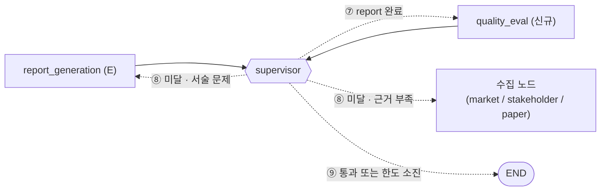

# 보고서 품질 평가 설계 (`quality_eval`)

> 상태: **구현 완료 (기준값은 팀 보정 필요, 11절)** · 구현 브랜치: **`feat/quality-eval`** (기반: `feat/hyomin-supervisor-pattern`, PR #45)
> 근거: 과제 지시사항 "D. 보고서 품질 평가" · 설계서 3.7–3.8, 6장 · [`2026-10-07-supervisor-plan2.md`](2026-10-07-supervisor-plan2.md)

---

## 1. 결정 요약

| 항목 | 결정 |
|---|---|
| 평가 방식 | **3안 Hybrid**: 1단계 규칙 검사 → 2단계 LLM Judge |
| 구조 | **2단계 Fast-Fail**. 1단계 규칙에서 실패하면 Judge를 부르지 않고 바로 재작업으로 보낸다. 1단계를 통과하면 Judge가 내용을 판정한다 |
| 평가 항목 | Groundedness · 중립성 · 편향 통제 · 관점 커버리지 (지시사항 최소 항목) + 형식(10장 상한, 렌더링 오류) |
| 통과 기준 | 1단계 규칙 전부 통과 **그리고** Judge 4개 항목 모두 4점 이상(5점 만점) |
| 미달 시 | Supervisor가 실패 원인에 맞는 노드로 재작업을 보낸다. 보고서 개정은 최대 2회다 |
| 한도 소진 시 | 미통과 항목을 보고서 6.3절에 공개하고 종료한다 |

### 왜 3안인가

- **1안(형식만)으로는 내용을 못 본다.** 금지어 없이 "KIVI가 현실적인 선택이다"라고 쓰면 중립성 검사를 통과한다.
- **2안(LLM만)은 비결정적이다.** 같은 보고서도 실행마다 판정이 달라질 수 있어 재현성(채점 10점)에 불리하다. 인용 번호가 REFERENCE에 실제로 있는지 같은 검사는 코드로 하는 편이 정확하다.
- **기존 설계와 같은 구조다.** `evidence_audit`가 이미 "R1~R4 규칙 → R5 Judge"로 동작한다. README에는 "Claim 검증과 보고서 검증 모두 2단계 Fast-Fail"이라고 한 줄로 설명할 수 있다.

---

## 2. 그래프 내 위치



`decide()`에 추가할 규칙(기존 ⑥ "synthesis → report → END"를 대체):

| 규칙 | 조건 | 다음 노드 |
|---|---|---|
| ⑦ | `report_generation`이 done이고, `quality_eval`이 pending 또는 stale | `quality_eval` |
| ⑧ | `report_eval.passed == False`이고 재작업 여유가 있음 | Supervisor가 `collect_agents`와 `retry_count`로 정한 노드 (6.1절) |
| ⑨ | `report_eval.passed == True`, 또는 한도 소진 | END |

- 재작업 대상이 수집 노드이면 `evaluation_synthesis`, `report_generation`, `quality_eval`을 `stale`로 바꾼다. 수집부터 다시 했으니 종합·보고서·평가도 다시 거친다.
- `report_generation`으로 보낼 때는 `quality_eval`만 `stale`로 바꾼다.

---

## 3. 인터페이스

### 3.1 State

```python
class QualityItem(TypedDict):
    passed: bool
    score: int | None        # Judge 점수 1–5. 규칙만 본 항목은 None
    failures: list[str]      # 실패한 규칙 ID와 메시지. 예: "G1: 3.1절 KIVI Claim DOM-03에 인용 번호 없음"
    quotes: list[str]        # Judge가 지목한 문제 문장 원문

class ReportEval(TypedDict):
    passed: bool
    stage: Literal["rules", "judge"]       # 어느 단계에서 판정이 끝났는지
    items: dict[str, QualityItem]          # groundedness | neutrality | bias | coverage | format
    collect_agents: list[str]              # 근거 부족(C5·B2)으로 재수집이 필요한 관점. 재작업 대상 결정은 Supervisor
    feedback: str                          # report_generation 프롬프트에 넣을 수정 지시 (1,500자 이내)

class OverallState(TypedDict):
    ...
    report_eval: ReportEval | None         # 신규. overwrite (최신 판정만 유지)
```

- `retry_count["report"]`: 보고서 개정 횟수. 기존 dict에 키만 추가하므로 스키마 변경은 없다.
- 판정 이력은 State에 쌓지 않는다. `quality_eval` 실행마다 출력이 LangSmith 트레이스에 남는다.

### 3.2 모듈과 담당

| 파일 | 함수 | 담당 |
|---|---|---|
| `src/quality/rules.py` | `run_quality_rules(report: str, skeleton: str, state) -> dict[str, QualityItem]` | 김효민 |
| `src/quality/judge.py` | `run_quality_judge(report: str, state) -> dict[str, QualityItem]` | B 최지윤 |
| `src/quality/node.py` | `quality_eval_node(state) -> {"report_eval": ..., ["report": ...]}` | 김효민 |
| `src/synthesis/report_gen.py` | `render_skeleton(state) -> str` 분리(polishing 전 마크다운), `report_eval.feedback` 반영 | E 정은희 |
| `src/supervisor/supervisor.py` | `decide()`에 ⑦⑧⑨ 추가, `WORKERS`에 `quality_eval` 추가 | D 강건호 |
| `src/state.py`, `src/graph.py` | `ReportEval` 추가, 노드 등록 한 줄 | A 윤영민 |

`skeleton`은 State에 저장하지 않고 `render_skeleton(state)`로 다시 렌더링한다. 같은 State에서 같은 마크다운이 나오므로 결정적이고, State 크기도 늘지 않는다.

---

## 4. 1단계: 규칙 검사 (결정적, LLM 호출 없음)

**입력**:
- `report`: polishing까지 끝난 최종 마크다운
- `skeleton`: polishing 전 템플릿 결과
- `state`: `claims`, `evidence`, `sources`

### 4.1 Groundedness

| ID | 검사 | 판정 |
|---|---|---|
| G1 | 3.1, 3.2절의 Claim 줄(`- **[ID]** …`)마다 인용 번호 `[n]`이 1개 이상 있는가 | 하나라도 없으면 실패 |
| G2 | 본문의 모든 `[n]`이 REFERENCE 항목 번호 안에 있는가. REFERENCE의 모든 항목이 본문에서 1회 이상 인용됐는가 | 범위 밖 인용, 또는 인용되지 않은 참고문헌이 있으면 실패 (지시사항: REFERENCE = 실제 인용한 자료) |
| G3 | SUMMARY와 3–5장에 나온 Claim ID가 State에 `status == "ok"`로 있는가 | 없는 ID가 있거나, `insufficient`/`rejected` ID가 6장 밖에 나오면 실패 |
| G4 | 3–5장에서 polishing 전후 **숫자 집합이 같은가** (헤딩 번호와 `[n]`은 빼고 비교) | 숫자가 추가되거나 빠졌으면 실패. Polishing LLM이 수치를 바꾸는 것을 잡는다 |

### 4.2 중립성

| ID | 검사 | 판정 |
|---|---|---|
| N1 | 금지어가 있는 문장 중 **부정 표현이 없는 문장**<br/>금지어: `우수`, `승자`, `추천`, `권장`, `도입해야`, `더 낫`, `압도`, `최선`, `superior`, `outperform`, `winner`, `recommend`<br/>부정 표현: `않`, `없`, `아니`, `금지`, `배제`, `not`, `no ` | 1건 이상이면 실패. 6.2절 "우열을 결론내리지 않는다" 같은 문장은 부정 표현이 있어 통과한다 |
| N2 | 비교 우위 구문: `A(이/가) B보다 (더) 우수/낫/뛰어/적합/유리` | 1건 이상이면 실패 |

### 4.3 편향 통제

> T4 단독 근거(R2)와 반대 쿼리 수행(R3)은 근거 검증(`evidence_audit`)이 Claim 단위로 보장한다. 보고서에는 `status == "ok"` Claim만 들어가고, `ok`는 마지막 검증에서 R2·R3를 통과했다는 뜻이므로 여기서 다시 검사하지 않는다. (초안의 B3·B4는 리뷰 후 삭제)

| ID | 검사 | 판정 |
|---|---|---|
| B1 | 본문 인용 중 단일 출처가 차지하는 비율 | 40% 초과면 실패 |
| B2 | 시장성(4.2)과 이해관계자(4.3) 근거의 기술별 고유 출처 수 | 2개 미만이면 실패 → 재작업 대상은 해당 수집 노드 |
| B5 | KIVI와 CXL-PNM의 서술 분량 비율 (3.1 vs 3.2 글자 수) | 0.5–2 범위를 벗어나면 실패 |

### 4.4 관점 커버리지

| ID | 검사 | 판정 |
|---|---|---|
| C1 | 필수 목차가 순서대로 있는가: SUMMARY, 1–6, REFERENCE | 누락되거나 순서가 다르면 실패 |
| C2 | 3.1, 3.2, 4.1–4.4가 템플릿 기본 문구(`검증된 … 없다`)만으로 채워져 있지 않은가 | 기본 문구만 있으면 실패 |
| C3 | 4.3에 4대 Actor(서빙 운영자, 프레임워크 개발자, End User, 공급자)가 모두 있는가 | 누락되면 실패 |
| C4 | 4.4에 6대 축 행이 모두 있는가 | 누락되면 실패 |
| C5 | (관점 × 기술) 8칸마다 `ok` Claim이 1개 이상 인용됐거나, 6장 Evidence Gap에 명시됐는가 | 둘 다 아닌 칸이 있으면 실패 → 재작업 대상은 해당 관점의 수집 노드 |

### 4.5 형식

| ID | 검사 | 판정 |
|---|---|---|
| F1 | 헤딩이 템플릿 허용 목록(SUMMARY, 1–6, 3.1–3.2, 4.1–4.4, 5.1–5.5, 6.2–6.3, REFERENCE)에만 있는가 | 목록 밖 헤딩이 있으면 실패 |
| F2 | 렌더링 오류가 없는가: `{{`, `{%`, `{'`(dict 그대로 출력), `None` 단독 셀 | 1건 이상이면 실패 |
| F3 | PDF 10장 이하인가 (`convert_markdown_to_pdf`로 임시 파일 생성 → `pypdf`로 페이지 수 확인) | 10장 초과면 실패 (지시사항: 보고서 최대 10장) |

---

## 5. 2단계: LLM Judge (1단계 통과 시에만 실행)

### 5.1 입력

- `report`: 최종 마크다운
- **Claim 근거표**: `claims`(status ok) × `evidence.snippet` × `sources`(title, tier) 를 `ID | tech | perspective | kind | statement | snippet | tier` 형식 표로 전달한다. 보고서만 주면 Groundedness를 "그럴듯한지"로 판정하게 된다.
- **판정 집중 구간**: 3–4장은 템플릿이 Claim을 1:1로 옮긴 구간이다. 그래서 Judge는 LLM이 자유롭게 쓴 **SUMMARY와 5장**을 중심으로 판정하고, 나머지는 표본만 본다.

### 5.2 점수 기준 (1–5)

| 항목 | 5 | 4 (통과 하한) | 3 이하 (미달) |
|---|---|---|---|
| Groundedness | 모든 주장이 근거표의 snippet 범위 안에 있다 | 근거 범위를 살짝 넘는 일반화가 1건 있다 | 근거표에 없는 사실, 수치, 인과를 주장한다 |
| 중립성 | 우열·추천 뉘앙스가 0건이다 | 경미한 뉘앙스가 1건 있다 (예: 한쪽에만 긍정 형용사) | 명시적 추천, 결론이 한쪽으로 기움, 워크로드 조건 없이 단정 |
| 편향 통제 | 두 기술 모두 장점과 한계를 근거와 함께 제시한다 | 한쪽 기술의 한계 서술이 상대적으로 얕다 | 근거표에 있는 불리한 근거(한계, 반대 근거)를 누락하거나 축소한다 |
| 관점 커버리지 | 4관점 모두 두 기술에 대해 실질 내용이 있다 | 한 관점이 Gap 표기 위주지만 한계로 공개돼 있다 | 관점이 형식만 있고 내용이 없거나, Gap 공개 없이 빠져 있다 |

### 5.3 출력 (구조화)

```python
class JudgeItem(BaseModel):
    score: int = Field(ge=1, le=5)
    reason: str
    quotes: list[str]   # score < 5이면 문제 문장을 보고서에서 그대로 인용 (필수)

class JudgeVerdict(BaseModel):
    groundedness: JudgeItem
    neutrality: JudgeItem
    bias: JudgeItem
    coverage: JudgeItem
```

### 5.4 비결정성 통제

- `ChatOpenAI(model=JUDGE_LLM_MODEL, temperature=0, seed=고정값).with_structured_output(JudgeVerdict)`
- 점수마다 기준을 프롬프트에 넣는다(5.2 표 그대로).
- 미달 판정에는 `quotes`를 필수로 받는다. 인용 문장이 보고서에 실제로 있는지 코드로 확인하고, 없으면 그 항목 판정을 무효로 처리하고 1회 재호출한다. 지어낸 지적을 막기 위해서다.
- 호출은 보고서 1건당 1회다. 재호출은 무효 판정일 때만 한다.
- **Judge 모델**: 현재 config는 Polishing과 Judge가 모두 `gpt-4o`다. 자기가 쓴 글을 후하게 볼 수 있으므로 다른 모델로 바꾸는 것을 권장한다. 바꾸지 않으면 README 한계점에 적는다. (미결정, 9절)

### 5.5 API 키가 없을 때

`OPENAI_API_KEY`가 없으면 Judge를 건너뛰고 1단계 결과만으로 판정한다. 이때 `stage="rules"`로 기록하고 reason에 "Judge 미실행"을 남긴다. 기존 노드들의 Fallback 방식과 같다.

---

## 6. 판정 합성과 재작업 라우팅

```
rules = run_quality_rules(report, render_skeleton(state), state)
if 규칙 실패가 있음:  report_eval = {passed: False, stage: "rules", items: rules, ...}   # Judge 생략 (Fast-Fail)
else:                judge = run_quality_judge(report, state)
                     report_eval = {passed: 모든 score ≥ 4, stage: "judge", items: rules ⊕ judge, ...}
```

### 6.1 재작업 대상 결정 — Supervisor `decide()` ⑧ (위에서부터 먼저 걸리는 것 적용)

`quality_eval`은 판정과 `collect_agents`(재수집 필요 관점)만 기록하고 `retry_count`를 읽지 않는다. 재작업 대상과 한도 판단은 라우팅 책임이므로 Supervisor가 한다.

| 우선순위 | 실패 원인 | 재작업 대상 | 이유 |
|---|---|---|---|
| 1 | C5 (관점 근거 없음), B2 (출처 부족) **그리고** 해당 관점의 `retry_count < 2` | 해당 수집 노드 (`paper_analysis` / `market_research` / `stakeholder_research`) | 근거 자체가 부족해서 보고서를 다시 써도 고쳐지지 않는다 |
| 2 | 그 밖의 모든 실패 (G·N·B1·B5·C1–C4·F, Judge 미달) **그리고** `retry_count["report"] < 2` | `report_generation` | 서술, 형식, 인용의 문제다 |
| 3 | 재작업 여유 없음 | 없음 → END | 6.3절 공개 후 종료 |

- Judge가 "편향"으로 미달 판정해도 `report_generation`으로 보낸다. Judge 판정만으로 수집을 다시 돌리면 비용이 크고, 수집 노드가 무엇을 더 찾아야 하는지 구조화된 지시가 없기 때문이다.
- 수집 노드로 재작업을 보낼 때는 기존 관점별 재시도 횟수를 함께 쓴다. 근거 검증 재작업과 같은 카운터다.

### 6.2 `feedback` 작성

`report_generation`의 polishing 프롬프트에 그대로 들어가는 수정 지시다.

```
[품질 평가 1/2차 미달]
- G1: 3.1절 DOM-03에 인용 번호가 없다. 근거 [3]을 붙인다.
- N1: "KIVI가 현실적인 선택이다" (5.5절) → 우열 판정 표현을 삭제하고 워크로드 조건별 서술로 바꾼다.
- Judge/중립성(3점): "CXL-PNM은 도입 부담이 크다" — 근거 없이 한쪽에만 부정 형용사를 썼다.
```

- 규칙 실패 메시지와 Judge `quotes`를 합쳐서 1,500자 이내로 만든다.
- 수치·Claim ID·인용 번호는 바꾸지 말라는 기존 polishing 제약은 그대로 둔다.

### 6.3 미통과 항목 공개

`quality_eval`은 미달이면 **매번** 보고서 끝(6장 뒤, REFERENCE 앞)에 아래 절을 붙여 `report`로 반환한다.
- Supervisor가 재작성으로 보내면 `report_generation`이 골격부터 다시 만들므로 이 절은 사라진다.
- 한도를 다 써서 END로 가면 이 절이 최종 보고서에 남는다.
- 그래서 `quality_eval`은 한도를 알 필요가 없다.

```markdown
### 6.3 품질 평가 미통과 항목
- 편향 통제 (Judge 3점): <reason> — <quote>
- B5: KIVI/CXL-PNM 서술 분량 비율 2.4 (기준 0.5–2)
```

- 평가 결과를 숨기지 않고 공개하는 것이 목적이다. 설계서 3.7절의 "Evidence Gap 공개" 원칙과 같다.
- `quality_eval`은 미달일 때만 `report`를 쓴다. 앞뒤 노드와 동시에 실행되지 않으므로 쓰기 충돌은 없다.

---

## 7. 사전 정비: 현재 보고서가 이미 걸리는 항목

로컬의 최근 생성본 `final_evaluation_report.md`에 규칙을 적용해 보면, 아래 항목은 **품질 평가를 붙이자마자 매번 실패한다.** 루프만 돌고 고쳐지지 않으므로, 품질 평가보다 먼저 정비해야 한다.

| 규칙 | 현재 문제 | 원인 | 담당 |
|---|---|---|---|
| C3 | 4.3절에 Actor가 2개(클라우드 운영자, 하드웨어 벤더)만 나온다 | `report.md.j2`가 하위 호환 별칭 `cloud_ops`, `hw_vendors`만 읽는다. stakeholder 노드는 4개 슬롯을 만들지만 `framework_developer`, `end_user`는 출력되지 않는다 | E (템플릿) |
| F2 | 4.4절 셀에 `{'KIVI': '…', 'CXL-PNM': '…'}`처럼 dict가 그대로 출력된다 | `domain_axis_value`가 기술별 dict를 문자열로 그대로 반환한다 | E |
| F1 | 3.1절과 4.2절 안에 `### Why Your LLM Inference Is Slow …` 같은 웹 기사 제목이 헤딩으로 섞여 있다 | 웹 snippet의 마크다운 헤딩이 걸러지지 않고 statement와 market 요약에 들어간다 | C (statement 정제) |
| F2 | 보고서 전체가 ```` ```markdown ```` 코드 블록으로 감싸져 PDF가 코드로 렌더링된다 | Polishing LLM이 응답을 코드 블록으로 감싼다. `report_gen.py`에서 바깥 펜스를 벗겨야 한다 | E |
| B5 | (확인 필요) 3.1과 3.2의 분량 차이 | Claim 수 차이 | 측정 후 기준 조정 |

---

## 8. 테스트 계획

| 테스트 | 내용 | 파일 |
|---|---|---|
| 규칙별 단위 테스트 | G1–F3 각각 통과 사례 1개, 실패 사례 1개. 고의로 위반한 마크다운을 사용 | `tests/test_quality_rules.py` |
| 부정 표현 예외 | "우열을 결론내리지 않는다"는 통과, "KIVI를 추천한다"는 실패 | 위와 같음 |
| Judge 구조화 출력 | LLM을 mock 처리. 점수 → `passed` 변환, 지어낸 `quotes` 무효 처리 | `tests/test_quality_judge.py` |
| Fast-Fail | 규칙에서 실패하면 Judge가 호출되지 않는다 | `tests/test_quality_node.py` |
| 재작업 대상 결정 | C5 실패 → `collect_agents`, Supervisor가 여유에 따라 수집 노드 / `report_generation` / END 선택. 노드는 `retry_count`와 무관하게 같은 출력 | `tests/test_quality.py`, `tests/test_graph.py` |
| 루프 종료 | 항상 미달인 품질 평가에서도 개정 2회 후 END에 도달한다 | `tests/test_graph.py` |

---

## 9. 미결정 사항 (팀 결정 필요)

> 결정 방법과 담당은 **11절**을 따른다. 값은 모두 `src/quality/criteria.py`에 있다.

| 항목 | 초안 값 | 결정할 것 |
|---|---|---|
| Judge 통과 점수 | 항목별 4점 이상 | 4점으로 할지, 평균 기준으로 할지 |
| B1 단일 출처 비율 | 40% | 코퍼스가 논문 2편이라 3–4장은 논문 인용이 많다. 외부 근거(4.2–4.3)에만 적용할지 결정 |
| B5 분량 비율 | 0.5–2 | 실제 생성본으로 측정한 뒤 확정 |
| Judge 모델 | `gpt-4o` (Polishing과 같음) | 다른 모델로 바꿀지, README 한계점에 적을지 |
| 보고서 개정 한도 | 2회 | 비용과 시간을 보고 확정 |
| 7절 사전 정비 | E, C 담당 | 품질 평가 PR보다 먼저 머지할지 |

---

## 10. 구현 메모 (설계와 달라진 점)

| 항목 | 설계 초안 | 구현 | 이유 |
|---|---|---|---|
| N1·N2 검사 범위 | 보고서 전체 | **SUMMARY와 5장만** | 3–4장은 Claim 원문 번역이라 "outperform", "우수한" 같은 논문 표현이 사실 서술로 들어간다. 판정 대상은 LLM·종합 노드가 쓴 서술이다 |
| B1·B2 계산 기준 | 4.2·4.3절 인용 번호 | **State의 외부 Claim(MKT·STK·MAT-A) 근거 출처** | 템플릿의 4.2·4.3절에는 `[n]` 인용 번호가 없어 본문만으로는 출처를 셀 수 없다 |
| F2 | 렌더링 오류 패턴 | 패턴 + **보고서 전체가 ```` ``` ```` 코드 블록으로 감싸진 경우** | 최근 생성본이 polishing 결과를 ```` ```markdown ````로 감싸서 PDF가 코드로 렌더링됐다 |
| C5 maturity 재수집 대상 | 미정 | `paper_analysis` | MAT-R(연구 근거)이 원문 분석에서 나온다 |
| Judge 인용 무효 처리 | 1회 재호출 | 1회 재호출 후에도 인용이 없으면 **해당 항목은 통과 처리**(failures에 "무효" 기록) | 지어낸 지적으로 재작업 루프가 도는 것을 막는다 |
| `retry_count["report"]` | 품질 개정 횟수 | 품질 개정 + `report_generation` 실행 실패 재시도가 **같은 카운터를 공유** | `track_node` 실패 재시도와 키 체계를 하나로 유지 |
| 기준값 위치 | 미정 | **`src/quality/criteria.py` 한 파일** | 11절 보정 작업이 이 파일만 고치면 되도록 |
| B3·B4 | R2·R3를 보고서 기준으로 재확인 | **삭제** | 보고서에 들어가는 `ok` Claim은 이미 R2·R3를 통과했고, 검증을 건너뛰고 보고서로 가는 경로가 없어 절대 실패할 수 없는 검사였다 (PR #60 리뷰) |
| 재작업 대상·한도 판단 | `quality_eval`이 `target` 결정 | **Supervisor `decide()`**가 `collect_agents`와 `retry_count`로 결정. `quality_eval`은 `retry_count`를 읽지 않음 | 라우팅은 조정 계층 책임. 하위 노드는 평가만 한다 (PR #60 리뷰) |
| 6.3절 공개 시점 | 한도 소진 시에만 | 미달이면 매번 붙임 (재작성 시 골격부터 다시 만들어져 사라짐) | 하위 노드가 한도를 몰라도 되도록 |
| 보정 도구 | 없음 | `main.py`가 `final_state.json`을 저장하고, `scripts/eval_report.py`로 같은 State에 다른 보고서를 평가 | 11절 측정 절차용 |

---

## 11. 팀원 작업 지침: 9절 기준값 보정

> **작업 브랜치**: `feat/quality-eval`에서 각자 브랜치를 따서 PR을 `feat/quality-eval`로 올린다.
> 예) `feat/quality-eval-judge-score`, `feat/quality-eval-b1-ratio`
> PR #45(`feat/hyomin-supervisor-pattern`)가 main에 머지되면 `feat/quality-eval`의 base도 main으로 바뀐다.

### 11.1 무엇을 고치나

**코드 수정은 `src/quality/criteria.py`의 `[팀 결정]` 블록 값만** 바꾸는 것이 원칙이다. 규칙 로직(`rules.py`, `judge.py`, `node.py`)을 바꿔야 하면 PR 설명에 이유를 적는다.

| 항목 | 상수 | 현재값 | 담당 (제안) |
|---|---|---|---|
| Judge 통과 점수 | `JUDGE_PASS_SCORE` | 4 | B 최지윤 |
| Judge 모델 | `JUDGE_MODEL` | `JUDGE_LLM_MODEL`(gpt-4o) | B 최지윤 |
| B1 단일 출처 비율 | `SINGLE_SOURCE_MAX_RATIO` | 0.4 | C 전경호 |
| B5 분량 비율 | `LENGTH_RATIO_RANGE` | (0.5, 2.0) | E 정은희 |
| 보고서 개정 한도 | `REPORT_REVISION_LIMIT` | 2 | A 윤영민 |
| 7절 사전 정비 | (템플릿·statement 정제) | 미정비 | E 정은희(C3·F2), C 전경호(F1) |

### 11.2 측정 준비 (공통, 30분)

1. `feat/quality-eval`을 받아 `python main.py`를 실행한다. → `final_evaluation_report.md`, `final_state.json` 생성
2. 비교용 보고서 3개를 만든다.

| 파일 | 만드는 법 | 기대 결과 |
|---|---|---|
| A. `final_evaluation_report.md` | 그대로 (7절 사전 정비 후 생성본이면 더 좋다) | 통과 (사전 정비 전이면 C3·F1·F2 실패가 정상) |
| B. `biased.md` | A의 5.5절에 "KIVI가 현실적인 선택이다."를 넣고, 3.2절 CXL-PNM 한계 문장 1개를 삭제 | 중립성·편향 통제 미달 |
| C. `hallucinated.md` | A의 SUMMARY에 근거표에 없는 수치 문장을 넣음 (예: "CXL-PNM은 처리량을 5배 높인다.") | Groundedness 미달 (G4 또는 Judge) |

3. 각 보고서를 평가한다.

```bash
python scripts/eval_report.py --report final_evaluation_report.md --judge-repeat 3
python scripts/eval_report.py --report biased.md --judge-repeat 3
python scripts/eval_report.py --report hallucinated.md --judge-repeat 3
```

### 11.3 항목별 결정 절차

| 항목 | 측정 | 결정 규칙 |
|---|---|---|
| `JUDGE_PASS_SCORE` | A·B·C 각 3회 Judge 점수 | ① A의 모든 항목 ≥ 기준 ② B·C의 해당 항목 < 기준 ③ 같은 보고서 점수 변동 ≤ 1점. ③이 안 되면 `judge.py`의 `RUBRIC` 문구를 먼저 고친다 |
| `JUDGE_MODEL` | B·C가 현재 모델로 제대로 미달 판정되는지 | 잡으면 유지하고 README 한계점에 "Judge와 Polishing 모델 동일"을 적는다. 못 잡으면 다른 OpenAI 모델로 바꾸고 다시 측정한다 |
| `SINGLE_SOURCE_MAX_RATIO` | `main.py` 2–3회 실행, B1 메시지의 실제 비율 | 실측 최댓값 + 여유(예: 실측 35% → 0.5). 정상 실행이 B1로 실패하면 안 된다 |
| `LENGTH_RATIO_RANGE` | A의 B5 비율과 3.1/3.2 Claim 수 비율 | 분량 차이가 Claim 수 차이로 설명되면 `None`(B5 끔, Judge 편향 항목에 맡김). 아니면 실측 범위 + 여유 |
| `REPORT_REVISION_LIMIT` | `main.py` 실행 로그에서 보고서 재작성 + 품질 평가 1회 소요 시간 | 1회 5분 이하면 2, 넘으면 1. `MAX_STEPS=30` 안에 들어가는지 확인 |

### 11.4 완료 조건

- [ ] `criteria.py` 값 변경 + 아래 결정 기록표 갱신 (같은 PR)
- [ ] `pytest tests/test_quality.py tests/test_graph.py` 통과 (기준값을 바꿔 테스트가 깨지면 테스트 기대값도 같이 수정)
- [ ] 정상본 A가 통과하고, B·C가 의도한 항목에서 미달하는 `eval_report.py` 출력을 PR 설명에 붙인다

### 11.5 결정 기록표 (README "보고서 품질 평가"에 옮김)

| 항목 | 최종값 | 측정 근거 | 결정자 · 날짜 |
|---|---|---|---|
| `JUDGE_PASS_SCORE` | | | |
| `JUDGE_MODEL` | | | |
| `SINGLE_SOURCE_MAX_RATIO` | | | |
| `LENGTH_RATIO_RANGE` | | | |
| `REPORT_REVISION_LIMIT` | | | |

---

## 12. README 반영 문구 (초안)

> **보고서 품질 평가**: 보고서 생성 후 `quality_eval` 노드가 2단계 Fast-Fail로 평가한다.
> - 1단계 규칙 검사: 인용 연결, 수치 보존, 금지어, 출처 편중, 목차와 관점 커버리지, 10장 상한
> - 2단계 LLM Judge: Groundedness, 중립성, 편향 통제, 관점 커버리지를 1–5점 기준표로 판정
>
> 미달 시 Supervisor가 원인에 따라 보고서 재작성 또는 해당 관점 재수집으로 보낸다. 최대 2회 개정 후에도 미달이면 미통과 항목을 보고서 6.3절에 공개한다.
