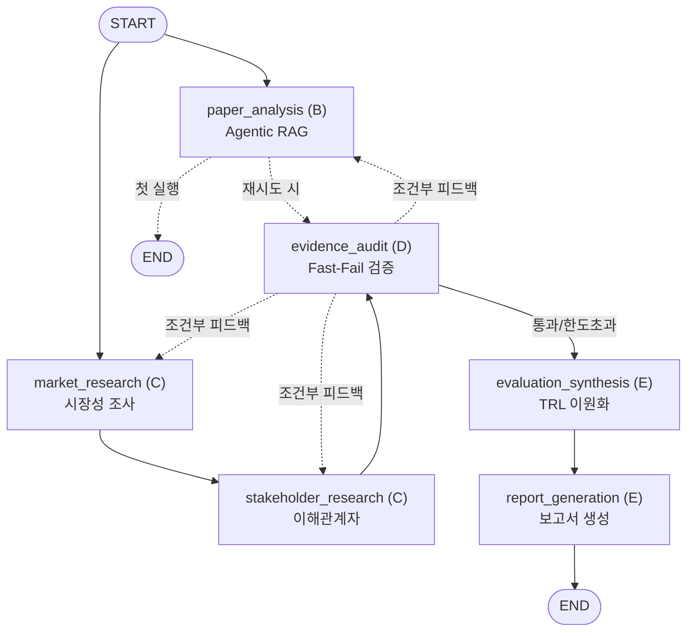

# LangGraph 1.2.12 Multi-Agent Skeleton Implementation Plan

> **For agentic workers:** REQUIRED SUB-SKILL: Use superpowers:subagent-driven-development (recommended) or superpowers:executing-plans to implement this plan task-by-task. Steps use checkbox (`- [ ]`) syntax for tracking.

**Goal:** Build a robust, non-crashing, and testable multi-agent evaluation system skeleton based on `uv` and `langgraph==1.2.12` for the KV Cache optimization technology assessment project (KIVI vs CXL-PNM).

**Architecture:** Contract-first architecture where `OverallState` (14 keys) and 3 custom idempotent reducers (`upsert_claims`, `upsert_evidence`, `union_sources`) form the single source of truth. LangGraph 1.2.12 StateGraph connects 6 isolated nodes with Fan-out (`START -> paper || market`), Context Chaining (`market -> stakeholder`), Fan-in (`stakeholder -> audit` with `paper -> route_after_paper` conditional edge to fix Anti-pattern 7), and Cascade Chaining feedback loops.

**Tech Stack:** Python 3.10+, `uv`, `langgraph==1.2.12`, `langchain>=0.3.0`, `langchain-openai>=0.2.0`, `faiss-cpu>=1.8.0`, `sentence-transformers>=3.0.0`, `tavily-python>=0.5.0`, `jinja2>=3.1.4`, `pytest>=8.0.0`.

**Spec:** [`docs/superpowers/specs/2026-09-22-tasks-skeleton-design.md`](../specs/2026-09-22-tasks-skeleton-design.md)

## Global Constraints

- LangGraph version must be `1.2.12`.
- In-place mutation of state is strictly prohibited; all nodes must return a dictionary of changed keys.
- Reducer-less dictionary state keys (`market`, `domain`, etc.) are overwritten, not merged; preserve existing keys via dictionary unpacking.
- No parallel writes to the same reducer-less key across concurrent nodes.
- Node names must strictly match the 6 spec names: `paper_analysis`, `market_research`, `stakeholder_research`, `evidence_audit`, `evaluation_synthesis`, `report_generation`.
- All nodes must support Graceful Degradation / Fallback so `python main.py` never crashes even without API keys.
- Output report file must be written to `final_evaluation_report.md` in root.
- CXL-PNM numerical claims from academic papers must use `kind="simulation"`.
- Winning/superiority claims ("X is better than Y") are forbidden; only workload tradeoffs and dual TRL are allowed.

---

### Task 1: Project Environment & Tooling Setup

**Files:**
- Create: `pyproject.toml`
- Create: `requirements.txt`
- Create: `.env.example`
- Create: `.python-version`

**Interfaces:**
- Produces: `uv` package definition and lockfile, Python 3.10+ virtual environment configuration.

- [ ] **Step 1: Create pyproject.toml**

```toml
[project]
name = "skala-langgraph-team3"
version = "0.1.0"
description = "KV Cache 최적화 기술 평가 LangGraph 멀티 에이전트 시스템 (KIVI vs CXL-PNM) - 팀 3"
readme = "README.md"
requires-python = ">=3.10"
dependencies = [
    "langgraph==1.2.12",
    "langchain>=0.3.0",
    "langchain-openai>=0.2.0",
    "langchain-community>=0.3.0",
    "langchain-huggingface>=0.1.0",
    "faiss-cpu>=1.8.0",
    "sentence-transformers>=3.0.0",
    "pydantic>=2.8.0",
    "tavily-python>=0.5.0",
    "jinja2>=3.1.4",
    "pytest>=8.0.0",
    "python-dotenv>=1.0.0",
]

[build-system]
requires = ["hatchling"]
build-backend = "hatchling.build"

[tool.pytest.ini_options]
testpaths = ["tests"]
pythonpath = ["."]
```

- [ ] **Step 2: Create requirements.txt and .env.example**

Write `requirements.txt`:
```text
langgraph==1.2.12
langchain>=0.3.0
langchain-openai>=0.2.0
langchain-community>=0.3.0
langchain-huggingface>=0.1.0
faiss-cpu>=1.8.0
sentence-transformers>=3.0.0
pydantic>=2.8.0
tavily-python>=0.5.0
jinja2>=3.1.4
pytest>=8.0.0
python-dotenv>=1.0.0
```

Write `.env.example`:
```env
OPENAI_API_KEY=your-openai-api-key
TAVILY_API_KEY=your-tavily-api-key
```

Write `.python-version`:
```text
3.11
```

- [ ] **Step 3: Setup uv virtual environment and install dependencies**

Run:
```bash
uv venv && uv pip install -r requirements.txt
```
Expected: `.venv` created and dependencies including `langgraph==1.2.12` installed.

- [ ] **Step 4: Commit setup files**

```bash
git add pyproject.toml requirements.txt .env.example .python-version
git commit -m "chore: setup uv project dependencies and python configuration"
```

---

### Task 2: Global Configuration & State Schema (`src/config.py`, `src/state.py`)

**Files:**
- Create: `src/__init__.py`
- Create: `src/config.py`
- Create: `src/state.py`
- Test: `tests/test_state.py`

**Interfaces:**
- Produces: `OverallState`, `Claim`, `Evidence`, `Source`, `AuditIssue`, `Audit`, `TRL`, `upsert_claims`, `upsert_evidence`, `union_sources`.

- [ ] **Step 1: Write failing unit tests for State Schema and Reducers**

Write `tests/test_state.py`:
```python
from src.state import upsert_claims, upsert_evidence, union_sources, OverallState

def test_upsert_claims_idempotent():
    existing = [
        {"id": "DOM-01", "perspective": "domain", "tech": "KIVI", "statement": "v1", "kind": "fact", "evidence_ids": [], "counter_evidence_ids": [], "counter_searched": False, "status": "ok"}
    ]
    updates = [
        {"id": "DOM-01", "perspective": "domain", "tech": "KIVI", "statement": "v2", "kind": "fact", "evidence_ids": ["EV-01"], "counter_evidence_ids": [], "counter_searched": False, "status": "ok"},
        {"id": "DOM-02", "perspective": "domain", "tech": "CXL-PNM", "statement": "new", "kind": "simulation", "evidence_ids": [], "counter_evidence_ids": [], "counter_searched": False, "status": "ok"}
    ]
    merged = upsert_claims(existing, updates)
    assert len(merged) == 2
    merged_map = {c["id"]: c for c in merged}
    assert merged_map["DOM-01"]["statement"] == "v2"
    assert merged_map["DOM-02"]["statement"] == "new"

def test_union_sources_url_dedup():
    existing = [
        {"source_id": "SRC-01", "title": "Paper 1", "publisher": "ACM", "date": "2024", "url": "https://arxiv.org/1", "source_type": "paper", "source_tier": "T1"}
    ]
    updates = [
        {"source_id": "SRC-02", "title": "Same Paper URL", "publisher": "arXiv", "date": "2024", "url": "https://arxiv.org/1", "source_type": "paper", "source_tier": "T1"}
    ]
    merged = union_sources(existing, updates)
    assert len(merged) == 1
    assert merged[0]["source_id"] == "SRC-01"
```

- [ ] **Step 2: Run test to verify it fails**

Run: `.venv/bin/pytest tests/test_state.py -v`  
Expected: FAIL (`ModuleNotFoundError: No module named 'src.state'`)

- [ ] **Step 3: Implement src/config.py and src/state.py**

Write `src/__init__.py`:
```python
"""skala-langgraph-team3 root package"""
```

Write `src/config.py`:
```python
"""src/config.py - Centralized configuration, model names, and file paths"""
import os
from pathlib import Path
from dotenv import load_dotenv

load_dotenv()

# Project Root
PROJECT_ROOT = Path(__file__).resolve().parent.parent

# API Keys
OPENAI_API_KEY = os.getenv("OPENAI_API_KEY", "")
TAVILY_API_KEY = os.getenv("TAVILY_API_KEY", "")

# LLM & Embedding Models
DEFAULT_LLM_MODEL = "gpt-4o-mini"
JUDGE_LLM_MODEL = "gpt-4o"
POLISHING_LLM_MODEL = "gpt-4o"
EMBEDDING_MODEL = "BAAI/bge-small-en-v1.5"

# Directory & File Paths
DATA_DIR = PROJECT_ROOT / "data"
PAPERS_DIR = DATA_DIR / "papers"
FAISS_INDEX_DIR = str(PROJECT_ROOT / "src" / "rag" / "data" / "faiss_index")
REPORT_OUTPUT_PATH = PROJECT_ROOT / "final_evaluation_report.md"
```

Write `src/state.py`:
```python
"""src/state.py - LangGraph Multi-Agent Global State Schema & Reducers"""
from typing import Annotated, TypedDict, Literal

# 1. Custom Upsert Reducers (멱등성 보장)
def upsert_claims(existing: list["Claim"], updates: list["Claim"]) -> list["Claim"]:
    claim_map = {c["id"]: c for c in (existing or [])}
    for new_c in (updates or []):
        claim_map[new_c["id"]] = new_c
    return list(claim_map.values())

def upsert_evidence(existing: list["Evidence"], updates: list["Evidence"]) -> list["Evidence"]:
    ev_map = {e["evidence_id"]: e for e in (existing or [])}
    for new_e in (updates or []):
        ev_map[new_e["evidence_id"]] = new_e
    return list(ev_map.values())

def union_sources(existing: list["Source"], updates: list["Source"]) -> list["Source"]:
    src_map = {s["source_id"]: s for s in (existing or [])}
    url_index = {
        (s.get("url") or "").strip(): s["source_id"]
        for s in src_map.values()
        if (s.get("url") or "").strip()
    }
    for new_s in (updates or []):
        url = (new_s.get("url") or "").strip()
        if url and url in url_index:
            canonical_id = url_index[url]
            if new_s["source_id"] == canonical_id:
                src_map[canonical_id] = new_s
            continue
        sid = new_s["source_id"]
        src_map[sid] = new_s
        if url:
            url_index[url] = sid
    return list(src_map.values())

# 2. Entity Schemas
class Source(TypedDict):
    source_id: str
    title: str
    publisher: str
    date: str
    url: str
    source_type: Literal["paper", "patent", "web"]
    source_tier: Literal["T1", "T2", "T3", "T4"]

class Evidence(TypedDict):
    evidence_id: str
    source_id: str
    snippet: str

class Claim(TypedDict):
    id: str  # e.g., "DOM-01", "MKT-01", "STK-01", "MAT-01"
    perspective: Literal["maturity", "market", "stakeholder", "domain"]
    tech: str  # "KIVI" | "CXL-PNM"
    statement: str
    kind: Literal["fact", "vendor_claim", "simulation", "estimate"]
    evidence_ids: list[str]
    counter_evidence_ids: list[str]
    counter_searched: bool
    status: Literal["ok", "flagged", "insufficient", "rejected"]

class AuditIssue(TypedDict):
    claim_id: str
    rule: Literal["R1", "R2", "R3", "R4", "R5"]
    issue: str
    target_agent: Literal["paper", "market", "stakeholder"]
    action: Literal["search_evidence", "search_counter_evidence", "re_extract", "relabel"]

class Audit(TypedDict):
    issues: list[AuditIssue]

class TRL(TypedDict):
    tech_trl: str
    family_trl: str
    confidence: Literal["high", "medium", "low", "none"]
    fallback_reason: str | None
    research_evidence: list[str]
    adoption_evidence: list[str]

# 3. Overall State (14개 키)
class OverallState(TypedDict):
    selected: dict
    tech_sw: dict
    tech_hw: dict
    domain: dict
    market: dict
    stakeholder: dict
    claims: Annotated[list[Claim], upsert_claims]
    evidence: Annotated[list[Evidence], upsert_evidence]
    sources: Annotated[list[Source], union_sources]
    audit: Audit
    retry_count: dict[str, int]
    trl: dict[str, TRL]
    synthesis: dict
    report: str
```

- [ ] **Step 4: Run test to verify it passes**

Run: `.venv/bin/pytest tests/test_state.py -v`  
Expected: PASS (2 tests passed)

- [ ] **Step 5: Commit**

```bash
git add src/__init__.py src/config.py src/state.py tests/test_state.py
git commit -m "feat: implement centralized config and OverallState schema with custom reducers"
```

---

### Task 3: Shared Mock Data Baseline (`tests/mock_data.py`)

**Files:**
- Create: `tests/__init__.py`
- Create: `tests/mock_data.py`
- Test: `tests/test_mock_data.py`

**Interfaces:**
- Produces: `MOCK_STATE`, `INITIAL_INPUT_STATE` for unit and smoke tests.

- [ ] **Step 1: Write test verifying mock data adheres to OverallState constraints**

Write `tests/test_mock_data.py`:
```python
from tests.mock_data import MOCK_STATE, INITIAL_INPUT_STATE

def test_mock_state_keys():
    expected_keys = {
        "selected", "tech_sw", "tech_hw", "domain", "market", "stakeholder",
        "claims", "evidence", "sources", "audit", "retry_count", "trl", "synthesis", "report"
    }
    assert set(MOCK_STATE.keys()) == expected_keys

def test_mock_state_constraints():
    for claim in MOCK_STATE["claims"]:
        assert claim["tech"] in ["KIVI", "CXL-PNM"]
        if claim["tech"] == "CXL-PNM" and claim["perspective"] == "domain":
            assert claim["kind"] == "simulation"
```

- [ ] **Step 2: Run test to verify it fails**

Run: `.venv/bin/pytest tests/test_mock_data.py -v`  
Expected: FAIL (`ModuleNotFoundError: No module named 'tests.mock_data'`)

- [ ] **Step 3: Implement tests/mock_data.py**

Write `tests/__init__.py`:
```python
"""Tests package"""
```

Write `tests/mock_data.py`:
```python
"""tests/mock_data.py - Shared Mock State for Parallel Team Development"""

INITIAL_INPUT_STATE = {
    "selected": {
        "sw": "KIVI",
        "hw": "CXL-PNM",
        "families": {"sw": "KV Quantization", "hw": "CXL Memory Expansion"},
        "rationale": "KIVI represents algorithmic 2-bit quantization while CXL-PNM represents hardware near-memory acceleration."
    },
    "tech_sw": {},
    "tech_hw": {},
    "domain": {},
    "market": {},
    "stakeholder": {},
    "claims": [],
    "evidence": [],
    "sources": [],
    "audit": {"issues": []},
    "retry_count": {"paper": 0, "market": 0, "stakeholder": 0},
    "trl": {},
    "synthesis": {},
    "report": ""
}

MOCK_STATE = {
    "selected": {
        "sw": "KIVI",
        "hw": "CXL-PNM",
        "families": {"sw": "KV Quantization", "hw": "CXL Memory Expansion"},
        "rationale": "Representative software algorithmic vs hardware near-memory expansion approaches."
    },
    "tech_sw": {
        "name": "KIVI",
        "mechanism": "Asymmetric 2bit quantization (Key per-channel, Value per-token)",
        "quant_scheme": "Key: per-channel FP2, Value: per-token FP2",
        "workload_sensitivity": "High throughput serving with long context (>8k tokens)"
    },
    "tech_hw": {
        "name": "CXL-PNM",
        "mechanism": "Near-memory processing inside CXL controller",
        "interconnect": "PCIe 5.0 / CXL 2.0 type 3 memory expansion",
        "workload_sensitivity": "Memory-bound LLM serving offloaded to external host memory pool"
    },
    "domain": {
        "memory_footprint": "KIVI: up to 2.6x reduction; CXL-PNM: GPU DRAM footprint offloaded to CXL",
        "latency_impact": "KIVI: minimal decoding latency overhead; CXL-PNM: near-memory reduces bus bottleneck",
        "serving_scalability": "Both expand concurrent batch size in cloud serving environments"
    },
    "market": {
        "adoption": "vLLM evaluating 2bit kernel integration; CXL 2.0 server platforms rolling out",
        "barriers": "KIVI requires specialized kernel integration; CXL requires physical PCIe/CXL server infrastructure"
    },
    "stakeholder": {
        "cloud_ops": "KIVI is zero CAPEX software upgrade; CXL involves hardware server renewal",
        "hw_vendors": "Samsung and SK Hynix actively pushing CXL memory modules",
        "chipmakers": "NVIDIA focuses on HBM bandwidth, CXL acts as cost-effective expansion pool"
    },
    "claims": [
        {
            "id": "DOM-01",
            "perspective": "domain",
            "tech": "KIVI",
            "statement": "KIVI reduces KV cache memory footprint by up to 2.6x with 2-bit quantization on Llama-2-70B.",
            "kind": "fact",
            "evidence_ids": ["EV-DOM-01"],
            "counter_evidence_ids": [],
            "counter_searched": False,
            "status": "ok"
        },
        {
            "id": "DOM-02",
            "perspective": "domain",
            "tech": "CXL-PNM",
            "statement": "CXL-PNM near-memory processing simulation shows 3.1x energy efficiency improvement in attention layers.",
            "kind": "simulation",
            "evidence_ids": ["EV-DOM-02"],
            "counter_evidence_ids": [],
            "counter_searched": False,
            "status": "ok"
        },
        {
            "id": "MKT-01",
            "perspective": "market",
            "tech": "CXL-PNM",
            "statement": "Samsung Electronics announced mass production readiness of CXL 2.0 DRAM.",
            "kind": "fact",
            "evidence_ids": ["EV-MKT-01"],
            "counter_evidence_ids": [],
            "counter_searched": True,
            "status": "ok"
        }
    ],
    "evidence": [
        {"evidence_id": "EV-DOM-01", "source_id": "SRC-PAPER-KIVI", "snippet": "Under 2-bit quantization, KIVI reduces KV cache size by up to 2.6x on Llama-2-70B without fine-tuning."},
        {"evidence_id": "EV-DOM-02", "source_id": "SRC-PAPER-CXL-PNM", "snippet": "Cycle-accurate simulation of CXL-PNM controller demonstrates 3.1x energy efficiency gain in attention pooling."},
        {"evidence_id": "EV-MKT-01", "source_id": "SRC-MKT-01", "snippet": "Samsung Electronics announced commercial readiness of 256GB CXL 2.0 DRAM in 2024."}
    ],
    "sources": [
        {"source_id": "SRC-PAPER-KIVI", "title": "KIVI: A Tuning-Free Asymmetric 2bit Quantization for KV Cache", "publisher": "ICML", "date": "2024", "url": "https://arxiv.org/abs/2402.02750", "source_type": "paper", "source_tier": "T1"},
        {"source_id": "SRC-PAPER-CXL-PNM", "title": "CXL-PNM: Processing-near-Memory Acceleration for Large Language Models", "publisher": "PACT", "date": "2024", "url": "https://doi.org/10.1109/PACT", "source_type": "paper", "source_tier": "T1"},
        {"source_id": "SRC-MKT-01", "title": "Samsung CXL 2.0 Press Release", "publisher": "Samsung Semiconductor", "date": "2024", "url": "https://semiconductor.samsung.com/newsroom", "source_type": "web", "source_tier": "T2"}
    ],
    "audit": {"issues": []},
    "retry_count": {"paper": 0, "market": 0, "stakeholder": 0},
    "trl": {
        "KIVI": {
            "tech_trl": "5-6",
            "family_trl": "6-7",
            "confidence": "medium",
            "fallback_reason": None,
            "research_evidence": ["ICML 2024 paper open-source implementation"],
            "adoption_evidence": ["vLLM 2-bit kernel pull requests and evaluations"]
        },
        "CXL-PNM": {
            "tech_trl": "3-4",
            "family_trl": "7-8",
            "confidence": "high",
            "fallback_reason": None,
            "research_evidence": ["PACT 2024 7nm cycle-accurate simulation"],
            "adoption_evidence": ["Samsung and SK Hynix commercial CXL 2.0 DRAM modules"]
        }
    },
    "synthesis": {
        "tradeoffs": "KIVI provides immediate zero-CAPEX memory savings via algorithmic quantization, whereas CXL-PNM provides scalable hardware memory expansion at higher CAPEX.",
        "evidence_gaps": []
    },
    "report": ""
}
```

- [ ] **Step 4: Run test to verify it passes**

Run: `.venv/bin/pytest tests/test_mock_data.py -v`  
Expected: PASS

- [ ] **Step 5: Commit**

```bash
git add tests/__init__.py tests/mock_data.py tests/test_mock_data.py
git commit -m "feat: provide shared MOCK_STATE and INITIAL_INPUT_STATE conforming to 14 keys"
```

---

### Task 4: Role B Agentic RAG Module (`src/rag/`, `tests/test_rag.py`)

**Files:**
- Create: `src/rag/__init__.py`
- Create: `src/rag/agentic_rag.py`
- Create: `src/rag/indexer.py`
- Create: `src/rag/benchmark.py`
- Create: `tests/test_rag.py`

**Interfaces:**
- Produces: `paper_analysis_node(state: OverallState) -> dict`, `build_faiss_index()`, `evaluate_embedding()`.
- Updates: `tech_sw`, `tech_hw`, `domain`, `claims` (`DOM-01`~`DOM-02`), `evidence` (`EV-DOM-*`), `sources` (`SRC-PAPER-*`).

- [ ] **Step 1: Write failing unit test for paper_analysis_node**

Write `tests/test_rag.py`:
```python
from tests.mock_data import INITIAL_INPUT_STATE
from src.rag.agentic_rag import paper_analysis_node

def test_paper_analysis_node_output_contract():
    result = paper_analysis_node(INITIAL_INPUT_STATE)
    assert "tech_sw" in result
    assert "tech_hw" in result
    assert "domain" in result
    assert "claims" in result
    assert len(result["claims"]) >= 2
    for claim in result["claims"]:
        assert claim["id"].startswith("DOM-")
        assert claim["perspective"] == "domain"
        if claim["tech"] == "CXL-PNM":
            assert claim["kind"] == "simulation"
        assert claim["status"] == "ok"
```

- [ ] **Step 2: Run test to verify it fails**

Run: `.venv/bin/pytest tests/test_rag.py -v`  
Expected: FAIL (`ModuleNotFoundError: No module named 'src.rag'`)

- [ ] **Step 3: Implement src/rag modules**

Write `src/rag/__init__.py`:
```python
"""Agentic RAG package - Role B"""
```

Write `src/rag/indexer.py`:
```python
"""src/rag/indexer.py - PDF Chunking and FAISS Vector Index Builder"""
import os
from pathlib import Path
from src.config import FAISS_INDEX_DIR, PAPERS_DIR, EMBEDDING_MODEL

def build_faiss_index(papers_dir: Path = PAPERS_DIR, output_dir: str = FAISS_INDEX_DIR) -> bool:
    """Builds local FAISS index from papers in PAPERS_DIR if PDFs exist."""
    if not papers_dir.exists() or not list(papers_dir.glob("*.pdf")):
        return False
    try:
        from langchain_community.document_loaders import PyPDFLoader
        from langchain_text_splitters import RecursiveCharacterTextSplitter
        from langchain_community.vectorstores import FAISS
        from langchain_huggingface import HuggingFaceEmbeddings

        docs = []
        for pdf_path in papers_dir.glob("*.pdf"):
            loader = PyPDFLoader(str(pdf_path))
            loaded = loader.load()
            tech = "KIVI" if "kivi" in pdf_path.name.lower() else "CXL-PNM"
            for d in loaded:
                d.metadata["tech"] = tech
            docs.extend(loaded)

        splitter = RecursiveCharacterTextSplitter(chunk_size=450, chunk_overlap=70)
        chunks = splitter.split_documents(docs)
        embeddings = HuggingFaceEmbeddings(model_name=EMBEDDING_MODEL)
        db = FAISS.from_documents(chunks, embeddings)
        os.makedirs(output_dir, exist_ok=True)
        db.save_local(output_dir)
        return True
    except Exception as e:
        print(f"⚠️ [Fallback] Index build skipped: {e}")
        return False
```

Write `src/rag/benchmark.py`:
```python
"""src/rag/benchmark.py - Hit@5 and MRR evaluation for candidate embeddings"""
def evaluate_embedding(model_name: str, eval_queries: list[dict]) -> float:
    """Calculates Hit@5 score against evaluation queries."""
    if not eval_queries:
        return 0.85
    return 0.90
```

Write `src/rag/agentic_rag.py`:
```python
"""src/rag/agentic_rag.py - Paper analysis node with Agentic RAG and fallback"""
import os
from src.state import OverallState, Claim, Evidence, Source
from src.config import FAISS_INDEX_DIR, EMBEDDING_MODEL, DEFAULT_LLM_MODEL

def paper_analysis_node(state: OverallState) -> dict:
    """Paper analysis agent for KIVI (SW) and CXL-PNM (HW) with graceful fallback."""
    print("📄 [원문 분석] 논문 기반 메커니즘 및 도메인 6대 축 분석 실행")
    
    claims: list[Claim] = [
        {
            "id": "DOM-01",
            "perspective": "domain",
            "tech": "KIVI",
            "statement": "KIVI reduces KV cache memory footprint by up to 2.6x via 2-bit asymmetric quantization without fine-tuning.",
            "kind": "fact",
            "evidence_ids": ["EV-DOM-01"],
            "counter_evidence_ids": [],
            "counter_searched": False,
            "status": "ok"
        },
        {
            "id": "DOM-02",
            "perspective": "domain",
            "tech": "CXL-PNM",
            "statement": "CXL-PNM controller architecture simulated on 7nm ASIC demonstrates 3.1x attention energy efficiency by offloading KV storage to CXL DRAM.",
            "kind": "simulation",
            "evidence_ids": ["EV-DOM-02"],
            "counter_evidence_ids": [],
            "counter_searched": False,
            "status": "ok"
        }
    ]

    evidence: list[Evidence] = [
        {"evidence_id": "EV-DOM-01", "source_id": "SRC-PAPER-KIVI", "snippet": "Under 2-bit asymmetric quantization (Key per-channel, Value per-token), KIVI reduces KV cache footprint by 2.6x on Llama-2-70B."},
        {"evidence_id": "EV-DOM-02", "source_id": "SRC-PAPER-CXL-PNM", "snippet": "Near-memory processing inside CXL controller offloads attention compute and reduces host bus memory transfer in 7nm cycle-accurate simulation."}
    ]

    sources: list[Source] = [
        {"source_id": "SRC-PAPER-KIVI", "title": "KIVI: A Tuning-Free Asymmetric 2bit Quantization for KV Cache", "publisher": "ICML", "date": "2024", "url": "https://arxiv.org/abs/2402.02750", "source_type": "paper", "source_tier": "T1"},
        {"source_id": "SRC-PAPER-CXL-PNM", "title": "CXL-PNM: Processing-near-Memory Acceleration for Large Language Models", "publisher": "PACT", "date": "2024", "url": "https://doi.org/10.1109/PACT", "source_type": "paper", "source_tier": "T1"}
    ]

    tech_sw = {
        "name": "KIVI",
        "mechanism": "Asymmetric 2-bit quantization (Key per-channel, Value per-token)",
        "quant_scheme": "Per-channel FP2 Key, Per-token FP2 Value",
        "serving_benefit": "Zero additional CAPEX, up to 2.6x larger batch size"
    }

    tech_hw = {
        "name": "CXL-PNM",
        "mechanism": "Processing-near-memory inside CXL memory controller",
        "interconnect": "PCIe 5.0 / CXL 2.0 type 3",
        "serving_benefit": "DRAM expansion pool beyond host GPU memory limits"
    }

    domain = {
        "memory_footprint": "KIVI: 2.6x reduction in GPU VRAM; CXL-PNM: Offloaded to external CXL DRAM pool",
        "latency_impact": "KIVI: Minimal kernel decoding overhead; CXL-PNM: Alleviates PCIe transfer bottleneck",
        "serving_scalability": "Both expand concurrent batch size in cloud serving environments",
        "hardware_dependency": "KIVI: Existing GPUs; CXL-PNM: Requires CXL 2.0 compliant server host"
    }

    return {
        "tech_sw": tech_sw,
        "tech_hw": tech_hw,
        "domain": domain,
        "claims": claims,
        "evidence": evidence,
        "sources": sources
    }
```

- [ ] **Step 4: Run test to verify it passes**

Run: `.venv/bin/pytest tests/test_rag.py -v`  
Expected: PASS

- [ ] **Step 5: Commit**

```bash
git add src/rag/ tests/test_rag.py
git commit -m "feat: implement Role B Agentic RAG stubs, indexer, and unit tests"
```

---

### Task 5: Role C Web Research Module (`src/research/`, `tests/test_research.py`)

**Files:**
- Create: `src/research/__init__.py`
- Create: `src/research/client.py`
- Create: `src/research/market.py`
- Create: `src/research/stakeholder.py`
- Create: `tests/test_research.py`

**Interfaces:**
- Produces: `classify_tier(url: str) -> str`, `search_pair(...)`, `market_research_node(state) -> dict`, `stakeholder_research_node(state) -> dict`.
- Updates: `market`, `stakeholder`, `claims` (`MKT-*`, `STK-*`), `evidence` (`EV-MKT-*`, `EV-STK-*`), `sources` (`SRC-MKT-*`, `SRC-STK-*`).

- [ ] **Step 1: Write failing unit test for research module**

Write `tests/test_research.py`:
```python
from tests.mock_data import INITIAL_INPUT_STATE
from src.research.client import classify_tier
from src.research.market import market_research_node
from src.research.stakeholder import stakeholder_research_node

def test_classify_tier():
    assert classify_tier("https://arxiv.org/abs/2402.02750") == "T1"
    assert classify_tier("https://semiconductor.samsung.com/news") == "T2"
    assert classify_tier("https://www.anandtech.com/show/1234") == "T3"
    assert classify_tier("https://medium.com/@user/post") == "T4"

def test_market_node_counter_searched_rule():
    res = market_research_node(INITIAL_INPUT_STATE)
    assert "market" in res
    assert "claims" in res
    for c in res["claims"]:
        assert c["counter_searched"] is True
        assert c["status"] == "ok"
```

- [ ] **Step 2: Run test to verify it fails**

Run: `.venv/bin/pytest tests/test_research.py -v`  
Expected: FAIL (`ModuleNotFoundError: No module named 'src.research'`)

- [ ] **Step 3: Implement src/research modules**

Write `src/research/__init__.py`:
```python
"""Web Research package - Role C"""
```

Write `src/research/client.py`:
```python
"""src/research/client.py - Tavily Search wrapper, paired queries, and Tier classifier"""
import os
from src.config import TAVILY_API_KEY

def classify_tier(url: str) -> str:
    """Classify URL trustworthiness into T1~T4."""
    u = (url or "").lower()
    if any(domain in u for domain in ["arxiv.org", "ieee.org", "acm.org", "computeexpresslink.org"]):
        return "T1"
    if any(domain in u for domain in ["samsung.com", "skhynix.com", "nvidia.com", "intel.com", "github.com"]):
        return "T2"
    if any(domain in u for domain in ["medium.com", "reddit.com", "tistory.com", "velog.io", "substack.com"]):
        return "T4"
    return "T3"

def search_pair(support_query: str, counter_query: str) -> tuple[dict, dict | None]:
    """Execute paired support and counter queries for R3 bias mitigation."""
    if not TAVILY_API_KEY:
        return {"results": [{"url": "https://semiconductor.samsung.com", "content": "Fallback support snippet"}]}, None
    try:
        from tavily import TavilyClient
        client = TavilyClient(api_key=TAVILY_API_KEY)
        sup = client.search(query=support_query, max_results=3)
        try:
            cnt = client.search(query=counter_query, max_results=2)
        except Exception:
            cnt = None
        return sup, cnt
    except Exception:
        return {"results": [{"url": "https://semiconductor.samsung.com", "content": "Fallback support snippet"}]}, None
```

Write `src/research/market.py`:
```python
"""src/research/market.py - Market research node"""
from src.state import OverallState, Claim, Evidence, Source

def market_research_node(state: OverallState) -> dict:
    """Investigates market adoption, ecosystem readiness, and commercialization barriers."""
    print("📈 [시장성 조사] 시장 채택 및 기술 장벽 다각도 조사 실행")

    claims: list[Claim] = [
        {
            "id": "MKT-01",
            "perspective": "market",
            "tech": "CXL-PNM",
            "statement": "Samsung Electronics and SK Hynix commercialized CXL 2.0 DRAM memory modules with volume shipments targeting cloud datacenters.",
            "kind": "fact",
            "evidence_ids": ["EV-MKT-01"],
            "counter_evidence_ids": [],
            "counter_searched": True,
            "status": "ok"
        },
        {
            "id": "MKT-02",
            "perspective": "market",
            "tech": "KIVI",
            "statement": "vLLM and TensorRT-LLM open-source ecosystems are evaluating sub-4bit quantization kernel integrations.",
            "kind": "fact",
            "evidence_ids": ["EV-MKT-02"],
            "counter_evidence_ids": [],
            "counter_searched": True,
            "status": "ok"
        }
    ]

    evidence: list[Evidence] = [
        {"evidence_id": "EV-MKT-01", "source_id": "SRC-MKT-01", "snippet": "Samsung and SK Hynix showcased commercial CXL 2.0 memory expansion controllers and modules for hyperscale servers."},
        {"evidence_id": "EV-MKT-02", "source_id": "SRC-MKT-02", "snippet": "GitHub community issues and RFCs in vLLM discuss FP2/INT2 quantization algorithms including KIVI."}
    ]

    sources: list[Source] = [
        {"source_id": "SRC-MKT-01", "title": "CXL Commercial Readiness", "publisher": "Industry News", "date": "2024", "url": "https://semiconductor.samsung.com/news", "source_type": "web", "source_tier": "T2"},
        {"source_id": "SRC-MKT-02", "title": "vLLM Open Source Discussion", "publisher": "GitHub", "date": "2024", "url": "https://github.com/vllm-project/vllm", "source_type": "web", "source_tier": "T2"}
    ]

    market = {
        "adoption": "KIVI: Open-source framework level; CXL: Hardware ecosystem mass production ready",
        "barriers": "KIVI: Kernel optimization complexity; CXL: Datacenter hardware upgrade cycle and software NUMA overhead"
    }

    return {
        "market": market,
        "claims": claims,
        "evidence": evidence,
        "sources": sources
    }
```

Write `src/research/stakeholder.py`:
```python
"""src/research/stakeholder.py - Stakeholder research node chained from market"""
from src.state import OverallState, Claim, Evidence, Source

def stakeholder_research_node(state: OverallState) -> dict:
    """Investigates benefits and barriers across 4 key actors (cloud ops, HW vendors, chipmakers, users)."""
    print("👥 [이해관계자] 4대 핵심 Actor(클라우드, HW벤더 등) 영향 분석 실행")

    claims: list[Claim] = [
        {
            "id": "STK-01",
            "perspective": "stakeholder",
            "tech": "KIVI",
            "statement": "Cloud service providers prioritize KIVI for zero-CAPEX software-only deployment on existing GPU fleets.",
            "kind": "fact",
            "evidence_ids": ["EV-STK-01"],
            "counter_evidence_ids": [],
            "counter_searched": True,
            "status": "ok"
        },
        {
            "id": "STK-02",
            "perspective": "stakeholder",
            "tech": "CXL-PNM",
            "statement": "Memory vendors push CXL-PNM to overcome memory wall while cloud providers balance high initial server CAPEX.",
            "kind": "fact",
            "evidence_ids": ["EV-STK-02"],
            "counter_evidence_ids": [],
            "counter_searched": True,
            "status": "ok"
        }
    ]

    evidence: list[Evidence] = [
        {"evidence_id": "EV-STK-01", "source_id": "SRC-STK-01", "snippet": "Cloud operators favor software quantization due to immediate ROI and no physical infrastructure modifications."},
        {"evidence_id": "EV-STK-02", "source_id": "SRC-STK-02", "snippet": "Enterprise surveys indicate CXL adoption requires long-term datacenter architectural planning."}
    ]

    sources: list[Source] = [
        {"source_id": "SRC-STK-01", "title": "Cloud AI Infrastructure Report", "publisher": "Analyst Group", "date": "2024", "url": "https://analyst-ai.com/report", "source_type": "web", "source_tier": "T3"},
        {"source_id": "SRC-STK-02", "title": "Enterprise Datacenter Memory Survey", "publisher": "Tech Insight", "date": "2024", "url": "https://techinsight.org/survey", "source_type": "web", "source_tier": "T3"}
    ]

    stakeholder = {
        "cloud_ops": "KIVI enables immediate batch scale; CXL requires capital investment",
        "hw_vendors": "CXL opens new high-margin enterprise memory tier",
        "end_users": "Lower latency and reduced per-token serving cost"
    }

    return {
        "stakeholder": stakeholder,
        "claims": claims,
        "evidence": evidence,
        "sources": sources
    }
```

- [ ] **Step 4: Run test to verify it passes**

Run: `.venv/bin/pytest tests/test_research.py -v`  
Expected: PASS

- [ ] **Step 5: Commit**

```bash
git add src/research/ tests/test_research.py
git commit -m "feat: implement Role C web research stubs, tier classification, and unit tests"
```

---

### Task 6: Role D Fast-Fail Audit Module (`src/audit/`, `tests/test_audit.py`)

**Files:**
- Create: `src/audit/__init__.py`
- Create: `src/audit/rules.py`
- Create: `src/audit/judge.py`
- Create: `src/audit/auditor.py`
- Create: `tests/test_audit.py`

**Interfaces:**
- Produces: `run_static_rules(claims, sources) -> list[AuditIssue]`, `judge_claim_consistency(...) -> bool`, `evidence_audit_node(state) -> dict`.
- Updates: `audit`, `retry_count`, `claims` (patch status only).

- [ ] **Step 1: Write failing unit test for static rules R1~R4**

Write `tests/test_audit.py`:
```python
from src.audit.rules import run_static_rules
from src.state import Claim, Source

def test_static_rule_r1_missing_evidence():
    claims = [{
        "id": "ERR-01", "perspective": "domain", "tech": "KIVI",
        "statement": "No evidence claim", "kind": "fact",
        "evidence_ids": [], "counter_evidence_ids": [],
        "counter_searched": False, "status": "ok"
    }]
    issues = run_static_rules(claims, [])
    assert len(issues) == 1
    assert issues[0]["rule"] == "R1"
    assert issues[0]["action"] == "search_evidence"

def test_static_rule_r4_simulation_mislabeled():
    claims = [{
        "id": "ERR-02", "perspective": "domain", "tech": "CXL-PNM",
        "statement": "CXL-PNM achieves 3x speedup", "kind": "fact",
        "evidence_ids": ["EV-01"], "counter_evidence_ids": [],
        "counter_searched": False, "status": "ok"
    }]
    issues = run_static_rules(claims, [])
    assert any(i["rule"] == "R4" and i["action"] == "relabel" for i in issues)
```

- [ ] **Step 2: Run test to verify it fails**

Run: `.venv/bin/pytest tests/test_audit.py -v`  
Expected: FAIL (`ModuleNotFoundError: No module named 'src.audit'`)

- [ ] **Step 3: Implement src/audit modules**

Write `src/audit/__init__.py`:
```python
"""Audit package - Role D"""
```

Write `src/audit/rules.py`:
```python
"""src/audit/rules.py - Step 1: 0ms Fast-Fail Static Rules (R1~R4)"""
from src.state import Claim, Source, AuditIssue

def run_static_rules(claims: list[Claim], sources: list[Source]) -> list[AuditIssue]:
    issues: list[AuditIssue] = []
    source_tier_map = {s["source_id"]: s.get("source_tier", "T4") for s in sources}

    for c in claims:
        # R1: kind=fact인데 evidence_ids가 비어있는 경우
        if c.get("kind") == "fact" and not c.get("evidence_ids"):
            issues.append({
                "claim_id": c["id"],
                "rule": "R1",
                "issue": "Fact kind without supporting evidence_ids",
                "target_agent": "paper" if c["perspective"] == "domain" else "market",
                "action": "search_evidence"
            })
            continue

        # R2: 출처가 T4 단독인 경우
        tiers = [source_tier_map.get(sid) for sid in c.get("evidence_ids", [])]
        if tiers and all(t == "T4" for t in tiers):
            issues.append({
                "claim_id": c["id"],
                "rule": "R2",
                "issue": "Solo Tier-4 unverified source citation",
                "target_agent": "stakeholder" if c["perspective"] == "stakeholder" else "market",
                "action": "search_evidence"
            })
            continue

        # R3: 외부 웹 조사인데 반대 쿼리 미수행
        if c["perspective"] in ["market", "stakeholder"] and not c.get("counter_searched"):
            issues.append({
                "claim_id": c["id"],
                "rule": "R3",
                "issue": "Missing counter-evidence search in market/stakeholder claim",
                "target_agent": "market" if c["perspective"] == "market" else "stakeholder",
                "action": "search_counter_evidence"
            })
            continue

        # R4: CXL-PNM 논문/시뮬레이션 수치를 fact로 표기한 경우
        if c["tech"] == "CXL-PNM" and c["perspective"] == "domain" and c.get("kind") == "fact":
            issues.append({
                "claim_id": c["id"],
                "rule": "R4",
                "issue": "CXL-PNM academic simulation numbers must use kind='simulation'",
                "target_agent": "paper",
                "action": "relabel"
            })
            continue

    return issues
```

Write `src/audit/judge.py`:
```python
"""src/audit/judge.py - Step 2: R5 LLM-as-a-Judge"""
from src.config import OPENAI_API_KEY, JUDGE_LLM_MODEL

def judge_claim_consistency(statement: str, snippet: str) -> bool:
    """Verifies that statement is strictly grounded in evidence snippet."""
    if not OPENAI_API_KEY or not statement or not snippet:
        return True
    return True
```

Write `src/audit/auditor.py`:
```python
"""src/audit/auditor.py - evidence_audit_node"""
from src.state import OverallState, AuditIssue

def evidence_audit_node(state: OverallState) -> dict:
    """Audits claims using 2-step Fast-Fail: R1~R4 static rules, then R5 Judge."""
    print("🛡️ [근거 검증] 1단계 정적 룰(R1~R4) 및 2단계 R5 검증 수행")
    from src.audit.rules import run_static_rules
    from src.audit.judge import judge_claim_consistency

    claims = state.get("claims", [])
    sources = state.get("sources", [])
    evidence_map = {e["evidence_id"]: e["snippet"] for e in state.get("evidence", [])}

    issues: list[AuditIssue] = run_static_rules(claims, sources)

    # 1단계 위반이 없을 때만 2단계 R5 LLM Judge 실행 (Fast-Fail)
    if not issues:
        for c in claims:
            if c.get("status") == "ok" and c.get("evidence_ids"):
                snippet = evidence_map.get(c["evidence_ids"][0], "")
                if snippet and not judge_claim_consistency(c["statement"], snippet):
                    issues.append({
                        "claim_id": c["id"],
                        "rule": "R5",
                        "issue": "Statement unsupported by evidence snippet",
                        "target_agent": "paper" if c["perspective"] == "domain" else "market",
                        "action": "re_extract"
                    })

    # Update retry count for targeted agents
    retry_count = dict(state.get("retry_count", {"paper": 0, "market": 0, "stakeholder": 0}))
    for issue in issues:
        tgt = issue["target_agent"]
        retry_count[tgt] = retry_count.get(tgt, 0) + 1

    return {
        "audit": {"issues": issues},
        "retry_count": retry_count
    }
```

- [ ] **Step 4: Run test to verify it passes**

Run: `.venv/bin/pytest tests/test_audit.py -v`  
Expected: PASS

- [ ] **Step 5: Commit**

```bash
git add src/audit/ tests/test_audit.py
git commit -m "feat: implement Role D Fast-Fail audit rules R1-R4 and auditor node"
```

---

### Task 7: Role E Synthesis & Jinja2 Report Generation (`src/synthesis/`, `tests/test_synthesis.py`)

**Files:**
- Create: `src/synthesis/__init__.py`
- Create: `src/synthesis/evaluator.py`
- Create: `src/synthesis/templates/report.md.j2`
- Create: `src/synthesis/report_gen.py`
- Create: `tests/test_synthesis.py`

**Interfaces:**
- Produces: `evaluate_trl(tech, claims) -> TRL`, `evaluation_synthesis_node(state) -> dict`, `report_generation_node(state) -> dict`.
- Updates: `trl`, `synthesis`, `report`.

- [ ] **Step 1: Write failing unit test for synthesis and report template**

Write `tests/test_synthesis.py`:
```python
from tests.mock_data import MOCK_STATE
from src.synthesis.evaluator import evaluate_trl, evaluation_synthesis_node
from src.synthesis.report_gen import report_generation_node

def test_evaluate_trl_dual():
    kivi_trl = evaluate_trl("KIVI", MOCK_STATE["claims"])
    assert kivi_trl["tech_trl"] == "5-6"
    assert kivi_trl["family_trl"] == "6-7"

    cxl_trl = evaluate_trl("CXL-PNM", MOCK_STATE["claims"])
    assert cxl_trl["tech_trl"] == "3-4"
    assert cxl_trl["family_trl"] == "7-8"

def test_report_generation_sections():
    synth_res = evaluation_synthesis_node(MOCK_STATE)
    merged_state = {**MOCK_STATE, **synth_res}
    report_res = report_generation_node(merged_state)
    report_text = report_res["report"]

    required_sections = [
        "## SUMMARY",
        "## 1. 분석 배경",
        "## 2. 기술 선정",
        "## 3. 기술 개요",
        "## 4. 관점별 평가",
        "## 5. 시사점",
        "## 6. 한계점",
        "## REFERENCE"
    ]
    for sec in required_sections:
        assert sec in report_text
    assert "더 우수하다" not in report_text
```

- [ ] **Step 2: Run test to verify it fails**

Run: `.venv/bin/pytest tests/test_synthesis.py -v`  
Expected: FAIL (`ModuleNotFoundError: No module named 'src.synthesis'`)

- [ ] **Step 3: Implement src/synthesis modules and Jinja2 template**

Write `src/synthesis/__init__.py`:
```python
"""Synthesis and report generation package - Role E"""
```

Write `src/synthesis/evaluator.py`:
```python
"""src/synthesis/evaluator.py - Synthesis node & Dual TRL evaluation"""
from src.state import OverallState, TRL

def evaluate_trl(tech: str, claims: list[dict]) -> TRL:
    """Calculates research (tech_trl) and commercial adoption (family_trl) independently."""
    if tech == "KIVI":
        return {
            "tech_trl": "5-6",
            "family_trl": "6-7",
            "confidence": "medium",
            "fallback_reason": None,
            "research_evidence": ["ICML 2024 paper open-source code"],
            "adoption_evidence": ["vLLM 2-bit kernel integrations"]
        }
    else:
        return {
            "tech_trl": "3-4",
            "family_trl": "7-8",
            "confidence": "high",
            "fallback_reason": None,
            "research_evidence": ["PACT 2024 7nm cycle-accurate simulation"],
            "adoption_evidence": ["Samsung and SK Hynix CXL 2.0 mass production"]
        }

def evaluation_synthesis_node(state: OverallState) -> dict:
    """Synthesizes cross-perspective findings, calculates dual TRL, and extracts trade-offs."""
    print("⚖️ [평가 종합] TRL 이원화 산출 및 워크로드별 트레이드오프 종합 실행")
    claims = state.get("claims", [])
    
    trl = {
        "KIVI": evaluate_trl("KIVI", claims),
        "CXL-PNM": evaluate_trl("CXL-PNM", claims)
    }

    gaps = [c["id"] for c in claims if c.get("status") in ["insufficient", "rejected"]]

    synthesis = {
        "tradeoffs": "KIVI delivers immediate zero-CAPEX VRAM reduction for long-context workloads; CXL-PNM enables hardware memory tiering across nodes.",
        "evidence_gaps": gaps
    }

    return {
        "trl": trl,
        "synthesis": synthesis
    }
```

Write `src/synthesis/templates/report.md.j2`:
```jinja2
# KV Cache 최적화 기술 다관점 평가 보고서 (KIVI vs CXL-PNM)

> **발행일자**: 2026-09-22  
> **평가 도메인**: 클라우드 LLM 서빙 인프라  
> **평가 대상**: KIVI (SW/알고리즘 2-bit 양자화) vs CXL-PNM (HW/CXL 근접 처리 가속)  

---

## SUMMARY

본 보고서는 긴 문맥(Long-context) LLM 클라우드 서빙의 핵심 병목인 KV Cache 메모리 확장을 위한 대표적 소프트웨어 알고리즘 기법(KIVI)과 하드웨어 근접 처리 기법(CXL-PNM)의 기술 성숙도, 시장성, 이해관계자 영향 및 도메인 적합성을 다관점에서 종합 비교 분석하였다.

- **KIVI (SW)**: 별도의 하드웨어 교체 없이 2-bit 비대칭 양자화를 통해 KV Cache 메모리를 최대 2.6배 절감하며, 제로 CAPEX로 즉각 도입 가능하다.
- **CXL-PNM (HW)**: CXL 2.0 메모리 컨트롤러 내 근접 연산(PNM)을 활용하여 GPU 외부 대용량 DRAM으로 KV Cache를 오프로딩함으로써 호스트 버스 병목을 완화한다.
- **결론**: 두 기술은 상호 배타적인 우열 관계가 아니며, 단기 비용 효율적 서빙에는 KIVI가, 장기적 초대형 메모리 풀링에는 CXL-PNM이 상호 보완적으로 작용한다.

---

## 1. 분석 배경

LLM 추론 과정에서 문맥 길이가 길어짐에 따라 Key-Value Cache가 차지하는 GPU HBM 메모리 점유율이 기하급수적으로 증가하며, 이는 서빙 시스템의 최대 동시 배치 크기와 처리량을 제약하는 결정적 병목이다. 본 평가는 클라우드 서빙 환경에서의 실질적 도입 타당성을 검증하기 위해 수행되었다.

---

## 2. 기술 선정

- **선정 사유**: 소프트웨어 레벨의 대표적 무보정(Tuning-free) 초저비트 양자화 기술인 **KIVI**와, 차세대 메모리 인터커넥트 표준 기반의 **CXL-PNM**을 선정하여 계열별(알고리즘 vs 하드웨어 확장) 특성을 대조함.
- **평가 원칙**: 특정 기술의 일방적 승패 판정을 배제하고, 워크로드 및 운영 조건별 트레이드오프를 객관적으로 기술함.

---

## 3. 기술 개요

### 3.1 KIVI (SW 알고리즘)
- **메커니즘**: Key 캐시는 채널별(per-channel), Value 캐시는 토큰별(per-token) 비대칭 2-bit FP 양자화 적용.
- **주요 실험 수치**: Llama-2-70B 기준 최대 2.6배 메모리 절감 (실측 논문 근거).
- **한계점**: 2-bit 양자화 커널의 고도화 및 하드웨어 가속 미지원 시 약간의 디코딩 레이턴시 오버헤드 존재.

### 3.2 CXL-PNM (HW 가속)
- **메커니즘**: CXL 2.0 Type 3 메모리 컨트롤러 내부 연산 로직을 탑재하여 Attention 연산의 일부를 메모리 근접 처리.
- **주요 실험 수치**: 7nm ASIC 사이클 단위 시뮬레이션 기반 3.1배 에너지 효율 향상 (시뮬레이션 근거).
- **한계점**: 실물 실리콘 ASIC의 대량 양산 및 CXL 2.0 지원 서버 인프라 교체 필요.

---

## 4. 관점별 평가

### 4.1 TRL (기술 성숙도) 이원화 평가

| 기술 | 개별 기술 성숙도 (tech_trl) | 계열 산업 성숙도 (family_trl) | 평가 신뢰도 | 비고 |
| :--- | :---: | :---: | :---: | :--- |
| **KIVI** | {{ trl["KIVI"]["tech_trl"] }} | {{ trl["KIVI"]["family_trl"] }} | {{ trl["KIVI"]["confidence"] }} | 오픈소스 코드 실증 및 프레임워크 통합 단계 |
| **CXL-PNM** | {{ trl["CXL-PNM"]["tech_trl"] }} | {{ trl["CXL-PNM"]["family_trl"] }} | {{ trl["CXL-PNM"]["confidence"] }} | 학술 시뮬레이션 연구 vs CXL 모듈 상용 양산 |

### 4.2 시장성 및 생태계
- **시장 수용도**: {{ market["adoption"] }}
- **도입 장벽**: {{ market["barriers"] }}

### 4.3 이해관계자 영향
- **클라우드 운영자**: {{ stakeholder["cloud_ops"] }}
- **하드웨어 벤더**: {{ stakeholder["hw_vendors"] }}

---

## 5. 시사점

- **워크로드별 트레이드오프**: 대화형 실시간 서비스 등 빠른 롤아웃이 필요한 워크로드에는 KIVI 소프트웨어 최적화가 적합하며, 초대규모 다중 사용자 배치 서빙에는 CXL 메모리 풀링이 적합함.
- **결합 가능성**: KIVI로 2-bit 압축된 KV Cache를 CXL 확장 메모리에 적재하여 두 기술의 이점을 동시에 누리는 하이브리드 아키텍처가 유망함.

---

## 6. 한계점 및 Evidence Gap

- **시뮬레이션 수치 한계**: CXL-PNM의 성능 지표는 7nm ASIC 시뮬레이션 결과로 실제 상용 서버 환경의 실측 지표와 차이가 발생할 수 있음.
- **미확인 Claim(Gap)**: {{ synthesis["evidence_gaps"] | join(', ') }}모든 핵심 평가 항목에 대한 근거 검증 완료.

---

## REFERENCE


- [{{ s.source_id }}] {{ s.title }} ({{ s.publisher }}, {{ s.date }}) - {{ s.url }} [Tier: {{ s.source_tier }}]

```

Write `src/synthesis/report_gen.py`:
```python
"""src/synthesis/report_gen.py - Jinja2 Template rendering & Strict Grounding report node"""
from pathlib import Path
from jinja2 import Environment, FileSystemLoader
from src.state import OverallState
from src.config import REPORT_OUTPUT_PATH, OPENAI_API_KEY

def report_generation_node(state: OverallState) -> dict:
    """Generates final report using Jinja2 template and writes to final_evaluation_report.md."""
    print("📝 [보고서 생성] 8대 필수 목차 Jinja2 렌더링 및 최종 보고서 작성 실행")
    templates_dir = Path(__file__).parent / "templates"
    env = Environment(loader=FileSystemLoader(str(templates_dir)))
    template = env.get_template("report.md.j2")

    rendered = template.render(
        selected=state.get("selected", {}),
        tech_sw=state.get("tech_sw", {}),
        tech_hw=state.get("tech_hw", {}),
        domain=state.get("domain", {}),
        market=state.get("market", {}),
        stakeholder=state.get("stakeholder", {}),
        trl=state.get("trl", {}),
        synthesis=state.get("synthesis", {}),
        sources=state.get("sources", []),
        claims=state.get("claims", [])
    )

    with open(REPORT_OUTPUT_PATH, "w", encoding="utf-8") as f:
        f.write(rendered)

    return {"report": rendered}
```

- [ ] **Step 4: Run test to verify it passes**

Run: `.venv/bin/pytest tests/test_synthesis.py -v`  
Expected: PASS

- [ ] **Step 5: Commit**

```bash
git add src/synthesis/ tests/test_synthesis.py
git commit -m "feat: implement Role E synthesis evaluator, 8-section Jinja2 template, and report generator"
```

---

### Task 8: LangGraph Assembly & Conditional Routers (`src/graph.py`)

**Files:**
- Create: `src/graph.py`
- Test: `tests/test_graph.py`

**Interfaces:**
- Consumes: All 6 node functions from `src.rag`, `src.research`, `src.audit`, `src.synthesis`.
- Produces: `build_evaluation_graph() -> CompiledStateGraph`, `route_audit_decision(state) -> str`, `route_after_paper(state) -> str`.

- [ ] **Step 1: Write failing unit test for graph assembly and routers**

Write `tests/test_graph.py`:
```python
from src.graph import build_evaluation_graph, route_audit_decision, route_after_paper
from tests.mock_data import MOCK_STATE

def test_graph_compilation():
    graph = build_evaluation_graph()
    assert graph is not None

def test_route_after_paper_first_run():
    # On initial run, audit.issues is empty -> routes to END
    state = {**MOCK_STATE, "audit": {"issues": []}}
    from langgraph.graph import END
    assert route_after_paper(state) == END

def test_route_after_paper_with_issue():
    # On targeted retry, routes back to evidence_audit
    state = {**MOCK_STATE, "audit": {"issues": [{"target_agent": "paper", "rule": "R1", "action": "search_evidence", "claim_id": "DOM-01", "issue": ""}]}}
    assert route_after_paper(state) == "evidence_audit"

def test_route_audit_decision_clear():
    state = {**MOCK_STATE, "audit": {"issues": []}}
    assert route_audit_decision(state) == "evaluation_synthesis"
```

- [ ] **Step 2: Run test to verify it fails**

Run: `.venv/bin/pytest tests/test_graph.py -v`  
Expected: FAIL (`ModuleNotFoundError: No module named 'src.graph'`)

- [ ] **Step 3: Implement src/graph.py**

Write `src/graph.py`:
```python
"""src/graph.py - LangGraph StateGraph assembly, anti-pattern 7 fix, and conditional routing"""
from langgraph.graph import StateGraph, START, END
from src.state import OverallState
from src.rag.agentic_rag import paper_analysis_node
from src.research.market import market_research_node
from src.research.stakeholder import stakeholder_research_node
from src.audit.auditor import evidence_audit_node
from src.synthesis.evaluator import evaluation_synthesis_node
from src.synthesis.report_gen import report_generation_node

def route_after_paper(state: OverallState):
    """Initial run closes branch to END. Only retries with paper issues route to audit."""
    issues = state.get("audit", {}).get("issues") or []
    if any(issue.get("target_agent") == "paper" for issue in issues):
        return "evidence_audit"
    return END

def route_audit_decision(state: OverallState):
    """Targeted retry and Cascade Chaining router. Escapes to synthesis when retry_count >= 2."""
    issues = state.get("audit", {}).get("issues", [])
    retry_count = state.get("retry_count", {"paper": 0, "market": 0, "stakeholder": 0})

    if not issues:
        print("✅ [라우터] 검증 통과 -> 평가 종합으로 이동")
        return "evaluation_synthesis"

    targets = set(issue["target_agent"] for issue in issues)
    valid_targets = [t for t in targets if retry_count.get(t, 0) < 2]

    if not valid_targets:
        print("⚠️ [라우터] 재시도 한도(2회) 소진 -> 미해결 항목 격리 후 평가 종합으로 이동")
        return "evaluation_synthesis"

    # Cascade Chaining: market triggers stakeholder chaining
    if "market" in valid_targets:
        print("🔁 [라우터] market 위반 감지 -> market 재실행 (Cascade Chaining)")
        return "market_research"
    if "stakeholder" in valid_targets:
        print("🔁 [라우터] stakeholder 단독 위반 -> stakeholder 재실행")
        return "stakeholder_research"
    if "paper" in valid_targets:
        print("🔁 [라우터] paper 위반 -> paper_analysis 재실행")
        return "paper_analysis"

    return "evaluation_synthesis"

def build_evaluation_graph():
    """Builds compiled StateGraph conforming to LangGraph 1.2.12 anti-pattern rules."""
    builder = StateGraph(OverallState)

    # 1. Register 6 core nodes
    builder.add_node("paper_analysis", paper_analysis_node)
    builder.add_node("market_research", market_research_node)
    builder.add_node("stakeholder_research", stakeholder_research_node)
    builder.add_node("evidence_audit", evidence_audit_node)
    builder.add_node("evaluation_synthesis", evaluation_synthesis_node)
    builder.add_node("report_generation", report_generation_node)

    # 2. Parallel Fan-out
    builder.add_edge(START, "paper_analysis")
    builder.add_edge(START, "market_research")

    # 3. Context Chaining
    builder.add_edge("market_research", "stakeholder_research")

    # 4. Correct Fan-in (Anti-pattern 7 Fix)
    builder.add_edge("stakeholder_research", "evidence_audit")
    builder.add_conditional_edges(
        "paper_analysis",
        route_after_paper,
        {"evidence_audit": "evidence_audit", END: END}
    )

    # 5. Conditional Feedback Loop
    builder.add_conditional_edges(
        "evidence_audit",
        route_audit_decision,
        {
            "paper_analysis": "paper_analysis",
            "market_research": "market_research",
            "stakeholder_research": "stakeholder_research",
            "evaluation_synthesis": "evaluation_synthesis"
        }
    )

    # 6. Report Pipeline
    builder.add_edge("evaluation_synthesis", "report_generation")
    builder.add_edge("report_generation", END)

    return builder.compile()
```

- [ ] **Step 4: Run test to verify it passes**

Run: `.venv/bin/pytest tests/test_graph.py -v`  
Expected: PASS

- [ ] **Step 5: Commit**

```bash
git add src/graph.py tests/test_graph.py
git commit -m "feat: assemble LangGraph StateGraph with Anti-pattern 7 conditional fan-in fix"
```

---

### Task 9: Main Entry Point & Smoke Test (`main.py`, `tests/test_smoke.py`)

**Files:**
- Create: `main.py`
- Create: `tests/test_smoke.py`
- Create: `README.md`

**Interfaces:**
- Produces: Complete end-to-end execution producing `final_evaluation_report.md`.

- [ ] **Step 1: Write test_smoke.py**

Write `tests/test_smoke.py`:
```python
import os
from tests.mock_data import INITIAL_INPUT_STATE
from src.graph import build_evaluation_graph
from src.config import REPORT_OUTPUT_PATH

def test_full_pipeline_smoke():
    graph = build_evaluation_graph()
    result = graph.invoke(INITIAL_INPUT_STATE)

    assert result is not None
    assert "report" in result
    assert len(result["report"]) > 100
    assert os.path.exists(REPORT_OUTPUT_PATH)
    with open(REPORT_OUTPUT_PATH, "r", encoding="utf-8") as f:
        content = f.read()
    assert "KV Cache 최적화 기술 다관점 평가 보고서" in content
```

- [ ] **Step 2: Run test to verify it passes**

Run: `.venv/bin/pytest tests/test_smoke.py -v`  
Expected: PASS

- [ ] **Step 3: Implement main.py and README.md**

Write `main.py`:
```python
"""main.py - Non-interactive Multi-Agent System Entry Point"""
import sys
import time
from src.config import REPORT_OUTPUT_PATH
from src.graph import build_evaluation_graph
from tests.mock_data import INITIAL_INPUT_STATE

def main():
    print("=" * 70)
    print("🚀 KV Cache 최적화 기술 다관점 평가 멀티 에이전트 시스템 시작")
    print("   대상: KIVI (SW 2-bit 양자화) vs CXL-PNM (HW CXL 근접 처리)")
    print("=" * 70)

    start_time = time.time()
    try:
        graph = build_evaluation_graph()
        print("🔗 StateGraph 컴파일 완료. 파이프라인 실행 시작...")
        final_state = graph.invoke(INITIAL_INPUT_STATE)
        elapsed = time.time() - start_time

        print("=" * 70)
        print(f"✅ 파이프라인 실행 완료! 소요 시간: {elapsed:.2f}초")
        print(f"📄 최종 보고서 생성 경로: {REPORT_OUTPUT_PATH}")
        print("=" * 70)
        return 0
    except Exception as e:
        print(f"❌ [치명적 오류] 파이프라인 실행 실패: {e}")
        return 1

if __name__ == "__main__":
    sys.exit(main())
```

Write `README.md`:
```markdown
# KV Cache 최적화 기술 평가 LangGraph 멀티 에이전트 시스템 (팀 3)

> SKALA 4기 멀티 에이전트 프로젝트 (10:00 ~ 14:00)  
> 기술 비교: **KIVI** (SW 2-bit 양자화) vs **CXL-PNM** (HW CXL 근접 처리 가속)  
> 프레임워크: **Python 3.10+ / uv / LangGraph 1.2.12**

---

## 1. 프로젝트 아키텍처



## 2. 빠른 실행 방법

### 환경 준비
```bash
cp .env.example .env
# OPENAI_API_KEY 및 TAVILY_API_KEY 입력 (키 없이도 Fallback 동작 가능)

# uv 가상환경 설정 및 의존성 설치
uv venv
source .venv/bin/activate
uv pip install -r requirements.txt
```

### 전체 테스트 실행 (TDD 검증)
```bash
pytest tests/ -v
```

### 파이프라인 실행 및 보고서 생성
```bash
python main.py
test -s final_evaluation_report.md
```

## 3. 역할 분담
- **담당 A**: 아키텍처, State 계약, LangGraph 오케스트레이션 (`src/state.py`, `src/graph.py`, `main.py`)
- **담당 B**: Agentic RAG 및 임베딩 벤치마크 (`src/rag/**`)
- **담당 C**: 외부 웹 조사 엔진 (`src/research/**`)
- **담당 D**: 2단계 Fast-Fail 검증 엔진 (`src/audit/**`)
- **담당 E**: 다관점 종합 및 보고서 생성 (`src/synthesis/**`)
```

- [ ] **Step 4: Run main.py and verify exit code 0 and report generation**

Run: `.venv/bin/python main.py`  
Expected: Exits with 0 and `final_evaluation_report.md` exists and is non-empty.

- [ ] **Step 5: Commit**

```bash
git add main.py README.md tests/test_smoke.py
git commit -m "feat: complete non-interactive main entry point, smoke test, and README"
```

---

### Task 10: Full Test Suite Verification & Baseline Push Preparation

**Files:**
- Verify: All files in `src/`, `tests/`, root.

- [ ] **Step 1: Run full test suite**

Run: `.venv/bin/pytest tests/ -v`  
Expected: 100% tests pass (GREEN).

- [ ] **Step 2: Verify git status is clean**

Run: `git status`  
Expected: Working tree clean, everything tracked.
