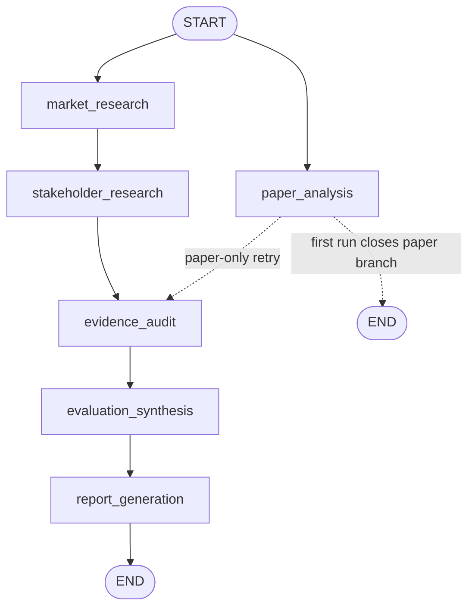
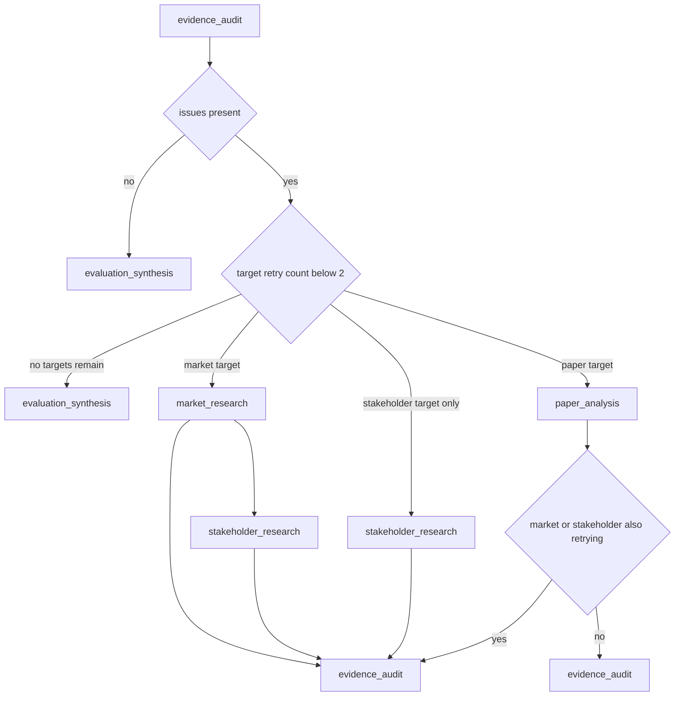

# Evaluation Graph and Runtime Orchestration

The runtime is a compiled LangGraph `StateGraph` over the shared `OverallState`. Its six application nodes are `paper_analysis`, `market_research`, `stakeholder_research`, `evidence_audit`, `evaluation_synthesis`, and `report_generation` ([`src/graph.py`](../../src/graph.py#L56-L66)). Each node returns state updates; reducers merge retry results by claim or evidence identity and normalize sources, so a retry can replace an existing claim rather than append a second copy ([`src/state.py`](../../src/state.py#L48-L79)).

The non-interactive entrypoint builds this graph and invokes it with `INITIAL_INPUT_STATE`; the Streamlit application builds the same graph and can stream node updates before invoking it to obtain the final state ([`main.py`](../../main.py#L31-L44), [`app.py`](../../app.py#L61-L105)).

## Runtime topology

The graph has two initial branches. Paper analysis is independent of the market branch and starts at the same `START` boundary. Market research must finish before stakeholder research runs, because stakeholder queries consume market context such as `market.key_vendors`. Stakeholder research is the normal synchronization point into `evidence_audit`.



*Caption: The six-node graph fans out to paper and market research, chains market context into stakeholder research, and converges at evidence audit before synthesis and report generation.*

### Call sequence and state ownership

1. `main.py` supplies the selected technologies, empty output containers, and per-agent retry counters initialized to zero. The graph is compiled once and invoked with that state ([`main.py`](../../main.py#L8-L29), [`src/graph.py`](../../src/graph.py#L56-L99)).
2. `paper_analysis` performs the paper-side Agentic RAG work and writes paper/domain outputs, claims, evidence, and sources. Retrieval is filtered by technology and uses a sufficiency gate before accepting a quoted passage ([`src/rag/agentic_rag.py`](../../src/rag/agentic_rag.py#L89-L157), [`src/rag/agentic_rag.py`](../../src/rag/agentic_rag.py#L218-L299)).
3. In parallel, `market_research` collects adoption, ecosystem, and deployment evidence. Its support and counter searches produce market claims and context ([`src/research/market.py`](../../src/research/market.py#L160-L233)).
4. `stakeholder_research` runs after `market_research`, reusing market-derived vendors to form actor-specific queries. It produces the stakeholder claims and evidence for the four actor categories ([`src/research/stakeholder.py`](../../src/research/stakeholder.py#L15-L69), [`src/research/stakeholder.py`](../../src/research/stakeholder.py#L150-L206)).
5. `evidence_audit` performs static rules first and invokes the LLM judge only for claims not already flagged by those rules. It updates `audit.issues`, retry counters, and claim status ([`src/audit/auditor.py`](../../src/audit/auditor.py#L25-L75)).
6. When audit passes, or when unresolved issues have no retry budget left, `evaluation_synthesis` computes the TRL and cross-perspective synthesis. `report_generation` then renders the report text. The graph ends after that node ([`src/graph.py`](../../src/graph.py#L83-L99)).

`report_generation` is the graph's completion boundary: it creates the in-memory `report` value, but file persistence and optional PDF conversion happen outside the graph. `main.py` writes Markdown and conditionally converts it to PDF; the Streamlit path performs the equivalent writes after obtaining the final state ([`main.py`](../../main.py#L41-L61), [`app.py`](../../app.py#L93-L105)). A report is therefore not considered an externally available artifact merely because synthesis completed.

## Audit fan-in and targeted feedback

The audit node is the fan-in for the normal first execution. Static rules R1–R4 run before R5, which avoids spending an LLM-judge call on claims already known to violate a static rule. Issues identify a `target_agent` of `paper`, `market`, or `stakeholder`; the router maps those logical targets back to graph node names ([`src/state.py`](../../src/state.py#L30-L35), [`src/audit/auditor.py`](../../src/audit/auditor.py#L33-L45), [`src/graph.py`](../../src/graph.py#L32-L53)).



*Caption: Audit issues are converted into targeted retries; market retries cascade through stakeholder research, while audit completion or retry exhaustion enters synthesis.*

### Routing rules

- `_retry_targets` reads `audit.issues` and keeps only targets whose counter is below two. Missing audit data behaves as an empty issue list ([`src/graph.py`](../../src/graph.py#L12-L20)).
- A market issue routes to `market_research`; its ordinary outgoing edge necessarily reruns `stakeholder_research`, preserving the market-to-stakeholder dependency. A stakeholder-only issue routes directly to `stakeholder_research` ([`src/graph.py`](../../src/graph.py#L40-L53), [`src/graph.py`](../../src/graph.py#L68-L76)).
- A paper issue routes to `paper_analysis`. If paper is the only retry target, `route_after_paper` sends it directly to audit. If market or stakeholder is also being retried, the paper branch closes at `END` and the stakeholder branch supplies the single audit entry; this prevents duplicate audit execution from parallel branches ([`src/graph.py`](../../src/graph.py#L23-L29), [`src/graph.py`](../../src/graph.py#L75-L81)).
- If no issue exists, audit routes to synthesis. If issues remain but every affected agent has reached two attempts, the router also routes to synthesis rather than looping indefinitely ([`src/graph.py`](../../src/graph.py#L32-L53)).

## Retry lifecycle and exhaustion

The retry limit is per logical agent, not per individual issue. During one audit pass, an agent's counter increments once even if several of its claims are flagged ([`src/audit/auditor.py`](../../src/audit/auditor.py#L46-L51)). While budget remains, affected claims are marked `flagged`; when the just-incremented counter reaches `RETRY_LIMIT`, the audit node finalizes them: R1–R4 become `insufficient`, while R5 becomes `rejected` ([`src/audit/auditor.py`](../../src/audit/auditor.py#L10-L21), [`src/audit/auditor.py`](../../src/audit/auditor.py#L58-L75)). This is important because the router can select a destination but cannot itself write state; the audit node owns terminal status updates.

A retry node is expected to repair only its own targeted claims. For example, stakeholder retry handling looks up the issue's claim and applies the requested action such as counter-evidence search, relabeling, or re-extraction ([`src/research/stakeholder.py`](../../src/research/stakeholder.py#L209-L240)). Reducers then upsert repaired claims and evidence by ID, making retries idempotent at the entity level ([`src/state.py`](../../src/state.py#L48-L59)).

## Operational and extension boundaries

- **Entrypoints:** use `python main.py` for a batch run; use `streamlit run app.py` for the interactive dashboard ([`README.md`](../../README.md#L172-L188)). Both entrypoints depend on the same `build_evaluation_graph` assembly.
- **Shared contract:** extensions should add a node only with an explicit state ownership and reducer strategy. `OverallState` currently separates research outputs, audit data, retry counters, synthesis, and report text ([`src/state.py`](../../src/state.py#L81-L96)).
- **External failure behavior:** absent web-search results are represented as `insufficient` rather than fabricated evidence in the research nodes; the graph can still proceed to synthesis after audit or retry exhaustion ([`src/research/market.py`](../../src/research/market.py#L177-L187), [`src/research/stakeholder.py`](../../src/research/stakeholder.py#L165-L174)).
- **Artifact boundary:** changing report storage or PDF behavior belongs in the entrypoint/export layer, not in graph routing. Changing retry policy belongs in both the router and audit status finalization so control flow and persisted claim status remain consistent.

## Focused verification

`tests/test_graph.py` covers graph compilation, first-run routing, paper-only and market/stakeholder retry paths, retry exhaustion, parallel retry fan-in, and end-to-end report/TRL production ([`tests/test_graph.py`](../../tests/test_graph.py#L7-L197), [`tests/test_graph.py`](../../tests/test_graph.py#L239-L286)). Run the focused suite with:

```bash
pytest tests/test_graph.py -v
```

The most valuable regression cases are the tests asserting that a market retry cascades to stakeholder research and that combined market-plus-paper or stakeholder-plus-paper retries invoke `evidence_audit` only once for the retry wave ([`tests/test_graph.py`](../../tests/test_graph.py#L246-L275)).

See [State and Evidence Contract](../concepts/state-and-evidence-contract.md) for reducer and evidence semantics, [Configuration and Artifacts](../operations/configuration-and-artifacts.md) for runtime settings and output paths, [End-to-End Evaluation](../workflows/end-to-end-evaluation.md) for the user-facing workflow, and [Evidence Audit and Retry](../workflows/evidence-audit-and-retry.md) for audit rules and remediation details.
