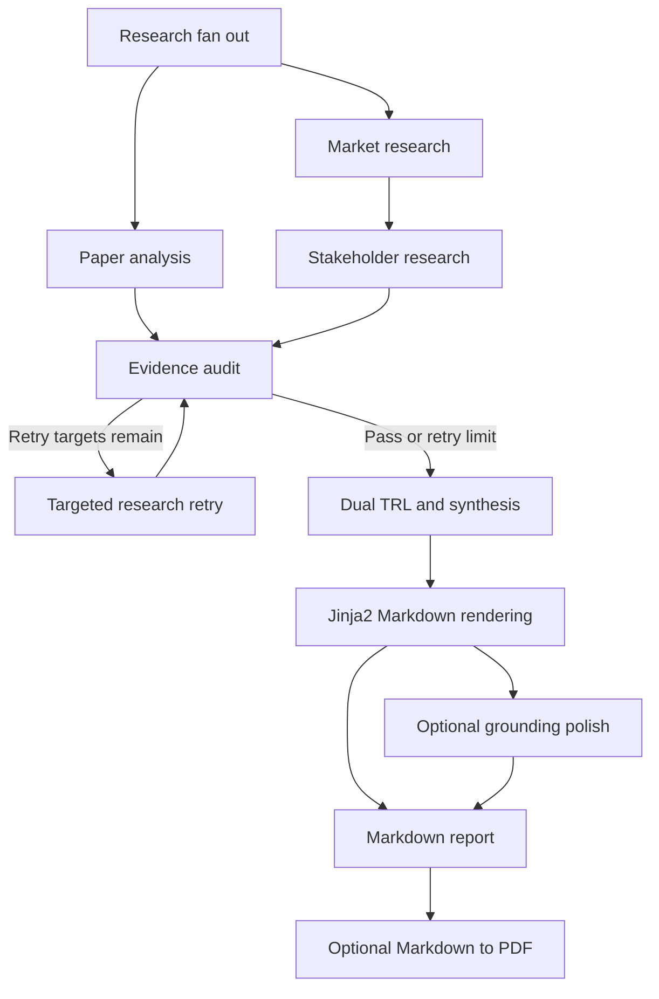

# Dual TRL Synthesis and Report Delivery

The synthesis stage is the boundary between evidence collection/audit and the final evaluation artifact. It consumes the shared `OverallState`, derives a separate maturity view for the named technology and for its broader adoption ecosystem, then renders the report. It does not select a winner or issue a recommendation: the report preserves workload conditions, infrastructure constraints, and evidence gaps instead.

## Position in the evaluation graph

The LangGraph pipeline fans out to paper and market research, chains market research into stakeholder research, and sends the resulting state through evidence audit. A clean audit, or an exhausted retry budget with unresolved issues isolated, reaches `evaluation_synthesis`; report generation follows it and then terminates the graph.

*The lifecycle from audited state to Markdown and optional PDF delivery.*

The graph itself owns the ordering (`src/graph.py`), while synthesis owns only the `trl` and `synthesis` outputs and report generation owns `report`. PDF conversion is a standalone utility; no graph edge invokes it automatically.

## Verified-claim filtering and dual TRL

`evaluate_trl(tech, claims)` first restricts claims to the requested technology and `status == "ok"`. It then divides verified claims into:

- **Research evidence**: `perspective` is `domain` or `maturity`.
- **Adoption evidence**: `perspective` is `market`.

The `kind` values are interpreted conservatively and deterministically:

| Evidence found | Technology TRL | Family/adoption TRL |
| --- | --- | --- |
| Research `fact` | `5-6` | — |
| Research `simulation` (when no fact takes precedence) | `3-4` | — |
| Adoption `fact` | — | `7-8` |
| Adoption `vendor_claim` (when no fact takes precedence) | — | `6-7` |
| No matching kind | `Unknown` | `Unknown` |

A fact takes precedence over simulation for technology TRL and over a vendor claim for family TRL. Confidence is `high` when both research and adoption evidence exist, `medium` when exactly one side exists, and `none` when neither exists. With no verified claim at all, the result explicitly sets both TRLs to `Unknown`, confidence to `none`, and `fallback_reason` to `Insufficient Evidence`; evidence ID lists contain only the claims from their respective perspective. This prevents market adoption from being mistaken for proof of an individual implementation, and prevents a simulation from being presented as a deployed technology.

`evaluation_synthesis_node` computes this result independently for `KIVI` and `CXL-PNM`. It also collects every `insufficient` or `rejected` claim as `evidence_gaps`. Its synthesis payload contains fixed, non-ranking statements about the KIVI compression versus CXL-PNM near-memory/infrastructure trade-off, possible combined consideration, why research and ecosystem maturity must be separated, and an overall opinion that explicitly declines superiority and recommendation claims.

## Report rendering and citation boundary

`report_generation_node` loads `src/synthesis/templates/report.md.j2` with Jinja2 and passes selected technologies, perspective outputs, TRL, synthesis, claims, evidence, and sources. The template produces the fixed report structure: `SUMMARY`, sections 1–6, and `REFERENCE`. It includes:

- verified claims (`status == "ok"`) under each technology, with claim IDs, kinds, and numbered source references;
- a TRL table with separate `tech_trl`, `family_trl`, confidence, and research/adoption claim IDs;
- market, stakeholder, and six-axis domain tables with explicit fallback text when a value is absent;
- disagreement, research-versus-adoption interpretation, trade-offs, synergy, and a non-ranking overall opinion;
- a limitations/evidence-gap section that shows rejected or insufficient claims and keeps simulation results labeled as simulation;
- references only for sources reached through evidence attached to verified claims.

Thus a source present in state but unused by an `ok` claim is not silently promoted into the bibliography. Missing mechanisms, market facts, stakeholder facts, and domain-axis values render human-readable “no verified evidence” fallbacks. The template also preserves the report’s Korean prose and technical identifiers; the report-generation module does not translate or reinterpret claim facts itself.

### Source metadata enrichment

Before rendering, each source is copied through `enrich_source`. If `authors`, `date`, or `site_name` is blank or a known placeholder, `fetch_source_metadata` performs a bounded HTTP request (four-second timeout, at most 512,000 decoded bytes) and parses HTML meta tags and JSON-LD. It fills only missing fields, preferring explicit metadata over JSON-LD and deduplicating JSON-LD values. Network or parsing errors return an empty result and leave the original source usable. The function is LRU-cached (32 URLs), so repeated report rendering does not repeatedly fetch the same URL.

Citation filters then normalize dates by requested precision, choose author/publisher/site fallbacks, and format paper, patent, web, or generic references. The URL remains the source of truth; enrichment is presentation metadata, not new evidence.

## Optional strict-grounding polishing

Rendering is deterministic when `OPENAI_API_KEY` is unset: the generated Markdown is returned directly. When a key is configured, the module sends the rendered report to `ChatOpenAI` using `POLISHING_LLM_MODEL` at temperature `0.1`. The prompt constrains the model to preserve section order, numbers, TRL values, claim IDs, URLs, source tiers, and `simulation` labels, and forbids adding a winner, recommendation, or unsupported forecast. It is a polishing pass, not an additional research or validation pass.

Any exception during the optional call logs a warning and falls back to the already-rendered Markdown. Operators should therefore treat the unpolished template output as the guaranteed artifact and regard polishing as best-effort. The API key and model are configured centrally in `src/config.py`; the configured default polishing model is `gpt-4o`.

## Markdown-to-PDF delivery

`convert_markdown_to_pdf(markdown_text, output_pdf_path)` is an explicit post-processing operation. It creates the destination directory, converts Markdown with `tables` and `fenced_code` extensions, wraps the HTML in A4 portrait styling, and writes through `xhtml2pdf`. It returns `True` only when the PDF library succeeds, `pisa` reports no errors, and a non-empty output exists.

Korean rendering uses the first existing file from the project NanumGothic and AppleGothic paths, then Linux NanumGothic and macOS AppleGothic system paths. When found, the font is installed in CSS through `@font-face` and applied globally; otherwise the exporter uses `sans-serif`. Missing `markdown`/`xhtml2pdf`, conversion exceptions, and non-zero `pisa` errors return `False` rather than replacing the Markdown report. The configured conventional destinations are `final_evaluation_report.md` and `final_evaluation_report.pdf`, but the utility accepts any output path.

## Invariants, failure semantics, and safe changes

1. **Only verified claims drive positive report content and TRL evidence.** `flagged`, `insufficient`, and `rejected` claims cannot raise TRL; the latter two remain visible as gaps.
2. **Technology and family TRL are independent axes.** Do not collapse them into one score or infer adoption from a research fact.
3. **No winner or recommendation.** Changes to template text, polishing instructions, or synthesis prose must retain the explicit trade-off and no-ranking behavior.
4. **Evidence provenance is preserved.** Claim IDs link to evidence IDs, evidence links to source IDs, and only reachable verified sources receive reference numbers.
5. **Fallbacks are normal outputs.** Unknown TRL, absent-axis text, missing metadata, unavailable polishing, and unavailable PDF dependencies must degrade without inventing facts.
6. **Retry termination precedes synthesis.** Synthesis is reached after audit pass or retry exhaustion; it is not responsible for re-running evidence collection.

When extending the evaluator, add a new perspective or evidence kind deliberately: update the state contract, precedence rules, report labels, and tests together. When extending the report, preserve the section headings expected by consumers and the claim/source linkage. When extending PDF styling, retain the boolean failure contract and test both successful output and dependency/font fallback behavior.

## Focused tests

`tests/test_synthesis.py` checks dual-axis TRL derivation for both technologies, the no-claims fallback, normalization of internal missing-evidence text, required report sections, source numbering, simulation labeling, citation fallbacks, and the absence of superiority language. `tests/test_pdf_export.py` checks that a Korean font candidate is found and that a Markdown table and Korean text produce a non-empty PDF. Together these tests protect the boundary between verified evidence, report presentation, and optional artifact conversion.

### Source map

- [Evaluation and TRL derivation](../../src/synthesis/evaluator.py)
- [Jinja2 rendering, metadata enrichment, and polishing](../../src/synthesis/report_gen.py)
- [Report template](../../src/synthesis/templates/report.md.j2)
- [PDF conversion](../../src/synthesis/pdf_export.py)
- [Evaluation graph](../../src/graph.py)
- [State and TRL contract](../../src/state.py)
- [Focused synthesis tests](../../tests/test_synthesis.py)
- [Focused PDF tests](../../tests/test_pdf_export.py)
