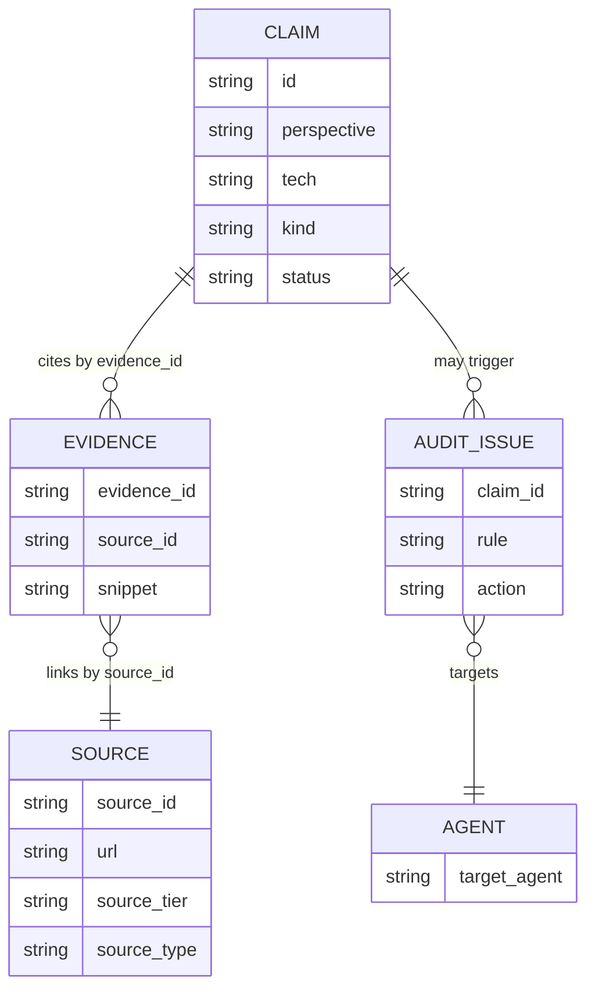
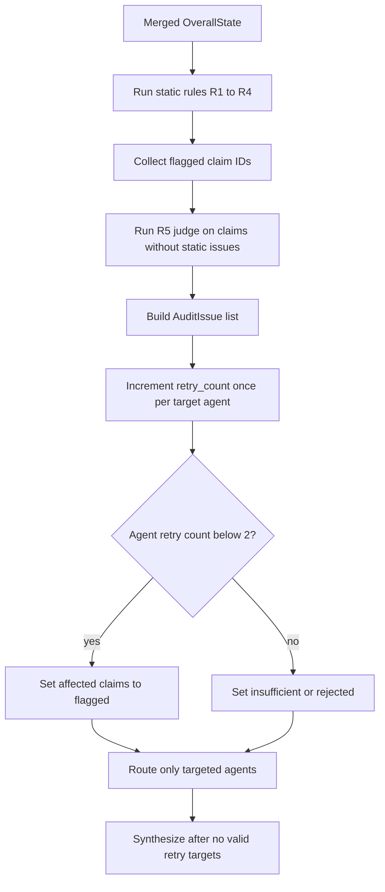

# State, Claims, Evidence, and Reducers

`OverallState` is the shared contract for the multi-agent evaluation graph. It is not merely a bag of intermediate results: the `claims`, `evidence`, and `sources` collections form a provenance model, while `audit` and `retry_count` drive targeted correction before synthesis. The graph starts with the selected technologies and empty research collections, then fans out into paper and market research, chains market context into stakeholder research, audits the merged result, and finally synthesizes and renders the report.

## Contract at a glance

`OverallState` has exactly 14 top-level keys:

| Key | Role | Primary writer or use |
|---|---|---|
| `selected` | Selected software/hardware technologies, families, and rationale | Initial input; stakeholder research reads family labels |
| `tech_sw`, `tech_hw` | Per-technology research summaries | Paper analysis |
| `domain` | Domain-axis results such as memory, bandwidth, accuracy, and infrastructure | Paper analysis |
| `market` | Adoption, ecosystem, vendors, and barriers | Market research |
| `stakeholder` | Actor-specific benefits, concerns, and barriers | Stakeholder research |
| `claims` | Auditable propositions keyed by claim ID | Paper, market, stakeholder, and audit updates; `upsert_claims` merges |
| `evidence` | Snippets tied to sources by `source_id` | Research nodes; `upsert_evidence` merges |
| `sources` | Source metadata and trust tier | Research nodes; `union_sources` merges |
| `audit` | Current `AuditIssue` list | Evidence audit |
| `retry_count` | Per-agent audit-pass attempts for `paper`, `market`, and `stakeholder` | Evidence audit increments; graph routing reads |
| `trl` | Technology/family readiness assessments and confidence | Evaluation synthesis |
| `synthesis` | Cross-technology trade-offs and evidence gaps | Evaluation synthesis |
| `report` | Final rendered report text | Report generation |

The initial state in `main.py` supplies all 14 keys. In particular, `claims`, `evidence`, `sources`, and `trl` start empty; `audit` starts with `issues: []`; and each research agent's retry counter starts at zero. LangGraph uses the `Annotated` reducers on the three collection fields when node outputs are merged.

## Provenance model

A **Claim** is a proposition, not just a retrieved passage. It has an owned `id` (for example `DOM-01`, `MKT-01`, `STK-01`, `MAT-R01`, or `MAT-A01`), `perspective`, `tech`, `statement`, and a `kind`: `fact`, `vendor_claim`, `simulation`, or `estimate`. It records supporting `evidence_ids`, optional `counter_evidence_ids`, whether counter-search was performed, and a lifecycle `status` of `ok`, `flagged`, `insufficient`, or `rejected`.

An **Evidence** record contains an `evidence_id`, the exact `source_id` it came from, and a snippet. A **Source** contains bibliographic/web metadata (`title`, `publisher`, `date`, `url`) plus `source_type` (`paper`, `patent`, or `web`) and trust `source_tier` (`T1` through `T4`). The link is deliberately two-step: a claim names evidence, and evidence names its source. This permits the audit rules to inspect the tier of every cited claim and permits report references to resolve to source metadata.

This diagram shows the state contract's provenance and correction relationships.

### ID ownership and source linkage

Claim IDs are the routing contract. `resolve_target_agent` maps `DOM-*` and `MAT-R*` to `paper`, `MKT-*` and `MAT-A*` to `market`, and `STK-*` to `stakeholder`; perspective is only a fallback for ad-hoc IDs. A writer must therefore update only IDs in its ownership domain during a retry. `market` and `stakeholder` also derive `MAT-A*` maturity claims from market claims rather than launching an independent search.

Every generated evidence record must point at a source ID that exists in the merged `sources` collection. Before creating a web source, market and stakeholder research call `resolve_source_id`: a matching trimmed URL reuses the existing canonical ID and suppresses a duplicate source. This is important because `union_sources` will discard a later source with an already-seen URL; reusing the ID prevents an evidence record from pointing at the discarded ID. Empty URLs are not deduplicated and may retain their proposed IDs.

## Reducers and idempotence

The collection reducers are replacement-by-key upserts:

- `upsert_claims` maps existing and incoming claims by `id`. An incoming claim replaces the old record with that ID, while new IDs are appended.
- `upsert_evidence` does the same by `evidence_id`, so a corrected snippet replaces the previous snippet.
- `union_sources` initially indexes by `source_id`, then indexes non-empty trimmed URLs. A new URL is added; a duplicate URL is ignored unless its incoming `source_id` is the existing canonical ID, in which case that canonical record is refreshed.

Consequently, repeating the same node output is idempotent with respect to collection cardinality, and a retry can atomically replace a claim while adding its new evidence and source records. These reducers do not merge fields inside a claim or evidence record: writers must emit a complete replacement record, not a partial patch. They also do not repair dangling references, so source resolution is a writer responsibility and evidence/source linkage should be treated as an invariant.

The focused state tests assert replacement behavior for duplicate claim and evidence IDs, URL deduplication and empty-URL handling, and the exact 14-key schema. They are the safest regression tests when changing IDs, reducer behavior, or state shape.

## Audit lifecycle and failure semantics

The audit node runs two stages. `run_static_rules` performs fast R1–R4 checks: facts without evidence (`R1`), claims supported only by T4 or unresolved sources (`R2`), missing counter-search for market/stakeholder or adoption-maturity claims (`R3`), and incorrect `kind` labels for academic CXL-PNM simulations or vendor-sourced market facts (`R4`). Claims already `insufficient` or `rejected` are terminal and skipped. Claims that pass static rules are sent to the R5 LLM judge for consistency checking.

For each audit pass, `retry_count` increments once per affected target agent, regardless of how many claims that agent has flagged. A flagged claim remains `flagged` while its agent has attempts remaining. Once that agent reaches the retry limit of two, the auditor finalizes R1–R4 failures as `insufficient` and R5 failures as `rejected`. Terminal claims are not re-audited, preventing an exhausted failure from reopening indefinitely.

This flow shows how audit findings become targeted retries or terminal claim statuses.

The graph routes only agents with unresolved issues and available attempts. A paper-only retry can return directly to audit; market retries may cascade into stakeholder research because stakeholder context depends on market output. When no valid retry target remains, unresolved items are isolated and synthesis proceeds rather than blocking the report. Search/API and LLM failures are intentionally graceful: paper retrieval produces insufficient claims when it cannot ground a quote, while web search returns empty results and market/stakeholder nodes use `insufficient` instead of inventing evidence.

## Writer boundaries and safe extension points

- **Paper analysis** owns domain and research-maturity claims (`DOM-*`, `MAT-R*`). It retrieves from the technology-filtered FAISS corpus, accepts only grounded excerpts, and marks CXL-PNM paper claims as `simulation` rather than `fact`.
- **Market research** owns market claims (`MKT-*`) and derives market-adoption maturity (`MAT-A*`). It performs paired support/counter searches, classifies URL tiers, infers `vendor_claim` for vendor domains and `estimate` for forecast language, and resolves source IDs before returning updates.
- **Stakeholder research** owns `STK-*`. It reads `state["market"]` for key vendors and writes stakeholder summaries without mutating the market summary; its paired searches produce support and counter evidence.
- **Evidence audit** owns `audit`, `retry_count`, and status changes caused by audit issues. It does not invent replacement evidence; the targeted research writer does that.
- **Evaluation synthesis** consumes the researched state to populate `trl` and `synthesis`; report generation consumes the resulting state and writes `report`.

When adding a new writer, preserve complete-record upserts, stable ID ownership, canonical source reuse by URL, and the evidence-to-source invariant. If a new claim family needs retries, extend both the ID-to-agent mapping and the corresponding research plan; changing only the `perspective` is unsafe because maturity claims intentionally share that perspective across paper and market ownership.

## Operational checklist

1. Initialize all 14 keys, including empty collection values and the three named retry counters.
2. Give every substantive claim a stable ID and complete schema record.
3. For every `evidence_id` in a claim, emit an evidence record whose `source_id` resolves in `sources`.
4. Reuse an existing source ID when URLs match after trimming; do not manufacture a second ID for the same URL.
5. Label simulations, vendor claims, and estimates explicitly; do not turn absence of search results into a fact.
6. On retries, emit only the owned claim IDs and complete replacement records; let reducers retain unrelated claims.
7. Keep terminal `insufficient` and `rejected` claims out of future audit loops.
