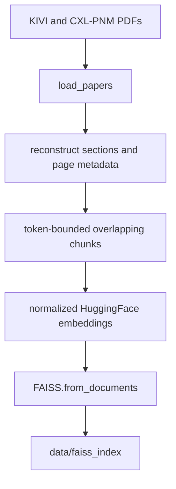
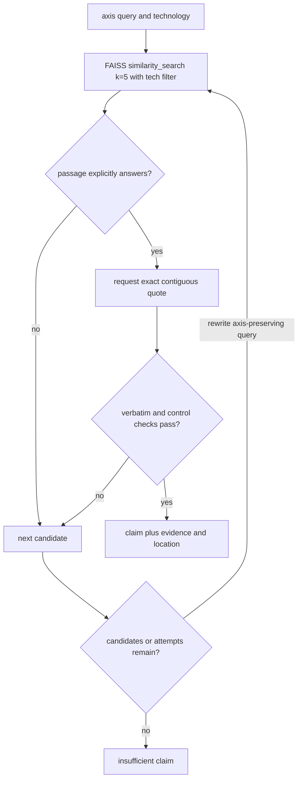

# Paper Corpus, FAISS Index, and Agentic RAG

This integration is the paper-only evidence path for the evaluation graph. It has three distinct responsibilities:

1. **Ingest and index** the two project PDFs (`kivi.pdf` and `cxl_pnm.pdf`) without mixing their provenance.
2. **Retrieve and ground** evidence for the KIVI and CXL-PNM technology axes, returning either a contiguous source quotation or an insufficient result.
3. **Measure retrieval quality** against source-derived queries and choose an embedding model under an explicit Hit@5 gate.

The paper sources are represented as T1 paper sources with their arXiv metadata in the agent, while the index itself persists only locally under `data/faiss_index`. This page describes the control path, not the papers' substantive findings; reported numbers belong to the inspected corpus and benchmark artifacts, not to the indexer design.

## Index construction: pages become section-aware chunks

`src/rag/indexer.py` defines the corpus boundary with `PAPERS = {"KIVI": "kivi.pdf", "CXL-PNM": "cxl_pnm.pdf"}`. `load_papers()` requires each file to exist, loads PDF pages through `PyPDFLoader`, and reduces page metadata to the technology label and zero-based PDF page number. A missing PDF therefore prevents a successful build rather than silently producing a partial trusted corpus.

`chunk_pages()` then reconstructs textual sections across page boundaries. It recognizes numbered and lettered headings, `Abstract`, and `References`; removes repeated page headers, page numbers, arXiv footer lines, and the KIVI author-affiliation footnote; joins a hyphenated continuation when the next page starts with a lowercase word; and keeps each chunk's `tech`, one-based `page`, and `section` metadata. Sections remain source-local, so a KIVI section cannot absorb CXL-PNM text. The chunker searches for the largest span no longer than 480 tokenizer tokens, prefers a sentence boundary once the span is at least 400 tokens, overlaps neighboring spans by at least enough text to reach 72 tokens where possible, and merges a short final span when the combined size stays within 500 tokens. A short KIVI Table 10 tail can carry its table caption so the result remains interpretable.

The build path tokenizes with `AutoTokenizer`, embeds chunks with normalized `HuggingFaceEmbeddings`, creates a LangChain FAISS store, and calls `save_local(output_dir)`. Failures—including missing PDFs or unavailable model/dependency resources—are caught, logged as an index-build fallback, and return `False`; the module's command-line entrypoint exits non-zero in that case.

*The index lifecycle from the two trusted PDFs to the persisted local FAISS store.*

The default embedding identifier is `intfloat/e5-small-v2`, centralized in `src/config.py`; the indexer accepts an override for build-time experiments. The persisted directory is also the path used by the runtime loader, so changing the output location requires changing the corresponding configuration or loader contract.

## Retrieval, sufficiency, and grounded quotations

`paper_analysis_node()` is the graph-facing entrypoint. With no paper audit issues it evaluates all 14 configured axes: six domain axes for each technology plus one research-maturity axis for each. On an audit retry it evaluates only paper-targeted issue claim IDs, preserving the retry's scope. A `relabel` action patches the existing claim's kind/status without loading FAISS or calling the LLM; other actions load the index and LLM and search for fresh evidence.

`load_index()` recreates E5-compatible passage/query embedding settings: normalized embeddings, `passage: ` for documents, and `query: ` for queries, then loads FAISS with `allow_dangerous_deserialization=True`. The retrieval request is always `similarity_search(query, k=5, filter={"tech": tech})`, and the result is checked again for matching `doc.metadata["tech"]`. Thus top-5 retrieval is technology-filtered both at the vector-store request and in application code.

Each candidate passes a sufficiency gate asking the LLM to answer only `YES` or `NO` as to whether the passage explicitly answers the current question. The gate adds a special rule for bandwidth questions: throughput alone is not transfer-bandwidth evidence. Accepted candidates are asked for an exact contiguous quotation of at most three sentences with measurement context. If the LLM paraphrases rather than copies, the agent enumerates source sentences and accepts only a consecutive one-to-three-sentence range that exists verbatim in the document. It rejects quotations that contain an interleaved figure caption, violate the bandwidth check, or— for the DOM-11 settings axis—omit both `residual length` or `group size`. Experimental-condition questions receive an additional check for model, context length, and hardware.

If no candidate passes, the agent tries at most two rewrites. Rewriting is constrained to technical synonyms and must preserve the original evaluation axis and metric. `_preserves_axis()` requires an axis term in the rewrite and rejects newly introduced terms from another axis unless they were already present in the original. A failed retrieval therefore produces an empty quotation and an `insufficient` claim rather than an invented answer. Retrieval and LLM exceptions follow the same safe direction: the operation logs a fallback and continues without evidence.

*The retrieval and grounding gates prevent cross-technology, cross-axis, paraphrased, or unsupported evidence from becoming a paper claim.*

For CXL-PNM research maturity, `_mat_r02_evidence()` deliberately retrieves two chunks from section `4.1 Evaluation Settings`: one for simulator/hardware setup and one for workloads/models. It keeps only chunks with that section metadata, matches required patterns for the cycle-level simulator, Llama models, token range, and NVIDIA DGX/A100 hardware, then asks a collective sufficiency gate before joining the verbatim sentences. This is a multi-chunk evidence relationship, not a license to infer missing experimental conditions.

On success, the node emits claims, evidence snippets, and source records. Evidence IDs are `EV-<claim-id>` (or numbered for the multi-chunk maturity claim); locations retain page and section metadata. A CXL-PNM claim is marked `simulation`, while a KIVI claim is a `fact`; empty retrievals are `insufficient`. The node returns its update rather than mutating the input state, and audit retries return only the targeted paper claims.

## Benchmark corpus and model selection

`prepare_queries()` rebuilds chunks from the actual PDFs and requires exactly 20 rows from `data/eval_queries.json`. Each row identifies a technology, query, and target phrase. The target is found by searching the corresponding technology's real chunk corpus, so a missing phrase raises an error instead of benchmarking canned passages. The supplied queries cover 10 KIVI and 10 CXL-PNM questions, but the benchmark logic remains driven by the JSON rows.

`evaluate_embedding()` encodes E5 queries as `query: ...` and passages as `passage: ...`; other models receive unprefixed text. It L2-normalizes vectors, ranks by the dot product, and reports Hit@5 and reciprocal rank. Multiple target indices are supported: the best target rank counts for the query. Empty queries, malformed corpora, and out-of-range targets raise `ValueError`.

The benchmark first measures both `BAAI/bge-small-en-v1.5` and `intfloat/e5-small-v2` on the same prepared corpus. Models with Hit@5 at least `0.8` are eligible, and the eligible model with the highest MRR is selected. Only when no small model passes does it evaluate `BAAI/bge-m3`; if that also fails the threshold, selection is `None`. The inspected `src/rag/benchmark_results.json` records 20 queries, `BAAI/bge-small-en-v1.5` at Hit@5 `0.75` and MRR `0.5480357142857144`, and `intfloat/e5-small-v2` at Hit@5 `0.8` and MRR `0.5955357142857143`; accordingly, it records `intfloat/e5-small-v2` as selected. These are benchmark artifact values, not a general claim about embedding quality.

The focused tests in `tests/test_rag.py` protect the important boundaries: real rank scoring and empty-input validation; section and source metadata; cross-page continuation, reference tails, captions, and author-footnote removal; project-root FAISS path consistency; missing-PDF failure; technology-filtered top-5 retrieval; retry and relabel behavior; contiguous quotation recovery; bandwidth/axis/DOM-11 gates; complete experimental-condition requirements; and the two-chunk CXL-PNM maturity evidence path. They use fakes for models, vector stores, and LLM calls, so the control logic can be tested without downloading models or making network calls.

For the surrounding state/evidence contract and operational artifact locations, see [State and Evidence Contract](../concepts/state-and-evidence-contract.md) and [Configuration and Artifacts](../operations/configuration-and-artifacts.md). The broader execution and testing context is covered by [End-to-End Evaluation](../workflows/end-to-end-evaluation.md) and [Test Strategy](../testing/test-strategy.md).
