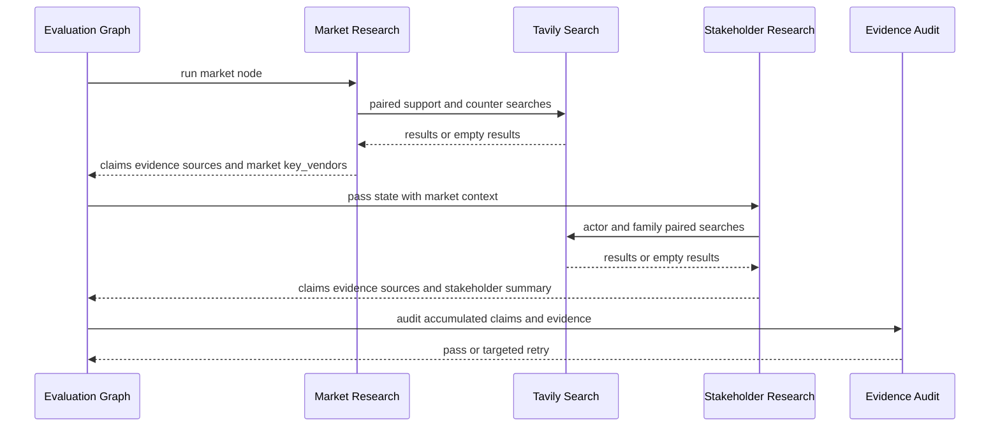

# Tavily Market and Stakeholder Research

This integration supplies the evaluation graph with two related research perspectives:

- **Market research** asks whether the two selected technology families—`KIVI` (KV quantization) and `CXL-PNM` (CXL memory expansion)—are being evaluated, supported, or deployed, and what barriers are reported.
- **Stakeholder research** follows market research and asks how four actors—Cloud Serving Operator, Framework Developer, End User, and HW/Memory Supplier—relate to both families.

The nodes return partial state updates containing `claims`, `evidence`, and `sources`; the market node additionally owns `market`, while the stakeholder node owns `stakeholder`. Their records conform to the shared state and evidence contract ([State and Evidence Contract](../concepts/state-and-evidence-contract.md)).

## Where the integration runs

The LangGraph starts `paper_analysis` and `market_research` in parallel. `market_research` feeds `stakeholder_research`, which then feeds `evidence_audit`; successful audit proceeds to synthesis and report generation. This ordering matters: stakeholder queries can consume `state["market"]["key_vendors"]`, but stakeholder research never writes or replaces the market dictionary. Audit retries are targeted to the flagged agent and claim rather than rerunning unrelated research. The graph allows at most two retries per target agent before unresolved items are isolated and synthesis continues ([end-to-end graph](../../src/graph.py#L12-L53), [node wiring](../../src/graph.py#L56-L99)).

*This sequence shows the data and control chain from market discovery to actor-specific research and audit.*

## Shared search and evidence mechanics

### Paired support and counter searches

`search_pair(support_query, counter_query, ...)` executes a support search with up to three results and a counter search with up to two results. Both use Tavily `search_depth="advanced"` by default; market searches additionally set `time_range="year"` because adoption and deployment evidence is time-sensitive. A counter search is attempted even when it returns no results, and a claim records `counter_searched: true`. Thus “no counter evidence found” is distinct from “the counter search was not performed” ([client](../../src/research/client.py#L19-L83), [market wrapper](../../src/research/market.py#L132-L135)).

The query plans deliberately separate three market axes:

- `adoption`: evaluation, piloting, or consideration;
- `deployment`: current production operation or shipping products;
- `ecosystem`: framework, vendor, or standards support.

Market IDs `MKT-01` through `MKT-06` cover these signals across KIVI and CXL-PNM, and each plan entry has a distinct support and counter question. Stakeholder IDs `STK-01` through `STK-08` cover four actors × two technology families, with each actor’s counter query looking for operational risk, integration difficulty, quality/latency concerns, or adoption barriers ([market plan](../../src/research/market.py#L14-L112), [stakeholder plan](../../src/research/stakeholder.py#L15-L69)).

### T1–T4 source classification

`classify_tier` assigns:

- **T1**: scholarly or standards sources such as arXiv, IEEE, ACM, and the CXL Consortium;
- **T2**: named vendor or major ecosystem domains such as Samsung, SK Hynix, NVIDIA, Intel, and GitHub;
- **T3**: other web publishers;
- **T4**: blogs and community/social sources such as Medium, Reddit, Tistory, Velog, and Substack.

Results are ranked T1 → T4 before selection. The selector tries candidates in that order and skips a result whose content cannot produce a usable statement, rather than blindly trusting Tavily’s first result. This avoids relying on a T4 result when a stronger candidate is available, while retaining a highest-ranked candidate as evidence if all summaries fail ([tiering and ranking](../../src/research/client.py#L7-L16), [ranking](../../src/research/client.py#L208-L218), [market selection](../../src/research/market.py#L138-L157), [stakeholder selection](../../src/research/stakeholder.py#L73-L88)).

### Claim kinds and neutral summaries

`infer_kind` distinguishes three important interpretations:

- `vendor_claim` for material from the vendor domains Samsung, SK Hynix, NVIDIA, or Intel;
- `estimate` when content contains forecast markers such as `CAGR`, `forecast`, `projected to`, market-size language, or future-year wording;
- `fact` for other content that is not identified as a vendor claim or forecast.

Vendor-domain classification takes precedence over forecast wording. `summarize_snippet` asks the LLM for exactly one neutral sentence, ignores navigation and boilerplate, and returns empty text for no relevant information. If the LLM call fails, it clips a sentence from the source text; callers still treat an empty statement as insufficient. Statements and stored evidence snippets are made from the same selected text so later evidence auditing can compare them consistently ([typing and summarization](../../src/research/client.py#L86-L205), [market claim construction](../../src/research/market.py#L177-L233), [stakeholder claim construction](../../src/research/stakeholder.py#L150-L206)).

### Source identity is URL-based

A source is not recreated merely because market and stakeholder research encountered it independently. Before creating a new `Source`, both nodes call `resolve_source_id` against the sources already accumulated in state and reuse the existing ID when the normalized URL matches. This is required because `union_sources` drops a later source with a duplicate URL; reusing the ID keeps every `Evidence.source_id` pointing to the surviving source. Known domains also receive human-readable publishers through `vendor_label` ([source resolution](../../src/research/client.py#L125-L149), [market builder](../../src/research/market.py#L115-L129), [stakeholder builder](../../src/research/stakeholder.py#L113-L127), [source reducer](../../src/state.py#L61-L79)).

## Market research lifecycle

On an initial run, the market node executes all six plan entries, collecting one support evidence record and, when available, one counter evidence record per query. A missing support result produces a claim with an empty statement, no evidence or source, and `status: "insufficient"`; it never invents a URL or a market conclusion. A successful support result can still be insufficient if no usable summary can be extracted. Counter evidence is summarized into the market `barriers` text without being mistaken for support ([market execution](../../src/research/market.py#L160-L233)).

After collection, the node derives two `MAT-A` maturity claims without another web search. `MAT-A01` combines the usable KIVI adoption, ecosystem, and deployment claims; `MAT-A02` does the same for CXL-PNM. The derived claims are `perspective: "maturity"` and `kind: "estimate"`; they do not assign a numeric TRL—the downstream evaluator computes that. If none of the contributing claims is usable, the derived claim is insufficient ([MAT-A plan](../../src/research/market.py#L107-L112), [derivation](../../src/research/market.py#L236-L274)).

The market summary contains `key_vendors`, `adoption`, `deployment`, `ecosystem`, and `barriers`. `key_vendors` is collected from vendor labels on accumulated sources, with generic CSP and hardware fallback labels only for the summary; those fallback labels are not inserted into stakeholder queries. Empty axes use explicit “evidence not found” wording rather than raw snippets or inferred conclusions ([summary assembly](../../src/research/market.py#L393-L425)).

### Retries and audit interaction

For a flagged market claim, the retry handler can:

- search counter evidence with a rewritten counter query;
- re-extract a statement from existing evidence;
- relabel the claim using URL and snippet typing; or
- rerun support and counter searches with rewritten queries while excluding prior evidence URLs.

Claims without a dedicated plan, including MAT-A claims, cannot be meaningfully searched again and become insufficient on retry. A retry returns only the changed claim/evidence/source records, leaving the market summary untouched so reducers do not erase current context ([market retry logic](../../src/research/market.py#L290-L349), [retry handling](../../src/research/market.py#L352-L373)).

## Stakeholder research chained from market context

The stakeholder node reads `state.get("market")` and extracts `key_vendors`. It chooses technology-relevant vendors rather than the first alphabetically sorted vendor: CXL-PNM prefers Samsung, SK Hynix, Intel, and CXL Consortium; KIVI prefers NVIDIA. If market context or a matching vendor is absent, the `{vendor}` placeholder is removed and the query remains valid without a fabricated vendor. The selected family labels come from `state["selected"]["families"]`, with KV Quantization and CXL Memory Expansion as defaults ([context and vendor filling](../../src/research/stakeholder.py#L91-L110), [node setup](../../src/research/stakeholder.py#L349-L360)).

Each successful actor/family claim has a benefit from its support evidence. The summary’s concern and adoption barrier are derived only from counter evidence, with a second counter result used for the barrier when available. If counter results are absent, both fields say `counter-evidence not found`; if there is no usable claim, the slot explicitly says evidence is unverified. End-user slots use the more specific “citable latency/quality indirect evidence not found” wording rather than guessing a persona’s experience. The summary preserves the established string-slot contract, including compatibility aliases `cloud_ops` and `hw_vendors` ([detail and slot assembly](../../src/research/stakeholder.py#L277-L326), [summary lifecycle](../../src/research/stakeholder.py#L332-L397)).

Stakeholder retry behavior is similarly targeted. Counter-search retries preserve an otherwise usable claim when the second search is empty; relabel retries correct `fact` to `vendor_claim` when an audit issue requires it; re-extraction restates only the existing snippet. General evidence retries rewrite both queries and exclude the prior source URL. Only the affected actor slot is rebuilt, while unrelated slots and extra summary keys are retained ([retry implementation](../../src/research/stakeholder.py#L209-L264), [targeted summary patch](../../src/research/stakeholder.py#L361-L379)).

## Failure semantics and operations

Set `TAVILY_API_KEY` to enable external search and `OPENAI_API_KEY` to enable LLM summarization and query rewriting; the default model for these utilities is `gpt-4o-mini` ([configuration](../../src/config.py#L11-L19)). Missing keys, Tavily construction failures, and search exceptions return `{"results": []}` and `None` for the counter result. That graceful degradation is intentional: absent keys or failed searches return empty results, and claims become `insufficient` rather than fabricated. No fake URL, source, snippet, vendor, or stakeholder conclusion should be added to make a report look complete ([fallback](../../src/research/client.py#L39-L83)).

Query rewriting is an optional retry aid. Without `OPENAI_API_KEY`, it returns the original query, so correctness does not depend on a second LLM service. When changing this integration, preserve these invariants:

1. Always execute and record the counter-search attempt.
2. Never treat vendor-originated claims as independently verified facts.
3. Prefer stronger tiers and do not use a T4-only result when a better candidate is available.
4. Keep statement input and evidence snippet aligned.
5. Reuse source IDs for duplicate URLs.
6. Keep market ownership in the market node and stakeholder ownership in the stakeholder node.
7. Represent missing evidence explicitly instead of filling it with inference.

## Focused tests

`tests/test_research.py` covers the material integration boundaries rather than only symbol existence. It tests tier and claim-kind classification, URL-based source reuse, paired-search fallback, missing-result insufficiency, candidate selection past boilerplate, market axis and MAT-A contracts, market-to-stakeholder URL deduplication, vendor selection from market context, four-actor/two-family coverage, family-labeled summaries, counter evidence and barrier handling, and targeted retry behavior. `tests/conftest.py` replaces `TavilyClient` with a deterministic mock, allowing these behaviors to be tested without network calls ([research tests](../../tests/test_research.py#L10-L119), [fallback and retry tests](../../tests/test_research.py#L553-L664), [test fixture](../../tests/conftest.py#L5-L50)).
