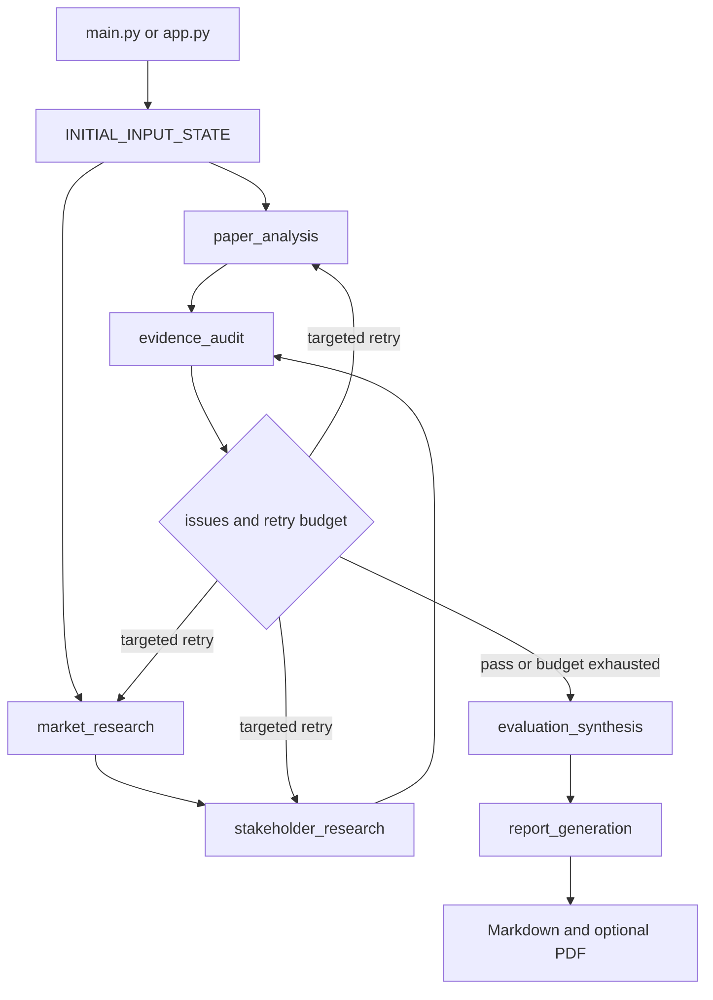

# Configuration, Runtime Operations, and Artifacts

This page describes the repository-level operating contract: local Python/uv setup, environment variables, paper prerequisites, the two execution entrypoints, and the files produced by a run. It complements the [Quickstart](../quickstart.md), while the [Paper RAG integration](../integrations/paper-rag.md) and [Web Research integration](../integrations/web-research.md) explain those boundaries in more depth.

## Runtime shape

The project is a Python package targeting Python 3.10 or newer. The declared project dependencies include LangGraph, LangChain, FAISS, sentence-transformers, Tavily, Jinja2, `pypdf`, Markdown, and `xhtml2pdf`; the pinned `requirements.txt` is the installation input used by the documented workflow. Configuration is loaded once by `src.config` from `.env` using `python-dotenv`, and paths are rooted at the repository directory rather than the current shell directory.

At runtime, `main.py` supplies an initial state containing the selected technologies (KIVI and CXL-PNM), empty per-perspective results, audit storage, retry counters, and report storage. The compiled graph fans out to paper analysis and market research, chains market research into stakeholder research, audits the combined state, optionally retries targeted agents, then synthesizes and renders a report. The retry router allows an affected perspective up to two retries; exhausted issues are isolated and the pipeline continues to synthesis.



*The LangGraph control flow, including targeted feedback and the terminal report stage.*

## Environment variables and optional integrations

Copy `.env.example` to `.env` and keep all credentials there or in the process environment; do not put secrets in source, committed reports, or command-line arguments.

| Variable | Role and missing-value behavior |
| --- | --- |
| `OPENAI_API_KEY` | Used by the paper/query LLM, audit Judge (`gpt-4o`), and optional report polishing (`gpt-4o`). When absent, LLM-dependent work is caught or skipped: paper retrieval cannot create grounded LLM excerpts, the Judge does not perform an API decision, and report generation returns the rendered template without polishing. Research summarization also falls back to a clipped source sentence when its LLM call is unavailable. |
| `TAVILY_API_KEY` | Enables paired support/counter web searches for market and stakeholder research. When absent, the client returns an empty result rather than fabricating a source; downstream claims are consequently represented as insufficient. |
| `LANGCHAIN_TRACING_V2` | Enables LangSmith V2 tracing when set to `true`. The example also sets `LANGCHAIN_ENDPOINT` and `LANGCHAIN_PROJECT`. |
| `LANGCHAIN_API_KEY` | Optional credential for sending LangSmith traces. Without the optional integration, the local graph still remains the execution mechanism. |
| `LANGCHAIN_ENDPOINT` / `LANGCHAIN_PROJECT` | Optional LangSmith destination and project grouping; the example values are `https://api.smith.langchain.com` and `RAG-PROJECT`. |
| `HF_TOKEN` | Optional Hugging Face credential. The embedding model can use it for model-download access/rate-limit relief; it is not read directly by the project code. |

The application does not provision remote services or deployment infrastructure. Missing optional keys should be diagnosed as reduced evidence or tracing, not solved by hard-coding credentials. See [Web Research](../integrations/web-research.md) for source-tier behavior and [Synthesis and reporting](../architecture/synthesis-and-reporting.md) for the report contract.

## Install, test, and run

The repository documents this local workflow:

```bash
uv venv && source .venv/bin/activate
uv pip install -r requirements.txt
pytest tests/ -v
```

The non-interactive entrypoint is:

```bash
python main.py
```

It builds and invokes the graph, always writes the generated report text to `final_evaluation_report.md`, and then attempts the configured output (`final_evaluation_report.pdf` by default). Its exit code is `0` after successful graph execution and artifact handling, and `1` for an uncaught pipeline error.

The Streamlit dashboard is deliberately optional: it is not in `requirements.txt`. Install it separately only when the interactive UI is wanted:

```bash
uv pip install streamlit
streamlit run app.py
```

The dashboard streams graph node updates for progress, can load the repository’s mock state without a live run, and exposes the report, claims/audit data, TRL/synthesis data, and raw state. A dashboard exception is shown in the UI; it does not change the CLI contract.

## Paper corpus and FAISS prerequisite

Paper analysis is local-corpus RAG, not a web lookup. The repository must contain these two files under `data/papers/`:

- `kivi.pdf`
- `cxl_pnm.pdf`

`python -m src.rag.indexer` parses both PDFs with `PyPDFLoader`, preserves technology, section, and one-based page metadata, chunks sections at roughly 480 tokenizer tokens with overlap, and saves a FAISS index under `data/faiss_index/`. The index uses `intfloat/e5-small-v2`, the configured embedding model. If either PDF is missing or an embedding dependency/model is unavailable, index construction catches the exception, prints a fallback warning, and returns failure rather than producing a partial index.

The paper agent loads that local index with the same embedding model and retrieves up to five chunks filtered by technology. It then gates candidate passages, requires an exact contiguous quote, and may rewrite a query up to two times without changing its evaluation axis. An absent or unusable index therefore degrades paper claims to insufficient; it is not a reason to invent evidence.

The checked-in benchmark records 20 queries and selects `intfloat/e5-small-v2` with Hit@5 `0.8` and MRR `0.5955357142857143`, versus Hit@5 `0.75` and MRR `0.5480357142857144` for `BAAI/bge-small-en-v1.5`. Rebuild or measure the index with:

```bash
python -m src.rag.indexer
python -m src.rag.benchmark
```

The benchmark result is a retrieval diagnostic, not a guarantee that every production query has evidence. Focused RAG tests cover missing PDFs, index path placement, section/page metadata, chunk boundaries, and preservation of exact retrieved content.

## Reports, PDF dependencies, and fallback diagnostics

`src.config` defines the artifact paths:

- `REPORT_MD_PATH`: repository-root `final_evaluation_report.md`.
- `REPORT_PDF_PATH`: repository-root `final_evaluation_report.pdf`.
- `REPORT_OUTPUT_PATH`: currently the PDF path by default.

The Markdown report is written before PDF conversion, so it remains the authoritative fallback. PDF conversion turns Markdown into HTML with tables and fenced-code support, searches for `data/fonts/NanumGothic.ttf` (with platform font fallbacks), and writes a non-empty PDF only when `xhtml2pdf` succeeds. If `markdown` or `xhtml2pdf` is not installed, conversion returns `False` and logs that the Markdown report is retained. Conversion errors are handled the same way. The default font file is present in the repository, which supports Korean text in the normal local setup.

For a successful CLI run, inspect both output files and the console line that reports either the PDF path or the Markdown fallback. A missing `final_evaluation_report.pdf` with a present Markdown file indicates PDF conversion failure, not necessarily graph failure. A missing Markdown file or exit code `1` indicates an exception before artifact persistence and should be investigated from the preceding graph/API/index diagnostics.

The focused checks that matter operationally are `tests/test_smoke.py` for graph and artifact persistence, `tests/test_pdf_export.py` for Korean-font PDF generation, and the RAG tests for missing corpus/index behavior. Run the full suite after changing dependencies or configuration because the smoke tests intentionally exercise the end-to-end state-to-report contract.
