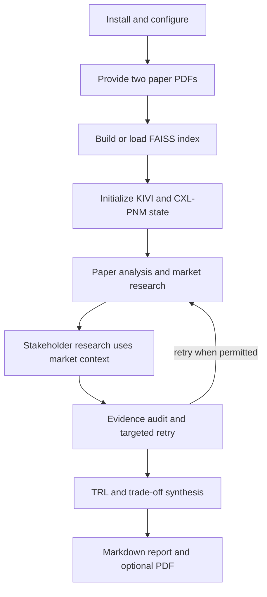

# Quickstart

This repository evaluates **KIVI** (software KV-cache quantization) against **CXL-PNM** (hardware CXL near-memory processing) through a LangGraph pipeline. The normal run starts from the fixed selection in `main.py`, analyzes the two trusted papers, researches market and stakeholder context, audits claims, synthesizes the evaluation, and writes a Markdown report plus a PDF when PDF conversion succeeds.

## 1. Install the project

Use Python 3.10 or newer. The project metadata pins LangGraph to `1.2.12` and declares the RAG, Tavily, templating, PDF, and test dependencies; `requirements.txt` is the compatible installation list.

```bash
uv venv && source .venv/bin/activate
uv pip install -r requirements.txt
```

On Windows PowerShell, activate the environment with `.venv\\Scripts\\Activate.ps1` instead. The Streamlit UI is intentionally not in `requirements.txt`; install it only when the dashboard is needed:

```bash
uv pip install streamlit
```

## 2. Configure credentials and local inputs

Create a local `.env` from the example:

```bash
cp .env.example .env
```

Fill in the keys needed for live behavior:

```dotenv
OPENAI_API_KEY=
LANGCHAIN_API_KEY=
LANGCHAIN_TRACING_V2=true
LANGCHAIN_ENDPOINT=https://api.smith.langchain.com
LANGCHAIN_PROJECT=RAG-PROJECT
HF_TOKEN=
TAVILY_API_KEY=
```

`OPENAI_API_KEY` enables the LLM-powered research, claim judging, and report polishing; `TAVILY_API_KEY` enables live market and stakeholder search. Both are optional at process start: missing keys activate the repository's fallback behavior, but web claims can become `insufficient` and paper/report quality is not equivalent to a fully provisioned run. LangSmith variables are optional tracing controls, and `HF_TOKEN` is useful for downloading the Hugging Face embedding model.

Before paper analysis, place the trusted PDFs at exactly:

```text
data/papers/kivi.pdf
data/papers/cxl_pnm.pdf
```

The indexer raises a missing-file error internally and returns failure from its CLI wrapper when either input is absent. The embedding model and FAISS index are stored locally under `data/faiss_index/`; report paths and model names are centralized in `src/config.py`.

## 3. Run the evaluation

### Non-interactive CLI

```bash
python main.py
```

`main.py` builds and invokes the compiled evaluation graph with the KIVI/CXL-PNM initial state. It always preserves the generated state report as `final_evaluation_report.md`. The configured output path is `final_evaluation_report.pdf`; if PDF conversion fails, the Markdown source remains available and the CLI reports the fallback instead of silently treating the PDF as complete.

### Streamlit dashboard

```bash
streamlit run app.py
```

Use **Run full pipeline** to stream node progress and inspect the final report, claims and audit issues, TRL/synthesis data, or raw state. **Load Mock Data** is useful for UI inspection without external calls. The dashboard also exposes Markdown and PDF downloads when those artifacts exist. For a production-like run, prefer the CLI first; the dashboard's progress display streams the graph and then invokes it again to obtain the final state.

The high-level execution path is:



This diagram summarizes the user-visible lifecycle; the exact six-node graph, fan-out/fan-in edges, retry routing, and terminal behavior are documented in [Evaluation Graph and Runtime Orchestration](architecture/orchestration.md).

## 4. Rebuild paper artifacts and benchmark embeddings

Rebuild the local FAISS index after changing either PDF, chunking logic, or the embedding model:

```bash
python -m src.rag.indexer
```

The indexer loads `kivi.pdf` and `cxl_pnm.pdf`, preserves technology and page metadata, creates section-aware chunks, embeds them with `intfloat/e5-small-v2` by default, and saves the FAISS store to `data/faiss_index/`. It exits non-zero when indexing cannot complete.

Run the benchmark when comparing or changing embedding models:

```bash
python -m src.rag.benchmark
```

The benchmark grounds its dataset in the PDF chunks and requires exactly 20 rows in `data/eval_queries.json`. It measures `Hit@5` and MRR for `BAAI/bge-small-en-v1.5` and `intfloat/e5-small-v2`, selects the best eligible model by MRR when `Hit@5 >= 0.8`, and evaluates `BAAI/bge-m3` only if neither small model meets that threshold. Results are written to `src/rag/benchmark_results.json`; this command downloads models and therefore needs the relevant Hugging Face access and network availability.

For retrieval internals—technology filtering, sufficiency gates, axis-preserving rewrites, and grounded quotations—see [Paper Corpus, FAISS Index, and Agentic RAG](integrations/paper-rag.md).

## 5. Run tests

```bash
pytest tests/ -v
```

The suite covers state contracts and reducers, graph compilation and routing, RAG chunking/grounding, research behavior, audit rules and judging, synthesis/report generation, PDF export, and an end-to-end smoke path. `tests/conftest.py` replaces `TavilyClient` with a deterministic fixture, so tests do not make direct Tavily API calls. Keep the focused tests close to the change, then run the full suite before a release:

```bash
pytest tests/test_state.py tests/test_graph.py -v
pytest tests/test_rag.py tests/test_research.py -v
pytest tests/test_audit.py tests/test_synthesis.py tests/test_pdf_export.py -v
pytest tests/test_smoke.py -v
```

The test strategy explains which invariants each group protects: [Testing and Safe Change Boundaries](testing/test-strategy.md).

## 6. Troubleshooting checklist

- **No paper evidence or missing FAISS files:** verify both PDFs exist, then run `python -m src.rag.indexer` from the repository root. The runtime index loader expects a locally saved FAISS index.
- **Search claims are empty or `insufficient`:** set `TAVILY_API_KEY` for live web research; fallback mode intentionally proceeds without real search evidence.
- **LLM behavior is degraded:** set `OPENAI_API_KEY`; `gpt-4o-mini` is the default generator, while `gpt-4o` is used for judging and polishing.
- **PDF is absent but Markdown exists:** inspect the PDF conversion environment and `data/fonts/`; the CLI preserves Markdown when conversion fails.
- **Need to inspect generated state or artifacts:** see [Configuration, Runtime Operations, and Artifacts](operations/configuration-and-artifacts.md).
- **Need to understand one run end to end:** follow [End-to-End Evaluation Workflow](workflows/end-to-end-evaluation.md).
- **Need to change audit or retry behavior:** read [Evidence Audit, Fast-Fail, and Targeted Retry](workflows/evidence-audit-and-retry.md) and then [Evaluation Graph and Runtime Orchestration](architecture/orchestration.md).

## Routing map

Use this page for setup and first execution, then route by the question being answered:

| If you need to… | Read |
|---|---|
| Understand graph nodes, fan-out, chaining, fan-in, retries, or completion | [Evaluation Graph and Runtime Orchestration](architecture/orchestration.md) |
| Understand state keys, claims/evidence, reducers, or ownership boundaries | [State, Claims, Evidence, and Reducers](concepts/state-and-evidence-contract.md) |
| Rebuild or tune paper retrieval and embedding evaluation | [Paper Corpus, FAISS Index, and Agentic RAG](integrations/paper-rag.md) |
| Understand Tavily market and stakeholder inputs | [Tavily Market and Stakeholder Research](integrations/web-research.md) |
| Understand TRL, synthesis, report templates, polishing, or PDF delivery | [Dual TRL Synthesis and Report Delivery](architecture/synthesis-and-reporting.md) |
| Operate configuration, paths, tracing, fallback behavior, or artifacts | [Configuration, Runtime Operations, and Artifacts](operations/configuration-and-artifacts.md) |
| Trace a complete evaluation lifecycle | [End-to-End Evaluation Workflow](workflows/end-to-end-evaluation.md) |
| Diagnose evidence audit, fast-fail, or targeted retries | [Evidence Audit, Fast-Fail, and Targeted Retry](workflows/evidence-audit-and-retry.md) |
| Choose tests or define a safe change boundary | [Testing and Safe Change Boundaries](testing/test-strategy.md) |

This map mirrors the current wiki domains; update it whenever pages are added, removed, moved, or materially regrouped.
