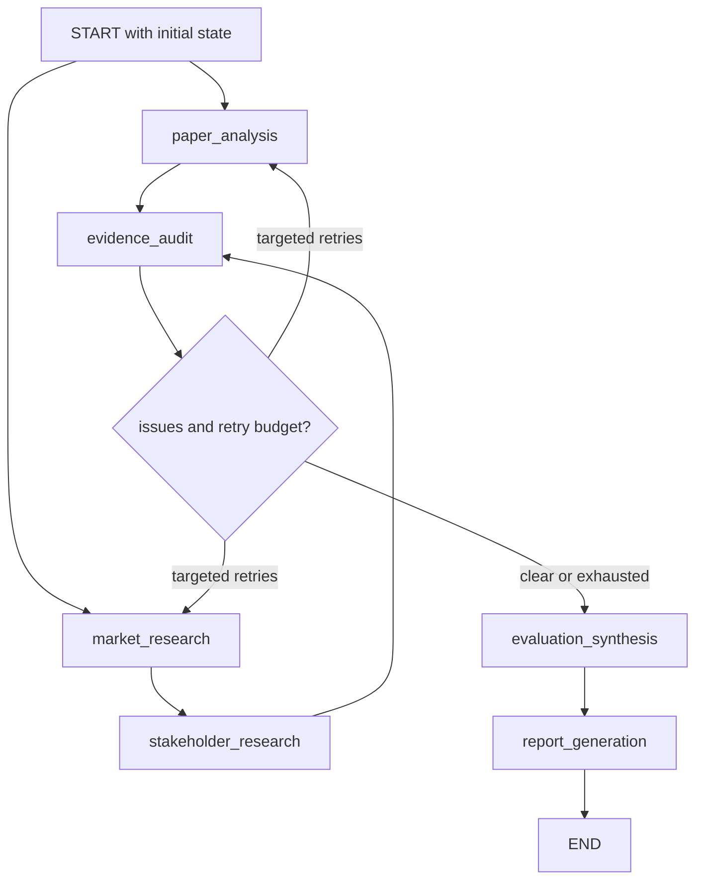

# Testing and Safe Change Boundaries

The test suite is organized around the evaluation pipeline's contracts rather than around a one-to-one inventory of modules. The safest change is one that identifies its invariant first, changes the narrowest owner, and runs the tests at the boundary where that invariant is observable.

## Test the lifecycle before the implementation

The LangGraph pipeline fans out from paper analysis and market research, chains market results into stakeholder research, joins at one evidence audit, and then either retries targeted agents or proceeds to synthesis and report generation. `tests/test_graph.py` tests both the compiled node set and the routing decisions, including the anti-duplicate-audit behavior when multiple retry branches converge.

*This diagram shows the tested first-run, audit, bounded-retry, synthesis, and persistence lifecycle.*

`test_flow_first_run_order` verifies the initial fan-out and fan-in; retry tests verify paper-only, market-cascade, and parallel retry paths. `route_after_paper` deliberately defers to the stakeholder edge when another branch is also retrying, so the audit is opened once rather than once per converging branch. `route_audit_decision` returns synthesis when there are no issues or when all relevant retry budgets are exhausted. These are routing contracts: changing an edge, retry limit, or issue grouping requires graph tests, not only node unit tests. The graph's retry budget is two attempts per target agent (`src/graph.py#L12-L53`).

`test_graph_end_to_end_execution` and `tests/test_smoke.py` are integration/smoke tests. They invoke the real compiled graph and assert a non-empty report, TRL entries for KIVI and CXL-PNM, and a populated claim set. They are valuable for detecting incompatible state shapes across nodes, but they are more expensive and more dependent on local fixtures than pure routing tests.

## State reducers and contract tests

`OverallState` is the shared boundary: 14 keys carry selected technologies, per-perspective summaries, claims, evidence, sources, audit status, retry counts, dual TRL, synthesis, and the final report (`src/state.py#L81-L96`). The state tests protect the shape and reducer semantics:

- `test_overall_state_schema_keys` catches accidental additions, removals, or renames to the state contract.
- `test_upsert_claims_idempotent` and `test_upsert_evidence_idempotent` verify last-write-wins replacement by stable claim/evidence ID without duplication.
- `test_union_sources_url_dedup` and `test_union_sources_new_url_and_empty_url` verify that a repeated non-empty URL resolves to the existing canonical source while distinct and URL-less sources remain available.

The reducers are the safe ownership boundary for retries: nodes should return patches, not mutate the input state. The RAG test `test_paper_node_uses_retrieved_chunk_and_preserves_other_claims` explicitly checks input immutability, scoped return keys, and preservation of claims owned by other agents. Research retry tests likewise require a flagged claim to be patched without replacing the market or stakeholder summary. A state schema change should therefore update `src/state.py`, initial state construction, node return patches, and contract tests together—not merely alter a TypedDict.

## Audit rules are fast-fail invariants

The audit suite in `tests/test_audit.py` treats evidence quality as executable policy. `run_static_rules` checks, in order, missing evidence for fact claims (R1), claims supported only by Tier-4 material (R2), missing counter-search for market/stakeholder and MAT-A claims (R3), and incorrect labels for academic simulation or vendor-derived figures (R4). Terminal `insufficient` and `rejected` claims are skipped rather than repeatedly re-flagged (`src/audit/rules.py#L4-L7`, `#L39-L122`).

Focused tests cover:

- R1 routing to paper versus market, and the exemption for terminal statuses.
- R2's Tier-4-only failure.
- R3's counter-search requirement, including MAT-A adoption claims.
- R4 relabeling of CXL-PNM simulation claims and T2 vendor claims.
- ID-prefix ownership: `DOM-*` and `MAT-R*` go to paper, `MKT-*` and `MAT-A*` to market, and `STK-*` to stakeholder. This matters because `maturity` is shared by research and adoption claims.

The audit tests are the boundary for adding a rule: first define the failure and target action, then test that action and its router effect. Do not silently convert an audit failure into a report-time warning; the graph's retry and terminal-status semantics depend on the issue shape.

## RAG: chunking, grounding, and offline-safe retrieval

The RAG tests split into corpus preparation and agent behavior. `tests/test_rag.py` verifies that `chunk_pages` preserves `tech`, converts PDF page numbers to one-based metadata, records section headings, carries table captions, joins sections across page boundaries, avoids false headings from wrapped text, and excludes the KIVI author footnote. Chunk limits and overlap are implementation details only insofar as they preserve retrievability and source traceability; the indexer targets at most 480 tokens per span and saves the FAISS index under `data/faiss_index` (`src/rag/indexer.py#L31-L35`, `#L89-L129`, `#L133-L153`).

Agent tests use fake vector stores and fake LLMs, not downloaded models or live OpenAI calls. They verify that:

- retrieval is filtered by technology and asks for five candidates;
- accepted quotes are contiguous source text and include context for measured numbers;
- a bandwidth question cannot be satisfied by throughput-only evidence;
- query rewriting is capped and cannot drift to another evaluation axis;
- an unavailable index produces an insufficient claim rather than fabricated evidence;
- relabel-only retries do not retrieve or rewrite evidence.

The grounding boundary is especially important: changes to prompts, rewrite logic, quote extraction, or axis terms should preserve the tests that reject invented or semantically shifted evidence. `test_missing_papers_do_not_build_index` also defines a safe build failure: missing corpus files return `False` rather than creating a partial index.

## Web research and mocked Tavily behavior

`tests/conftest.py` installs an autouse `MockTavilyClient` by monkeypatching `tavily.TavilyClient`. It returns deterministic Samsung CXL results for CXL queries and a vLLM GitHub result otherwise, so the research tests are offline-safe and do not spend API quota (`tests/conftest.py#L5-L49`). The mock is deliberately small: it tests the client contract, not Tavily ranking or network availability.

`tests/test_research.py` protects the web-source boundary: URL tier classification, vendor-domain labeling, forecast-to-`estimate` classification, empty results without an API key, reuse of a canonical source ID for a repeated URL, and counter-search coverage. The market and stakeholder nodes must return claims, evidence, and sources; every returned research claim must mark `counter_searched` true. The URL-dedup chain test runs both nodes with a shared URL and asserts that every evidence `source_id` survives `union_sources` and that only one source remains for that URL. If search client behavior, source identity, or evidence linking changes, run these tests together with the reducer tests.

The mock is a boundary, not a substitute for an opt-in live integration test. Keep normal CI offline; any live Tavily check should be explicit, credentialed, and separated from deterministic unit and smoke tests.

## Synthesis, TRL, and report contracts

`tests/test_synthesis.py` covers the semantic contract after audit: `evaluate_trl` derives separate technology and family/adoption TRLs from verified research and market claims, and returns `Unknown` with `confidence: none` when there are no verified claims (`src/synthesis/evaluator.py#L4-L31`). This prevents a report template from collapsing research maturity and ecosystem adoption into one number.

The report test asserts the required sections—SUMMARY, sections 1 through 6, and REFERENCE—plus TRL dualization, claim IDs, references, simulation labeling, non-overclaiming language, and absence of obsolete citation labels. Template or polishing changes must preserve those observable strings. With no `OPENAI_API_KEY`, `report_generation_node` returns the deterministic Jinja-rendered Markdown directly; with a key, polishing must retain headings, numbers, claim IDs, URLs, tiers, and simulation labels (`src/synthesis/report_gen.py#L147-L180`). This makes no-key report generation the preferred offline contract test.

## PDF and artifact persistence

`tests/test_pdf_export.py` tests two separate concerns: a usable Korean font is discoverable, and Markdown containing headings, emphasis, a table, and a block quote converts to a non-trivial PDF. It writes to `tmp_path`, so the test does not modify repository artifacts.

`tests/test_smoke.py` tests the operational boundary owned by `main.py`: the graph's `report` string is written to the configured Markdown path, and a `.pdf` output additionally creates the Markdown backup and a non-empty PDF. `main.main()` converts only when `REPORT_OUTPUT_PATH` has a `.pdf` suffix; otherwise it writes Markdown directly, and a failed PDF conversion leaves the Markdown source available (`main.py#L37-L63`). Configuration tests anchor paths beneath the project `data` directory and verify the model/path exports (`tests/test_state.py#L177-L187`, `src/config.py#L21-L28`).

## Safe change matrix

| Change area | First tests | Why the boundary matters |
| --- | --- | --- |
| State key or reducer | `tests/test_state.py`, then graph smoke | Prevents merge, identity, and initialization drift. |
| Graph edge, router, retry limit | `tests/test_graph.py` | Preserves fan-out, single audit fan-in, cascade order, and bounded retries. |
| Audit rule or claim ownership | `tests/test_audit.py`, graph routing tests | Keeps failure action and responsible agent aligned. |
| PDF parsing/chunking/grounding | focused `tests/test_rag.py` | Protects section, page, axis, and verbatim-evidence invariants. |
| Tavily/source identity | `tests/test_research.py`, state reducer tests | Prevents duplicate sources and dangling evidence links. |
| TRL or report template | `tests/test_synthesis.py`, smoke test | Preserves dual TRL semantics and required report sections. |
| PDF conversion or output path | `tests/test_pdf_export.py`, smoke test | Verifies both rendering and durable Markdown/PDF artifacts. |

A practical local sequence is to run the focused file for the changed boundary, then `pytest tests/test_graph.py tests/test_smoke.py` for lifecycle compatibility, and finally the full `pytest` suite before changing shared state or report contracts. The suite's default design is offline-safe: Tavily is mocked globally, RAG uses fakes where possible, and report polishing is bypassed when `OPENAI_API_KEY` is absent. External models, network retrieval, and large index construction should remain explicit operational steps rather than hidden prerequisites of unit tests.
