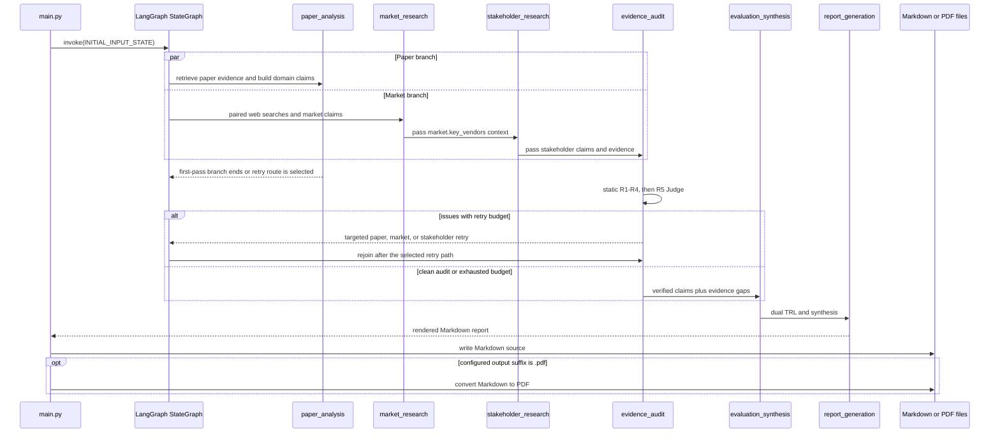

# End-to-End Evaluation Workflow

This workflow turns a selected technology pair into a grounded evaluation report. The non-interactive entrypoint is `main.py`: it builds the compiled LangGraph, invokes it with `INITIAL_INPUT_STATE`, persists the returned `report` as Markdown, and optionally converts the same text to PDF. The current selection is KIVI for software and CXL-PNM for hardware, but the important contract is the state-and-evidence pipeline rather than those particular names.

For the state fields, reducers, and ownership boundaries, see [State and Evidence Contract](../concepts/state-and-evidence-contract.md). Operational paths and environment setup are described in [Configuration and Artifacts](../operations/configuration-and-artifacts.md); the audit/retry mechanics are expanded in [Evidence Audit and Retry](./evidence-audit-and-retry.md).

## Runtime topology

`build_evaluation_graph()` registers six nodes. Paper analysis and market research fan out from `START`; market research then feeds stakeholder research so the latter can use market-derived vendor context. Stakeholder research is the normal fan-in edge into `evidence_audit`. The paper branch is conditionally routed: on the first pass it returns `END` for that branch, while a paper-only retry is routed to the audit; when other agents are retried, the graph avoids opening a duplicate audit path.

*The sequence shows the normal runtime, targeted feedback loop, and the persistence boundary; PDF export is optional and never replaces the Markdown source.*

## 1. Initialize the state

`INITIAL_INPUT_STATE` injects only the selected technologies and initializes the remaining contract fields: technology/domain/market/stakeholder summaries, empty `claims`, `evidence`, and `sources`, an empty audit issue list, per-agent retry counters at zero, and empty synthesis/report values. `OverallState` then carries these state fields through the graph. Claims and evidence are upserted by ID, while sources are unioned with URL deduplication, so retries can replace a claim without duplicating its evidence or leaving a dangling source reference.

The entrypoint deliberately keeps Markdown as the canonical intermediate artifact. `main()` writes `final_state["report"]` to `REPORT_MD_PATH` before attempting PDF output. If the configured output is not `.pdf`, it writes the report there directly; if PDF conversion fails, it reports the fallback and retains the Markdown file.

## 2. Paper analysis: Agentic RAG with an explicit evidence gate

`paper_analysis_node` owns the domain axes and research-maturity claims. On an initial pass it asks about six domain dimensions—memory footprint, bandwidth/transfer, throughput/latency, accuracy, infrastructure, and operational complexity—for both technologies, plus experimental conditions (`MAT-R01` and `MAT-R02`). It loads the local FAISS index with the configured embedding model and filters similarity search by technology.

For each question, the RAG path retrieves up to five chunks, requires an LLM sufficiency decision, and asks for a short contiguous quotation. It rejects invented or non-contiguous text and applies axis-specific checks, including preventing throughput from being used as bandwidth evidence. A failed retrieval, unavailable index, unavailable paper LLM, or unsuccessful grounding does **not** produce successful evidence: the claim is marked `insufficient`, with no evidence ID. A successful path produces a quote, an evidence record linked to one of the trusted paper sources, and the corresponding domain or research summary. Query rewriting is bounded to two attempts and must preserve the evaluation axis.

The graph can later target only paper claims mentioned by the audit. `paper_analysis_node` then reprocesses the affected IDs rather than rebuilding unrelated summaries; a `relabel` action can correct claim kind without another search.

## 3. Market research and stakeholder context chaining

`market_research_node` runs six paired plans covering adoption, ecosystem, and production deployment for each technology. Each plan runs a support query and a counter query, classifies sources into T1–T4, selects a usable ranked result, and stores support plus optional counter evidence. It derives `MAT-A01` and `MAT-A02` from the successful market claims instead of inventing a separate adoption search. The market summary also records `key_vendors`, adoption, deployment, ecosystem, and barriers.

The external-search boundary has a deliberate degradation contract. `search_pair()` returns an empty support result when `TAVILY_API_KEY` is missing or a Tavily call fails. The market node then creates an `insufficient` claim with empty evidence rather than a synthetic URL or fabricated fact. If a counter search has no result, the claim records that the counter search was performed and the report says `counter-evidence not found`; it does not manufacture a disagreement.

`stakeholder_research_node` runs after market research and reads only the market context it needs, especially `market["key_vendors"]`. It surveys four actors—cloud serving operator, framework developer, end user, and hardware/memory supplier—across both technology families, yielding `STK-01` through `STK-08`. Each item also uses paired support/counter searches. The summary is organized into actor slots with benefit, concern, barrier, and evidence IDs; missing evidence is rendered as an explicit unknown rather than a persona statement attributed without textual support. Retries patch only the affected stakeholder claims and actor slots.

## 4. Evidence audit and bounded feedback

`evidence_audit_node` is a two-stage fast-fail gate. First, `run_static_rules()` checks R1–R4: missing evidence for a fact, a Tier-4-only source, missing counter search for external/adoption claims, and inappropriate fact labeling for simulation or vendor material. Only claims that pass static checks and are not already terminal proceed to the R5 LLM judge, which tests statement/evidence consistency.

An audit issue names the claim, rule, target agent, and corrective action. The node increments each affected agent once per audit pass, marks still-retryable claims `flagged`, and finalizes claims at the retry limit as `insufficient` (or `rejected` for R5). The router uses the target set to send only the implicated agent(s) back through the graph. Market is preferred before stakeholder when both are valid, preserving market-to-stakeholder context ordering. Once no issues remain—or all target agents have exhausted two retries—the graph proceeds to synthesis with unresolved claims isolated as evidence gaps.

This ordering is an invariant: successful evidence must have a source/evidence chain and pass the audit, while a missing API, missing index, failed LLM call, or exhausted retry budget must remain visible as `insufficient`, `rejected`, or an explicit fallback—not be upgraded to `ok` merely to fill a report cell.

## 5. Dual TRL synthesis

`evaluation_synthesis_node` computes a TRL object independently for `KIVI` and `CXL-PNM`. `evaluate_trl()` separates verified research claims (`domain` and `maturity`) from verified market claims. Research facts map to `tech_trl` `5-6`; research simulations map to `3-4`. Adoption facts map to `family_trl` `7-8`, while vendor claims map to `6-7`. Confidence is `high` only when both research and adoption evidence exist, `medium` when one side exists, and `none` otherwise. With no verified claims, the result is `Unknown` on both scales and carries `Insufficient Evidence` as its fallback reason.

The same node records trade-offs, possible synergy, disagreement between individual-technology and ecosystem maturity, the overall non-ranking opinion, and all insufficient/rejected claims as `evidence_gaps`. Thus the report can distinguish what was observed from what remains unverified instead of collapsing both into a single maturity number.

## 6. Jinja2 report generation and persistence

`report_generation_node` renders `src/synthesis/templates/report.md.j2` with selected technologies, per-technology and domain summaries, market/stakeholder context, TRL, synthesis, sources, evidence, and claims. The template emits the fixed SUMMARY, sections 1–6, and REFERENCE structure; only claims with `status == "ok"` contribute to citation numbering and references. Source metadata may be enriched from web-page metadata, but failed metadata fetches are swallowed and do not block report generation.

If `OPENAI_API_KEY` is absent, the rendered Jinja2 Markdown is returned directly. If polishing is configured but the polishing LLM fails, the node logs a warning and returns the unpolished render. The polishing prompt forbids changing numbers, TRL values, Claim IDs, URLs, source tiers, simulation labels, headings, or adding recommendations, preserving strict grounding.

`main.py` persists the returned Markdown before optional export. `convert_markdown_to_pdf()` converts tables and fenced code through Markdown and xhtml2pdf, searches known Korean font paths, and returns `False` for missing PDF libraries or conversion errors. The caller retains the Markdown backup and exits the normal path rather than treating optional PDF support as a prerequisite for a completed evaluation.

## Focused verification

`tests/test_smoke.py` covers the workflow at its most important boundaries: graph invocation returns a non-trivial report with the expected report title; `main()` writes the state’s `report` string to Markdown; a `.pdf` output still writes the Markdown backup and produces a non-empty PDF; and the entrypoint’s initial state remains independent of test fixtures. These tests complement targeted tests for retrieval, audit rules, retries, and export, but the smoke tests are the quickest check that orchestration and artifact persistence still agree.
