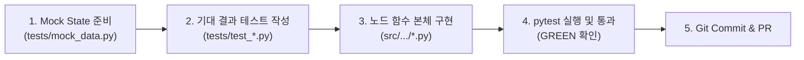

# 📜 [팀 공통] LangGraph 안티패턴 방지, TDD 및 코드 일관성 개발 룰

> **대상**: SKALA 4기 · 판교 9반 팀원 전체 (담당 A ~ E)  
> **목적**: 4시간 초집중 멀티 에이전트 프로젝트(10:00 ~ 14:00)에서 **LangGraph 결함을 사전 차단**하고, **제출 평가 루브릭(100점)을 설계·코드·산출물이 함께 충족**하도록 맞추기 위한 팀 공통 개발 헌장

---

## 📌 목차
1. [LangGraph 안티패턴 (1.2.12)](#1-langgraph-안티패턴-1212)
2. [TDD(테스트 주도 개발) 워크플로우 룰](#2-tdd테스트-주도-개발-워크플로우-룰)
3. [코드 일관성 및 방어적 프로그래밍 가이드](#3-코드-일관성-및-방어적-프로그래밍-가이드)
4. [Git 협업 및 커밋 컨벤션](#4-git-협업-및-커밋-컨벤션)
5. [State 계약 Freeze (전원 필수)](#5-state-계약-freeze-전원-필수)
6. [R1~R5 검증 치트시트](#6-r1r5-검증-치트시트)
7. [재실행 루프 및 평가 원칙](#7-재실행-루프-및-평가-원칙)
8. [제출 평가 루브릭 대응 (100점)](#8-제출-평가-루브릭-대응-100점)

설계서 체크리스트는 **자기 `role_*.md` §7에서만** 체크한다. 인덱스: [`design_checklist.md`](design_checklist.md). 이 파일과 인덱스의 체크박스를 고치면 Git 충돌이 난다.

---

## 1. LangGraph 안티패턴 (1.2.12)

아래는 **LangGraph 1.2.12**에서 이 저장소의 `OverallState`와 현재 그래프 모양으로 확인한 동작입니다. 1·3·5는 값이 어긋나거나 예외가 납니다. 7은 예외 없이 실행 순서가 어긋납니다. 2·4·6은 엔진이 막지 않지만, 이 과제의 State 계약과 제출 루브릭에서 지키지 않으면 감점됩니다.

### 수정 요약

이전 공통 룰에서 엔진이 그렇게 동작하지 않던 문장만 고쳤습니다. 팀 규칙(`upsert_*`, `retry_count < 2`, 쓰기 권한, 노드 6개)은 그대로입니다.

| # | 이전 문장 | 1.2.12에서 확인한 사실 |
| --- | --- | --- |
| 1 | 직접 수정하면 체크포인터·시간 여행·트레이싱이 파괴된다 | 체크포인터는 유지됩니다. 반환하지 않은 변경은 `get_state()`에 남지 않습니다. 리듀서 리스트를 고쳐 그 리스트를 반환하면 항목이 두 배가 됩니다. 리듀서 없는 dict는 부분 병합이 아니라 통째로 교체됩니다 |
| 2 | 큰 노드는 엔진이 금지한다 | 엔진은 큰 노드를 허용합니다. 체크포인트·재시도 단위가 노드라서, 이 과제는 노드를 합치면 감점입니다 |
| 3 | `operator.add` 자체가 안티패턴이다 | add는 추가 전용 로그의 정석입니다. `claims` / `evidence` / `sources`처럼 id로 갱신할 키에 쓰면 안 됩니다 |
| 4 | 탈출이 없으면 영원히 돌다 시스템이 멈춘다 | 기본 10007스텝 뒤 `GraphRecursionError`가 납니다. `retry_count < 2`는 팀 규칙입니다 |
| 5 | 병렬 쓰기는 레이스로 한쪽이 덮어쓴다 | 리듀서 없는 같은 키는 `InvalidUpdateError`로 실패합니다 |
| 6 | 스키마에 없는 키를 쓰면 계약 위반으로 거부된다 | 예외 없이 그 키만 버려집니다 |
| 7 | (없음. 이번에 추가) | `add_edge`를 두 번 호출하는 fan-in은 합류가 아닙니다. 아래 7번 |

---

### ❌ 안티패턴 1. State In-place Mutation (원본 상태 직접 수정)
- **증상**: `state["claims"].append(new_claim)`, `state["market"]["status"] = "done"`처럼 인자로 받은 `state`를 직접 고칩니다. 고친 객체를 `return state`로 그대로 돌려주는 것도 같습니다.
- **1.2.12**: 체크포인터가 망가지지는 않습니다. 반환하지 않은 변경은 기록하지 않습니다.
  - 고치고 `{}`만 반환하면, 같은 프로세스의 `invoke()` 결과에는 수정이 보입니다. `get_state()` 체크포인트에는 수정 전 값이 남습니다. 시간 여행과 재개는 체크포인트 기준이라 방금 본 결과와 다릅니다.
  - 리듀서가 있는 리스트를 `append`한 뒤 그 리스트를 반환하면, 리듀서가 한 번 더 합쳐 항목이 두 배가 됩니다.
- **올바른 패턴**: 바꾼 키만 담은 **새 딕셔너리**를 반환합니다. `market`처럼 리듀서가 없는 딕셔너리는 부분 병합이 아니라 **통째로 교체**됩니다. 남길 필드는 새 dict에 다시 넣습니다.

```python
# ❌ 체크포인트에 안 남거나, 리듀서 키가 두 배가 된다.
def bad_node(state: OverallState) -> dict:
    state["claims"].append(new_claim)
    state["market"]["status"] = "done"
    return state

# ✅ 반환한 키만 갱신된다. market은 이 노드의 전용 키.
def market_research(state: OverallState) -> dict:
    return {
        "claims": [new_claim],  # upsert_claims: 이 id만 덮어쓴다
        "market": {**state["market"], "status": "done"},
    }
```

`{"market": {"status": "done"}}`만 반환하면 기존 `market`의 다른 키는 사라집니다.

---

### ❌ 안티패턴 2. Monolithic Node (거대 절차형 노드)
- **증상**: 한 노드에 `검색 → LLM 질의 → 검증 → 템플릿 렌더링`을 모두 넣습니다.
- **1.2.12**: 엔진은 큰 노드를 거부하지 않습니다. 체크포인트와 `RetryPolicy`의 단위가 노드 하나라서, 중간 LLM이 실패하면 그 노드의 검색부터 다시 실행됩니다. 조건부 엣지는 노드 중간으로 들어갈 수 없습니다.
- **이 과제**: 설계서의 6개 노드를 합치면 루브릭에서 감점됩니다. 노드 이름은 설계서 그대로 두고, 데이터는 State로만 넘깁니다.

---

### ❌ 안티패턴 3. Append 리듀서를 Upsert 자리에 쓰기
- **증상**: 같은 Claim을 다시 써야 하는 필드에 `operator.add`를 씁니다. 재실행이 같은 `id`를 다시 반환할 때마다 이전 Claim 뒤에 붙습니다.
- **1.2.12**: `operator.add`는 메시지 로그처럼 추가만 하는 채널에서는 정석입니다. 잘못된 것은 add 자체가 아니라, id로 갱신해야 하는 `claims` / `evidence` / `sources`에 add를 쓰는 것입니다. 같은 id를 두 번 반환하면 add는 2건, `upsert_claims`는 마지막 1건입니다.
- **올바른 패턴**: 세 키는 `upsert_claims`, `upsert_evidence`, `union_sources`(source_id와 url)만 씁니다. 노드는 이번에 바꾼 객체만 고유 `id`를 채워 반환합니다. 상태에 있던 리스트 전체를 다시 반환하지 않습니다.

---

### ❌ 안티패턴 4. 탈출 없는 사이클
- **증상**: `route_audit_decision`이 `retry_count`를 보지 않고 항상 재실행 노드로 보냅니다.
- **1.2.12**: 영원히 돌거나 프로세스가 멈추지는 않습니다. 기본 한도는 **10007**스텝(`LANGGRAPH_DEFAULT_RECURSION_LIMIT`)이고, 그 다음 `GraphRecursionError`가 납니다. 스텝마다 LLM이나 검색을 호출하면 그 전에 API 예산이 소진됩니다.
- **이 과제**: 엔진 한도에 맡기지 않습니다. `retry_count < 2`일 때만 재실행하고, 넘으면 `evaluation_synthesis`로 빠져 해당 Claim을 `insufficient`로 둡니다. `retry_count`는 검증 노드만 올립니다.

---

### ❌ 안티패턴 5. 같은 스텝의 동시 쓰기 (InvalidUpdateError)
- **증상**: 한 슈퍼스텝에서 `paper_analysis`와 `market_research`가 리듀서 없는 같은 키를 둘 다 반환합니다.
- **1.2.12**: 레이스로 한쪽이 덮어쓰지 않습니다. 그래프가 결정적으로 실패합니다.

```text
InvalidUpdateError: At key 'market': Can receive only one value per step.
Use an Annotated key to handle multiple values.
```

- **올바른 패턴**: 병렬 노드는 서로 다른 키(`tech_sw`와 `market`)에만 씁니다. 공유 키는 리듀서가 있는 `claims` / `evidence` / `sources`만 씁니다. 쓰기 권한은 [5절](#5-state-계약-freeze-전원-필수)을 따릅니다.

---

### ❌ 안티패턴 6. 스키마에 없는 State 키
- **증상**: `OverallState`에 없는 키를 반환하거나, `state["temp_result"] = 123`처럼 직접 넣습니다.
- **1.2.12**: 예외가 나지 않습니다. 그 키는 조용히 버려지고, 다음 노드와 체크포인트에 없습니다.
- **올바른 패턴**: `src/state.py`에 선언된 필드만 반환합니다. 임시 값은 노드 지역 변수로만 둡니다.

---

### ❌ 안티패턴 7. 엣지 두 개를 합류로 착각
- **증상**: `paper_analysis`와 `stakeholder_research`에서 `evidence_audit`로 `add_edge`를 각각 호출합니다. 현재 `src/graph.py`와 담당 A 가이드의 이전 예제가 이 형태입니다.
- **1.2.12**: 출발을 리스트로 넘기지 않은 `add_edge`는 합류가 아닙니다. 도착할 때마다 다음 노드가 실행됩니다. `paper`는 1홉, `stakeholder`는 `market` 다음인 2홉이라 짧은 쪽이 먼저 검증을 실행합니다. 같은 형태로 재현하면 검증이 `stakeholder`보다 먼저 돌고, 검증 3회·보고서 2회가 겹칩니다.
- **리스트 합류는 재시도에 쓰지 않습니다.** `add_edge(["paper_analysis", "stakeholder_research"], "evidence_audit")`는 첫 실행에서 둘 다 끝날 때까지 기다립니다. `paper`만 다시 실행하면 반대쪽이 다시 도착하지 않아 검증이 열리지 않고, 예외 없이 그래프가 끝납니다.
- **올바른 패턴**: 첫 실행의 검증 입구는 `stakeholder_research → evidence_audit` 정적 엣지 하나입니다. 그 시점의 State에는 `paper`의 반환이 이미 반영되어 있습니다. `paper`에서 검증으로 가는 엣지는 `audit.issues`에 `target_agent == "paper"`가 있을 때만 엽니다. 첫 실행의 `issues`는 비어 있어야 하며, 이때 그 분기는 `END`로 빠지고 `market` 분기는 취소되지 않습니다.

```python
def route_after_paper(state: OverallState):
    issues = state.get("audit", {}).get("issues") or []
    if any(issue.get("target_agent") == "paper" for issue in issues):
        return "evidence_audit"
    return END

builder.add_edge("stakeholder_research", "evidence_audit")
builder.add_conditional_edges(
    "paper_analysis",
    route_after_paper,
    {"evidence_audit": "evidence_audit", END: END},
)
```

1.2.12에서 이 연결은 첫 실행이 `paper ∥ market → stakeholder → audit → synthesis → report`로 한 번씩입니다. `paper`·`stakeholder`·`market` 재시도도 검증을 한 번 더 지난 뒤 보고서로 갑니다.

---

## 2. TDD(테스트 주도 개발) 워크플로우 룰

4시간(10:00 ~ 14:00)의 초집중 개발에서 버그를 잡느라 시간을 낭비하지 않으려면, **코드를 작성하기 전에 Mock 기반의 단위 테스트를 먼저 작성**해야 합니다.



### 📋 TDD 개발 표준 3단계
1. **Given (준비)**: `tests/mock_data.py`의 `MOCK_STATE`를 복사하여 테스트용 입력 데이터를 만듭니다.
2. **When (실행)**: 자신이 만든 노드 함수(예: `evidence_audit_node(state)`)에 입력을 넣고 결과를 받습니다.
3. **Then (검증)**: 반환된 딕셔너리에 기대하는 키와 데이터가 오차 없이 존재하는지 `assert`로 검증합니다.

```python
# 💡 표준 단위 테스트 템플릿 (tests/test_audit.py 예시)
from tests.mock_data import MOCK_STATE
from src.audit.rules import run_static_rules

def test_static_rule_r1_missing_evidence():
    # Given: Fact인데 출처가 비어있는 불량 Claim 주입
    bad_claims = [{
        "id": "ERR-01", "perspective": "domain", "tech": "KIVI",
        "statement": "False fact", "kind": "fact",
        "evidence_ids": [], "counter_searched": False, "status": "ok"
    }]
    
    # When: 검사기 실행
    issues = run_static_rules(bad_claims, sources=[])
    
    # Then: R1 위반이 정확히 감지되었는지 단언
    assert len(issues) == 1
    assert issues[0]["rule"] == "R1"
    assert issues[0]["action"] == "search_evidence"
    print("✅ R1 Fast-Fail 검증 통과!")
```

### 🧪 테스트 실행 명령어
```bash
# 본인 담당 모듈 테스트만 빠르게 단독 실행
.venv/bin/pytest tests/test_rag.py -v
.venv/bin/pytest tests/test_research.py -v
.venv/bin/pytest tests/test_audit.py -v
.venv/bin/pytest tests/test_synthesis.py -v

# 전체 스모크 테스트 실행
.venv/bin/pytest tests/test_smoke.py -v
```

---

## 3. 코드 일관성 및 방어적 프로그래밍 가이드

### ① 방어적 프로그래밍 (Graceful Degradation)
- 외부 API(OpenAI, Tavily) 호출은 언제든 네트워크 지연이나 할당량 초과(Rate Limit)로 실패할 수 있습니다.
- API 호출부는 반드시 `try-except` 블록으로 감싸고, 실패하더라도 파이프라인 전체가 Crash되지 않도록 **안전한 기본값(Fallback)**을 반환해야 합니다.

```python
# ✅ 필수 방어 코드 패턴
try:
    response = llm.invoke(prompt)
    result_text = response.content
except Exception as e:
    print(f"⚠️ [경고] LLM 호출 실패, Fallback 적용: {e}")
    result_text = "기본 분석 텍스트 (Fallback)"
```

### ② 표준 로깅 컨벤션
디버깅 시 콘솔에서 어느 노드가 실행 중인지 즉시 식별할 수 있도록 아래 표준 이모지 태그를 함수 첫 줄에 출력하세요:
- `📄 [원문 분석]`: `paper_analysis` 노드
- `📈 [시장성 조사]`: `market_research` 노드
- `👥 [이해관계자]`: `stakeholder_research` 노드
- `🛡️ [근거 검증]`: `evidence_audit` 노드
- `⚖️ [평가 종합]`: `evaluation_synthesis` 노드
- `📝 [보고서 생성]`: `report_generation` 노드
- `⚠️ [경고/Fallback]`: 예외 및 Fallback 발생 시
- `✅ [성공/통과]`: 주요 검증 단계 통과 시

---

## 4. Git 협업 및 커밋 컨벤션

### 🌿 브랜치 전략
- `main`: 항시 테스트를 통과한 완벽한 실행 가능 상태 유지. 직접 Push 금지.
- 작업 브랜치:
  - `feat/rag-b` (담당 B)
  - `feat/research-c` (담당 C)
  - `feat/audit-d` (담당 D)
  - `feat/synthesis-e` (담당 E)
  - `feat/orchestration-a` (담당 A)

### 💬 커밋 메시지 컨벤션 (Conventional Commits)
커밋 메시지는 반드시 아래 접두어를 사용하세요:
- `feat:` 새로운 노드/기능 구현 (예: `feat: implement R5 LLM-as-a-Judge in judge.py`)
- `fix:` 버그 및 안티패턴 수정 (예: `fix: resolve state mutation in paper_analysis_node`)
- `test:` 단위 테스트 코드 추가 (예: `test: add unit test for static rules R1-R4`)
- `refactor:` 코드 리팩토링 (기능 변화 없음)
- `docs:` 문서 수정 및 주석 보강

---

## 5. State 계약 Freeze (전원 필수)

`src/state.py`는 설계서 부록 B와 동일한 **공통 계약**입니다. 필드 키·엔티티 스키마·리듀서를 임의로 바꾸지 마세요 (Interface Freeze). 모델명·API 키·경로는 `src/config.py`만 사용합니다.

### ① OverallState 키와 쓰기 권한

| 키 | 리듀서 | Writer | 비고 |
| --- | --- | --- | --- |
| `selected` | Last-write | 입력 (`main.py`) | `{sw, hw, families, rationale}` 불변. 조사 노드가 덮어쓰지 않음 |
| `tech_sw` / `tech_hw` | Overwrite | paper | 메커니즘·실험 수치·한계 |
| `domain` | Overwrite | paper | 도메인 6대 축 |
| `market` | Overwrite | market | 채택·배포·생태계·장벽. stakeholder 입력 |
| `stakeholder` | Overwrite | stakeholder | 4대 Actor Benefit/Concern/Barrier |
| `claims` | `upsert_claims` (id) | paper, market, stakeholder, **검증(status)** | 동일 id는 덮어쓰기 |
| `evidence` | `upsert_evidence` (evidence_id) | paper, market, stakeholder | |
| `sources` | `union_sources` (source_id **및 url**) | paper, market, stakeholder | URL이 같으면 중복 추가 금지 |
| `audit` | Overwrite | 검증 | `{issues: [AuditIssue]}`. `targets`는 State에 저장하지 않음 |
| `retry_count` | Overwrite (**reducer 없음**) | **검증만** | `{"paper", "market", "stakeholder"}`. 조사 노드가 반환하면 카운터가 리셋됨 |
| `trl` | Overwrite | 종합 | 키는 반드시 `"KIVI"`, `"CXL-PNM"` |
| `synthesis` | Overwrite | 종합 | 일치/불일치, Evidence Gap, 트레이드오프 |
| `report` | Overwrite | 보고서 | |

병렬 노드(`paper` ∥ `market`)는 전용 키만 덮어쓰고, 공유 키는 Reducer가 있는 `claims` / `evidence` / `sources`만 사용합니다.

### ② ID · `tech` · kind/status

| 객체 | 규칙 | 예시 |
| --- | --- | --- |
| Claim `id` | `{관점}-{번호}` | `DOM-01`, `MKT-01`, `STK-01`, `MAT-01` (`TEC-*`도 허용) |
| Evidence | `EV-{claim_id}` | `EV-DOM-01` |
| Source | `SRC-{claim_id}` 또는 `SRC-{tech}` | `SRC-MKT-01` |
| `perspective` | `maturity` \| `market` \| `stakeholder` \| `domain` | |
| `tech` | **`"KIVI"` 또는 `"CXL-PNM"`** | 계열명은 `selected.families` / `market` 딕셔너리에만. `"General"` 금지 |
| `kind` | `fact` \| `vendor_claim` \| `simulation` \| `estimate` | CXL-PNM 논문 수치 = `simulation`. 벤더 홍보 = `vendor_claim` |
| `status` | `ok` \| `flagged` \| `insufficient` \| `rejected` | 미확인 슬롯: `statement=""`, `status="insufficient"` |

- `counter_searched=True`는 **반대 쿼리를 실행했다**는 뜻입니다. 결과가 없어도 True이며, 그때는 `counter-evidence not found`로 기록하고 Claim 상태는 `ok`를 유지합니다.
- 논문(domain) Claim은 반대 쿼리 대상이 아니므로 `counter_searched=False`여도 R3 위반이 아닙니다.
- 자기 노드 Claim만 반환하세요. upsert는 **반환한 항목만** 기존 리스트와 병합합니다.

Claim ID 대역 (겹치면 upsert가 상대 데이터를 지웁니다):

| 담당 | 사용 | 금지 |
| --- | --- | --- |
| B | `DOM-01`~`DOM-12`, `MAT-R01`~`MAT-R02` | `MKT-*`, `STK-*`, `MAT-A*` |
| C | `MKT-01`~`MKT-08`, `STK-01`~`STK-04`, `MAT-A01`~`MAT-A02` | `DOM-*`, `MAT-R*` |
| D | 신규 ID 없음. 기존 Claim `status`만 | claims 재생성 |
| E | 신규 ID 없음 | claims/evidence 반환 |

### ③ 출처 Tier (R2)

| Tier | 기준 |
| --- | --- |
| T1 | arXiv, IEEE, ACM, 표준화 기구, 학술 논문 |
| T2 | 벤더 공식(Samsung, SK Hynix, NVIDIA), GitHub org |
| T3 | IT 전문 매체, 애널리스트 리포트 |
| T4 | Reddit, Medium, 개인 블로그 — **단독 근거 금지** |

논문 Source는 항상 T1입니다.

---

## 6. R1~R5 검증 치트시트

담당 D만 검사기를 짜는 것이 아닙니다. **B/C가 이 규칙을 통과하는 Claim을 만들어야** 오후 결합에서 검증 루프가 멈추지 않습니다.

| 규칙 | 단계 | 검사 | 누가 맞춰야 하는가 | `action` (한도 후 상태) |
| --- | --- | --- | --- | --- |
| R1 | 1단계 0ms | `kind=fact` 인데 `evidence_ids` 비어 있음 | B, C | `search_evidence`. **paper는 웹 재검색하지 않음** → `insufficient` |
| R2 | 1단계 0ms | T4 출처만 단독 | C (B는 T1) | T1~T3 보강 (`insufficient`) |
| R3 | 1단계 0ms | market/stakeholder/MAT채택인데 반대 쿼리 미수행 | C | `search_counter_evidence` |
| R4 | 1단계 0ms | 시뮬레이션·벤더 수치를 `fact`로 표기 | B, C | `relabel` |
| R5 | 2단계 LLM | `statement`가 snippet과 불일치 | B, C, D | `re_extract` (`rejected`) |

1단계 위반이 하나라도 있으면 R5 LLM을 호출하지 않습니다 (Fast-Fail).

---

## 7. 재실행 루프 및 평가 원칙

### ① 재진입 시 필수 동작

1. `state["audit"]["issues"]`에서 자기 `target_agent`만 필터합니다.
2. `action`대로만 고칩니다: `search_evidence` / `search_counter_evidence` / `re_extract` / `relabel`.
3. 해당 `claim_id`만 upsert로 반환합니다. 딕셔너리 슬롯 전체를 초기화하지 않습니다.
4. 에이전트당 재시도 **2회**. `retry_count` 증가는 **auditor만** 수행합니다.
5. 한도 초과 Claim은 `insufficient`(근거 부족) 또는 `rejected`(불일치)로 확정하고, 빈 statement를 추정으로 채우지 않습니다.

### ② 평가 원칙 (B/C/E 공통)

- **승패 판정 금지**: 더 낫다 / 승자 / 추천 문장 금지. 워크로드별 트레이드오프만 서술합니다.
- **수치 창작 금지**: 못 찾으면 `statement=""` + `status="insufficient"` + 기록값 `corpus 내 근거 미확인`. 원문에 없다고 단정하지 않습니다.
- **핵심 결론에서 gap 배제**: `insufficient` / `rejected`는 SUMMARY·시사점에 쓰지 않고 한계점(Evidence Gap)에만 남깁니다.
- 종합 노드는 추가 검색을 하지 않고, 수집된 MAT Claim ID만으로 `tech_trl`(연구) / `family_trl`(채택)을 이원화합니다.

### ③ Phase 1 공통 체크리스트 (10:00)

```bash
git pull origin main
# .env 에 OPENAI_API_KEY, TAVILY_API_KEY
uv pip install -r requirements.txt
.venv/bin/pytest tests/ -v
```

본인 브랜치(`feat/rag-b` 등)에서만 작업하고 `main`에 직접 push하지 않습니다.

---

## 8. 제출 평가 루브릭 대응 (100점)

채점자는 **설계 문서 ↔ 코드 ↔ 실행 산출물**만 봅니다. 단위 테스트 GREEN만으로는 점수가 나오지 않습니다. 아래 7개 항목이 제출물 채점표이며, 각 항목의 **완료 기준(DoD)**을 자기 모듈에서 충족해야 합니다.

| 배점 | 항목 | 채점자가 확인하는 것 |
| ---: | --- | --- |
| 15 | 설계 구현 충실도 | 에이전트 구조, Graph 흐름, State가 설계서와 코드에서 1:1인가 |
| 15 | Agent 구현 | 역할별 노드가 분리되어 있고, 흐름 제어가 논리적으로 맞는가 |
| 20 | RAG Pipeline | 문서 로딩 → 임베딩 → 검색 → 컨텍스트 활용이 **실제로** 도는가 |
| 10 | 코드 구조 | 디렉토리·모듈 분리·실행 스크립트가 명확한가 |
| 10 | 실행 결과 재현성 | `python main.py`로 보고서 파일이 생성되는가 |
| 20 | Output 보고서 | 설계 목차·평가 목적에 맞는 보고서인가 |
| 10 | Output README | 목적·구조·실행 방법이 간결히 적혀 있는가 |

---

### ① 설계 구현 충실도 (15) — 전원, 총괄 A

설계서 5.1 Graph / 부록 B State / 4.1 노드 표를 코드가 그대로 따라야 합니다. 새 노드명·새 State 키·우회 파이프라인을 만들지 마세요.

| 설계 요소 | 코드에서 보여야 하는 것 | 감점 포인트 |
| --- | --- | --- |
| 6개 노드 | `paper_analysis`, `market_research`, `stakeholder_research`, `evidence_audit`, `evaluation_synthesis`, `report_generation` | 노드를 합치거나 이름을 바꾸기 |
| Fan-out | `START → paper ∥ market` | 전부 직렬 실행 |
| Chaining | `market → stakeholder` | stakeholder가 market 컨텍스트 없이 독립 실행 |
| Fan-in | `stakeholder → evidence_audit` 한 엣지. `paper → audit`은 paper 이슈가 있을 때만 | `add_edge` 두 번(검증이 먼저·중복 실행) 또는 검증을 건너뜀 |
| Conditional loop | `retry_count < 2` + Cascade(market 재실행 시 stakeholder 연쇄) | 무한 루프 또는 재시도 없음 |
| State | `src/state.py` = 설계 부록 B (키·리듀서·엔티티) | `OverallState`에 없는 키 반환 |

담당 A는 merge 전에 `src/graph.py` 엣지와 설계서 Mermaid가 같은지 한 번 대조합니다.

---

### ② Agent 구현 (15) — A/B/C/D/E

역할이 파일과 함수로 **분리**되어 있어야 하고, 데이터가 State로만 전달되어야 합니다.

| 담당 | 분리되어야 하는 노드 | 논리 흐름 DoD |
| --- | --- | --- |
| B | `paper_analysis` | 충분성 게이트 → Rewrite ≤2 → 실패 시 `insufficient` |
| C | `market_research` → `stakeholder_research` | 지지/반대 쿼리 쌍, `market` 키를 stakeholder가 읽음 |
| D | `evidence_audit` (R1~R4 후 R5) | 1단계 위반 시 LLM 호출 없음. `retry_count` 증가 |
| E | `evaluation_synthesis` → `report_generation` | 검색 금지. TRL 이원화. 승패 문장 금지 |
| A | 라우터 | 표적 재실행 + 한도 초과 시 종합으로 탈출 |

한 파일에 검색+검증+보고서 렌더링을 몰아넣으면 이 항목과 안티패턴 2가 동시에 감점됩니다.

---

### ③ RAG Pipeline 구현 (20) — 담당 B (최고 배점 중 하나)

채점자는 “논문 요약을 프롬프트에 넣었는가”가 아니라 **로딩 → 임베딩 → 검색 → 컨텍스트 활용** 네 단계가 코드에 있는지 봅니다. Mock/fallback만으로 Claim을 `status=ok`로 내면 이 20점이 날아갑니다.

| 단계 | 구현 위치 | 제출 직전 확인 |
| --- | --- | --- |
| 문서 로딩 | `src/rag/indexer.py` + `data/papers/` PDF | PyPDF 로더가 실제 PDF를 읽음 |
| 청킹 | 400~500토큰, overlap 15%, `tech`/`section`/`page` 메타데이터 | 두 기술 청크가 섞이지 않음 |
| 임베딩·인덱스 | FAISS 로컬 저장 `data/faiss_index/` | 인덱스 파일이 커밋 또는 빌드 스크립트로 재생성 가능 |
| 검색 | top-k 5, `filter={"tech": ...}` | KIVI 질의에 CXL 청크가 안 붙음 |
| 컨텍스트 활용 | 충분성 게이트 YES일 때만 Claim 추출 | `Evidence.snippet` = 검색된 원문 청크 (LLM이 지은 문장 아님) |
| 실패 | 3회 후에도 없음 | `statement=""`, `status="insufficient"`, `corpus 내 근거 미확인` |

`main.py` 실행 로그에 FAISS 로드 실패 → fallback 문장만 찍히면 RAG 점수는 0에 가깝습니다. 제출 전에 인덱스 빌드와 검색 경로를 한 번은 실제 PDF로 통과시키세요.

---

### ④ 코드 구조 및 프로젝트 구성 (10) — 전원, README는 A

디렉토리와 실행 진입점을 바꾸지 않습니다. 새 패키지를 루트에 흩뿌리지 마세요.

```text
src/rag/          담당 B   indexer · benchmark · agentic_rag
src/research/     담당 C   client · market · stakeholder
src/audit/        담당 D   rules · judge · auditor
src/synthesis/    담당 E   evaluator · templates/report.md.j2 · report_gen
src/state.py, graph.py, config.py, main.py   담당 A
tests/            모듈별 test_*.py + mock_data.py
```

- 실행 스크립트는 루트 `main.py` 하나. 개인용 실험 스크립트는 커밋하지 않습니다.
- 산출물 경로는 `final_evaluation_report.md` (루트)로 고정합니다.
- `__init__.py`, `requirements.txt` / `pyproject.toml` 유지.

---

### ⑤ 실행 결과 재현성 (10) — 전원, 최종 확인 A

채점자는 README 명령 그대로 실행합니다. 로컬에서만 되는 경로는 감점입니다.

제출 전 필수:

```bash
# 1) 환경
cp .env.example .env   # 또는 README의 .env 예시
# OPENAI_API_KEY, TAVILY_API_KEY 존재

# 2) 설치·테스트
uv venv && source .venv/bin/activate
uv pip install -r requirements.txt
.venv/bin/pytest tests/ -v

# 3) 본실행 — 이 한 줄이 보고서를 만들어야 함
.venv/bin/python main.py
test -s final_evaluation_report.md
```

재현성 DoD:

- API 키가 없어도 **크래시하지 않고** Fallback으로 보고서 골격은 생성되어야 합니다. 다만 제출본은 키를 넣고 **실제 검색·RAG가 돈 보고서**를 첨부하는 것이 목표입니다.
- FAISS 인덱스가 없으면 `indexer.py`로 재생성하는 방법이 README에 있어야 합니다.
- 경로·모델명은 `src/config.py`만 사용 (하드코딩 금지).
- 실행이 대화형 input을 요구하면 안 됩니다 (`main.py`는 non-interactive).

---

### ⑥ Output 보고서 (20) — 담당 E, 근거는 B/C/D

보고서는 설계서 6장 목차를 **장 번호까지** 따라야 합니다. 현재 템플릿(`report.md.j2`)은 장 구성이 설계와 다릅니다. 제출 전에 아래 목차로 맞추세요.

| 설계 목차 | 반드시 들어갈 내용 |
| --- | --- |
| SUMMARY | 관점별 핵심 + 일치/불일치. 0.5p 이내. 승자 지정 금지 |
| 1. 분석 배경 | KV cache 병목, 클라우드 서빙을 도메인으로 둔 이유 |
| 2. 기술 선정 | 선정 기준, KIVI·CXL-PNM 선정 사유 (`selected.rationale`) |
| 3. 기술 개요 | 메커니즘, 수치(실측 vs **simulation** 구분), 한계, 실험 조건 |
| 4. 관점별 평가 | TRL 이원화(`tech_trl`/`family_trl`) · 시장성 · 이해관계자 · 도메인 6대 축 |
| 5. 시사점 | 원문 vs 외부, 워크로드별 트레이드오프, 결합 가능성. 우열 금지 |
| 6. 한계점 | Evidence Gap (`insufficient`/`rejected`), 시뮬레이션 수치, 확증편향 방지 |
| REFERENCE | **실제로 인용한** `sources`만. 가짜 URL 금지 |

보고서 품질 규칙:

- Jinja2가 State의 Claim/TRL/수치를 1:1 바인딩한 뒤, Polishing LLM은 **문장만** 다듬습니다. 숫자·TRL·고유명사 변경 금지 (Strict Grounding).
- `ok` Claim만 본문에 사용. gap은 6장에만.
- 수치에는 가능하면 모델 크기 / 문맥 길이 / 실측·시뮬레이션 여부를 병기합니다.
- “KIVI가 더 우수하다”류 문장이 있으면 이 20점과 설계 충실도가 같이 깎입니다.

---

### ⑦ Output README (10) — 담당 A, 모듈 설명은 각 담당 검수

채점자가 README만 읽고 실행할 수 있어야 합니다. 소설이 아니라 **목적 / 구조 / 실행** 세 덩어리입니다.

README에 반드시 있을 것:

1. **목적**: KV cache 병목, KIVI vs CXL-PNM, 다관점 평가, 승패 판정 없음
2. **구조**: 디렉토리 + 6노드 Graph (기존 Mermaid 유지)
3. **실행**: uv 설치, `.env` 키 두 개, `pytest`, `python main.py`, 산출물 경로
4. **RAG 재생성**: PDF 위치, `indexer.py` / `benchmark.py` 실행법
5. **역할 안내**: `tasks/` 링크 (이미 있음)

제출 전 README에서 지울 것: 깨진 상대경로, 로컬 절대경로, “TODO”, 실행되지 않는 명령.

---

### ⑧ 제출 직전 통합 체크 (13:45, 담당 A 리딩)

아래를 위에서부터 막히면 해당 배점이 위험합니다.

- [ ] `src/graph.py` 노드 6개 + Fan-out/Chain/Fan-in/조건부 루프가 설계 5.1과 같음
- [ ] `src/state.py` 키가 설계 부록 B와 같음 (임의 키 없음)
- [ ] `data/papers/` PDF → FAISS 인덱스 실존, `paper_analysis`가 snippet을 청크에서 채움
- [ ] `python main.py`가 질문 없이 끝나고 `final_evaluation_report.md`가 비어 있지 않음
- [ ] 보고서 목차 = SUMMARY + 1~6 + REFERENCE, TRL 이원화 표 존재, 승자 문장 없음
- [ ] README만 보고 제3자가 설치·실행 가능
- [ ] `.venv/bin/pytest tests/ -v` GREEN

---
*SKALA 4기 · 판교 9반 팀 공통 개발 헌장 | 2026-09-22*
